## 今日大纲介绍

今日目标：掌握使用VMware+CentOS搭建聊天机器人项目环境

核心知识点模块：

①聊天机器人项目介绍

②大模型核心基础

③VM安装与Linux使用

④聊天机器人部署项目环境

## 【熟悉】聊天机器人项目简介

### 学习目标

掌握聊天机器人搭建核心步骤，完成聊天机器人架构设计

### 什么是聊天机器人  

* 概念：聊天机器人是一种基于人工智能的自然语言处理技术开发的软件程序，能够通过文本或语音与用户进行交互，模拟人类对话。它可以根据用户输入的问题或指令，生成相应的回答或执行特定的操作。


* 特点：

  > 1. **自然语言理解（NLP）**：能够理解用户输入自然语言，包括文字或语音，并从中提取意图和关键信息。
  >
  >    1. 人工智能     人工智障 
  >
  > 2. **对话管理**：通过对话引擎维持对话的连贯性，根据上下文生成合适的回答。
  >
  > 3. **个性化交互**：可以根据用户的历史记录和偏好提供定制化的回答。
  >
  >    ​		笔记本       电脑      真笔记本 
  >
  > 4. **多功能性**：除了聊天，还可以执行任务，如查询信息、预订服务、提供帮助等。
  >
  >    1. ​	执行任务
  >    2. ​        查询信息
  >    3. ​        预订服务

* 应用场景：

  > 1. **客户服务**：在电商、金融等领域，聊天机器人可以自动解答用户问题，提供24*7的客户支持。
  >
  >    1. 
  >
  > 2. **娱乐**：一些聊天机器人可以与用户进行趣味对话，提供娱乐体验。
  >
  >    ​	
  >
  > 3. **教育**：用于语言学习、知识问答等教育场景。
  >
  >    1. 
  >
  > 4. **智能家居**：控制家电设备，如灯光、空调等。
  >
  >    ​        智能音箱 
  >
  >    ​	扫地机器人
  >
  >    ​	
  >
  > 5. **医疗健康**：提供健康咨询、预约挂号等服务。
  >
  >    1. ​	AI +图形 （误诊率）   辅助

* 有哪些常见聊天机器人?

  > **DeepSeek**
  >
  > 由杭州深度求索人工智能基础技术研究有限公司研发,  其核心优势在于性能卓越、低成本开发和开源策略
  >
  > **Kimi智能助手**
  > 由月之暗面科技有限公司开发，支持超长上下文（最高200万汉字），适合长文本处理和复杂对话。

  > **通义千问**
  > 阿里云推出的人工智能助手，适合办公场景，提供高效的信息处理能力。
  >
  > **讯飞星火**
  > 科大讯飞出品，支持语音输入和语音朗读回复，适合语音交互场景。
  >
  > **豆包**
  > 字节跳动推出，支持抖音和今日头条的内容信息获取，适合内容创作和信息检索。
  >
  > 上面部分聊天机器人后面会给大家演示功能。

* 黑马智能聊天机器人效果展示

  > 本次课我们会带领大家完成从0-1的聊天机器人搭建。

  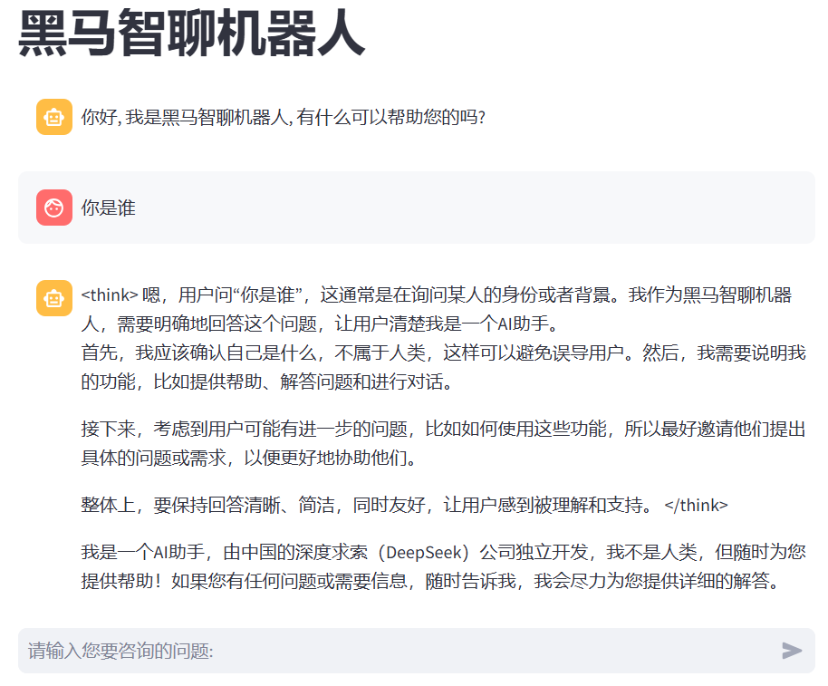

  如何搭建像上面一样的聊天机器人？我们一起来看看基本需求

### 项目需求分析

项目旨在构建一个基于大模型的智能聊天机器人，利用其强大的自然语言处理和生成能力，为用户提供高效、精准、个性化的对话服务。

该聊天机器人将集成先进的大规模预训练语言模型（如GPT、Qwen等），具备自然语言理解、多轮对话、情感分析、知识问答等核心功能，并可根据具体应用场景进行定制化扩展，如客服咨询、教育辅导、娱乐互动等。

相关功能需求如下：

（一）核心对话功能需求

1. **自然语言处理**：
   - 聊天机器人能够理解和生成自然语言文本，支持中文和英文对话。
   - 能够处理用户的输入并生成==准确、流畅==的回复。
2. **实时对话交互**：
   - 用户可以通过 Streamlit 界面输入文本，聊天机器人实时响应并展示回复。
   - 对话过程流畅，延迟时间不超过 3 秒。

（二）用户界面功能需求

1. **简洁明了的布局**：
   - 提供输入框、发送按钮和对话展示区域。
   - 界面设计简洁美观，易于操作。
2. **交互式体验**：
   - 用户输入问题后，点击发送按钮即可触发对话。
   - 聊天机器人的回复实时展示在对话区域。

根据上述功能需求，项目采用模块化设计，前端通过Streamlit等框架实现简洁易用的交互界面，后端基于Ollama等平台进行模型部署和管理，确保系统的高效性和可扩展性。

项目目标旨在开发一款基于自然语言处理技术的聊天机器人，能够通过网页界面与用户进行实时对话，为用户提供高效、便捷的交互体验。

> 了解了相关需求之后，如何搭建聊天机器人呢？我们一起看看有哪些方式？

### 如何搭建聊天机器人

常见搭建聊天机器人方式有3种，通常根据功能会结合其中1-2种实现聊天机器人搭建，3种方式分别是：

①使用无代码平台搭建

②使用开源框架开发

③基于大语言模型的集成

####  使用无代码平台搭建

无代码平台允许用户通过可视化界面快速创建聊天机器人，无需编程基础。例如，**扣子（Coze）** 是一个由字节跳动开发的智能体应用开发平台，支持集成多种大语言模型（如 DeepSeek），并可以快速接入微信公众号。

搭建步骤：

1. **注册并登录平台**：访问 [扣子官网](http://coze.cn)，使用抖音或飞书扫码登录。
2. **创建应用**：填写智能体名称、功能介绍和图标。
3. **配置机器人**：

- 选择模型（如 DeepSeek 或其他大模型）
- 添加插件（如联网、绘画等）
- 编写开场白并测试对话效果

4. **接入平台**：将机器人接入微信公众号或其他平台，配置必要的参数（如 AppID）

> 如果需求简单且希望快速上线，优先选择无代码平台。

####  使用开源框架开发

如果你有一定的编程基础，可以使用开源框架（如 ChatterBot）和 Web 框架（如 Flask）来开发聊天机器人

**安装必要的库**：安装 Flask 和 ChatterBot。

**编写代码**：创建一个 Flask 应用，集成 ChatterBot 并训练模型。

**创建前端界面**：使用 HTML 和 JavaScript 创建一个简单的聊天界面

**部署应用**：将应用部署到服务器，如 Heroku 或本地服务器。

> ChatterBot 是一个开源的 Python 库，用于创建聊天机器人。它通过机器学习技术来生成对话内容，能够根据用户输入自动学习和生成回答。
>
> ChatterBot库对话生成能力有限，生成文本可能不够自然，大模型出来之前使用较多

####  基于大语言模型的集成

如果你希望使用更强大语言模型（如 DeepSeek或QWen），可以通过本地部署或云服务快速搭建聊天机器人。

搭建步骤：

1. **部署模型**：使用 Ollama部署 QWen或DeepSeek。
2. **配置机器人**：通过 Ollama 的 API 配置聊天机器人，设置模型、对话历史等参数。
3. **接入微信或其他平台**：使用 Gewechat 框架将机器人接入微信。

> 适合有一定技术能力的企业，需要高度定制化功能的聊天机器人。
>
> 适合大模型出来后有更好对话效果场景，目前企业纷纷采用方式。

#### 三种方式区别联系

> - 如果需求简单且希望快速上线，优先选择无代码平台。
> - 如果需求复杂，需要高度定制化功能，建议选择开源框架。
> - 如果需要高质量的对话体验且预算充足，可以选择基于大语言模型的集成。

当前项目我们选择`基于开源框架和基于大语言模型集成的综合方式`来开发聊天机器人，不仅能保障适合数据隐私和安全性要求，还可以实现高质量对话体验。接下来我们一起看项目方案

#### 项目方案

这里我们采用综合的基于开源框架和编程开发方法来开发聊天机器人。具体来说，这种方法结合了后端模型（Ollama 平台的 Qwen, DeepSeek模型）和前端界面（Streamlit 框架）来实现聊天机器人的功能。这种方法需要一定的编程基础，但可以提供更高的灵活性和定制化能力。

**后端模型：Ollama 平台的 Qwen 模型**

- **特点**：基于 Ollama 平台部署 Qwen, DeepSeek模型作为后端核心，提供自然语言处理和对话生成能力。
- **技术细节**：
  - Ollama 是一个开源的 AI 模型部署平台，支持多种大语言模型（LLM）。
  - Qwen 是一个高性能的语言模型，能够处理和生成自然语言文本。
  - 通过后端服务调用 Qwen 模型，将用户输入传递给模型，并获取模型的回复。

------

**前端界面：Streamlit 框架**

- **特点**：使用 Streamlit 框架搭建用户界面，提供简洁、交互式的 Web 应用。
- **技术细节**：
  - Streamlit 是一个基于 Python 的开源框架，适合快速开发数据科学和机器学习相关的 Web 应用。
  - 你通过 Streamlit 创建了一个用户界面，包括输入框、发送按钮和对话展示区域。
  - 用户可以通过网页与聊天机器人进行实时对话。

------

**对话交互与模型调用**

- **特点**：后端服务负责将用户输入传递给 Qwen 模型，并将模型生成的回复返回给前端界面。
- **技术细节**：
  - 你可能使用了 Python 编程语言来实现后端逻辑，将用户输入发送到 Qwen 模型，并处理模型的输出。
  - 这种方式需要编写代码来实现前后端的通信，确保对话的实时性和准确性。

### 项目架构设计

整体项目架构如下：

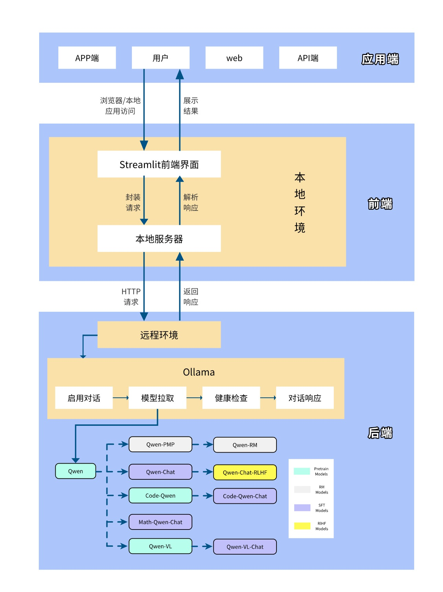

项目完整架构：

- **后端模型**：利用 Ollama 平台的 Qwen 模型，该模型具备出色的自然语言处理能力，能够理解和生成自然语言文本，为聊天机器人提供核心的对话处理功能。
- **前端界面**：采用 Streamlit 框架搭建用户界面，Streamlit 是一个简单易用的 Python 库，能够快速创建美观、交互式的 Web 应用，使用户能够通过网页与聊天机器人进行实时对话。
- **对话交互**：用户可以通过 Streamlit 界面输入文本，聊天机器人基于 Qwen 模型对输入内容进行理解和处理，生成相应的回复并展示在界面上，实现流畅的对话交互。
- **模型调用**：后端服务负责将用户输入传递给 Qwen 模型，并获取模型生成的回复，然后将回复内容返回给前端界面进行展示，确保对话的实时性和准确性。
- **界面展示**：Streamlit 界面提供简洁明了的布局，包括输入框、发送按钮和对话展示区域，用户可以方便地输入问题并查看机器人的回答，提升用户体验。

### 小结

Q1：搭建聊天机器人方法？	

* 无代码平台搭建
* 开源框架开发
* 基于大语言模型的集成

Q2：聊天机器人搭建核心有哪几步？	

* 1：完成Ollama平台部署
* 2：调用Qwen2大模型，完成基座模型构建
* 3：采用Streamlit构建聊天机器人前端页面

## 【熟悉】大模型核心基础

### 学习目标

掌握大模型（Lager Language Model，LLM）应用场景及核心运行机制（了解），为搭建聊天机器人应用奠定理论基础

### 大模型分类

#### 自然语言处理模型

专注于文本生成、理解、翻译等任务，GPT系列（OpenAI）、BERT（Google）、T5（Google）


#### 计算机视觉（CV）模型

视觉大模型（Large Visual Models）核心是通过大规模数据和复杂模型架构，实现对图像和视频的深度理解和生成。与传统计算机视觉模型相比，视觉大模型具有更强的泛化能力和多任务适应性，能够处理复杂的视觉任务，如图像分类、目标检测、语义分割、图像生成等。

Stable Diffusion、Vision Transformers (ViT)、DALL·E（OpenAI）、CLIP（OpenAI）


#### 语音模型

语音大模型是基于深度学习技术构建的人工智能模型，主要用于处理语音相关的任务，如语音识别（ASR）、语音合成（TTS）、语音翻译等。近年来，随着深度学习和大规模数据训练的发展，语音大模型在性能和功能上取得了显著进展，能够支持多语言、多场景的复杂任务。

举例：Whisper（OpenAI）、WaveNet（DeepMind）、讯飞星火

> Whisper 由 OpenAI 开发的开源多语言语音识别模型，支持多种语言的语音转录和翻译
>
> 讯飞星火由科大讯飞推出的语音大模型，尤其在中文语音识别方面表现突出，支持多种方言和少数民族语言。此外，讯飞星火还具备强大的语音合成能力。

**‌**语音模型**‌是一种将声音信号转换为数字信号的模型。**


语音模型的应用场景

1. ‌**语音识别**‌：将人类语音转换为文本或其他可理解的形式，广泛应用于智能助手、语音输入和自动化客服系统。
2. ‌**语音合成**‌：生成自然、具备韵律且富有情感的语音，适用于多语言、情感丰富的TTS应用。
3. ‌**语音增强**‌：提高语音信号的清晰度和质量，常用于噪声环境下的语音处理。
4. ‌**声音事件监测**‌：识别环境中的特定声音事件，如警报声、机器故障声等。
5. ‌**说话人识别**‌：识别说话人的身份，常用于安全验证和个性化服务。

#### 多模态模型

`多模态模型`是一种能够同时处理多种数据模态（如文本、图像、音频、视频等）的人工智能模型。与传统的单模态模型（如仅处理文本或图像）相比，多模态模型通过整合不同模态的数据，能够提供更全面、更准确的理解和生成能力。这些模型在多个领域展现出强大的应用潜力，例如医疗诊断、自动驾驶、智能助手等。

多模态模型的核心在于跨模态融合，即将不同模态的数据表示映射到同一空间，以便模型能够理解和生成跨模态的内容。例如，在视觉问答（VQA）任务中，模型需要同时理解图像内容和自然语言问题，以生成准确的答案。

举例：GPT-4（支持多模态）、Flamingo（DeepMind）、BLIP、KOSMOS（微软）

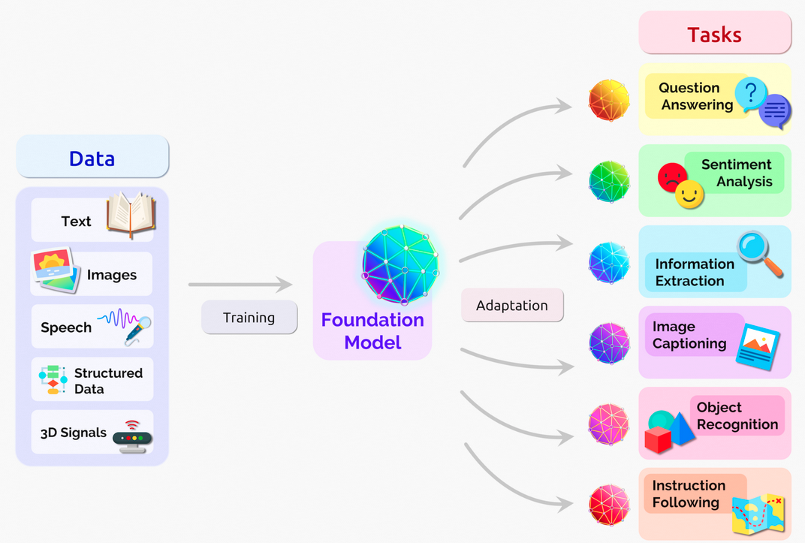

对图解释如下：

```
这里展示了一个基础模型（Foundation Model）如何通过训练和适应（Adaptation）处理不同类型的数据，并执行多种任务。以下是图中各部分的详细解释：
数据（Data）
基础模型的训练需要多种类型的数据，这些数据包括：
文本（Text）：包括书籍、文章、网页等文本信息。
图像（Images）：包括照片、插图、图表等视觉信息。
语音（Speech）：包括语音记录、音频文件等声音信息。
结构化数据（Structured Data）：包括数据库中的表格数据、电子表格等。
3D信号（3D Signals）：可能包括3D模型、点云数据等三维信息。

训练（Training）
使用上述数据对基础模型进行训练，使其能够理解和处理不同类型的信息。

基础模型（Foundation Model）
训练完成后，基础模型能够执行多种任务，并通过适应过程进一步优化其性能。

适应（Adaptation）
基础模型可以通过适应过程针对特定任务进行优化，以提高其在特定应用场景下的表现。

任务（Tasks）
基础模型可以执行以下任务：
问答（Question Answering）：回答用户的问题。
情感分析（Sentiment Analysis）：分析文本中的情感倾向，如正面、负面或中性。
信息提取（Information Extraction）：从文本中提取关键信息，如实体、关系等。
图像描述生成（Image Captioning）：为图像生成描述性文本。
物体识别（Object Recognition）：识别图像中的物体。
指令遵循（Instruction Following）：根据用户的指令执行特定的任务。

这里展示了基础模型的强大能力，它可以通过训练和适应处理多种类型的数据，并执行广泛的任务，从而在各种应用场景中发挥作用。
```

### 大模型应用场景

* 智能客服与对话系统：用于构建聊天机器人、虚拟助手，提供24*7的客户支持。目前大模型最广泛应用。
* 文本生成：生成文章、故事、代码、营销文案等。
* 机器翻译：实现多语言之间的高质量翻译。
* 问答系统：提供精准的问答服务，如知识库查询、技术支持。
* 图像分类与识别：识别图像中的物体、场景或人脸。
* 目标检测与跟踪：用于自动驾驶、安防监控等场景。


### 热门大模型初体验

这里主要包括讯飞星火及阿里通义千问大模型使用。

#### 讯飞星火认知大模型

科大讯飞推出的新一代认知智能大模型，拥有跨领域的知识和语言理解能力，能够基于自然对话方式理解与执行任务。例如：语言理解、知识问答、逻辑推理、数学题解答、代码理解与编写。

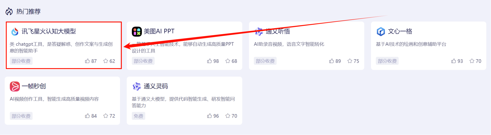

* 场景一：编写报告&计划

  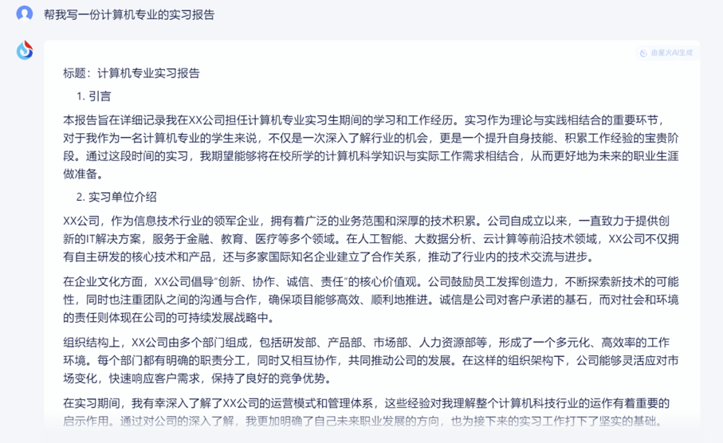

* 场景二：朋友圈&简历书写

  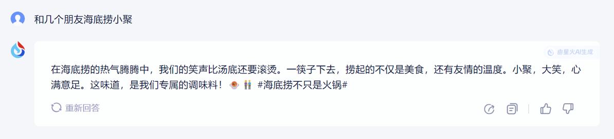

#### 阿里通义大模型

通义千问是阿里巴巴推出的一款大型预训练语言模型，它能够回答问题、创作文字，还能表达观点、撰写代码。基于海量数据训练，通义千问具备广泛知识和较强理解能力，致力于为用户提供精准、多样、有创意的回答，成为用户在学习、工作、生活中的智能助手。

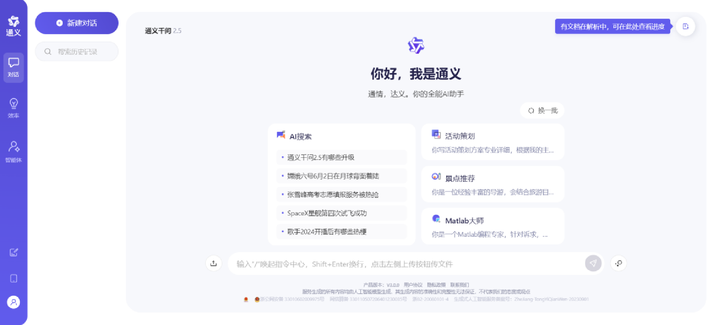

* 场景一：文本对话

  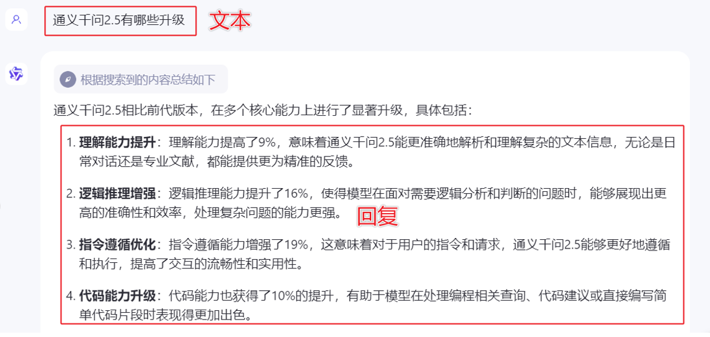

* 场景二：指令中心

  > 什么是指令中心
  >
  > 指令中心就是通义千问的一个插件库，输入/或者点击右侧按钮，就可以进入通义千问的指令中心了。

  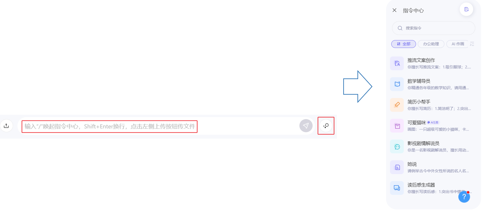

* 场景三：解题高手

  > 什么是解题高手
  >
  > 你擅长回答学习问题并给出解题步骤，鉴于以下学习问题，请提供详细的回答并给出解题步骤：
  >
  > 七人并排站成一行,如果甲乙两个必须不相邻,那么有几种排列方法

  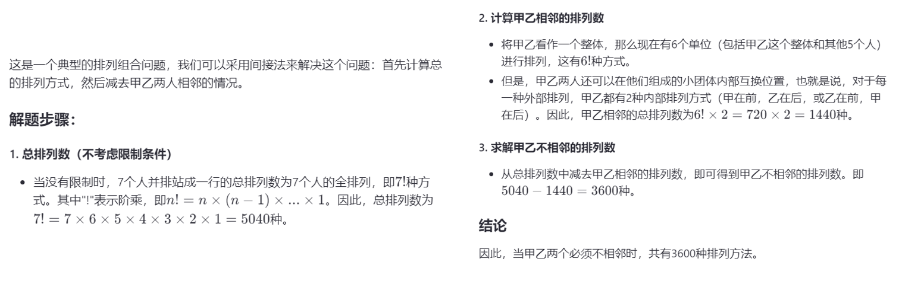

 * 场景四：编程助手

   > 什么是编程助手
   >
   > 你是一个Python代码的工程师，
   >
   > 请解答我的问题：请基于 Python 写一个生成器代码，用于生成斐波那契数列

   ​	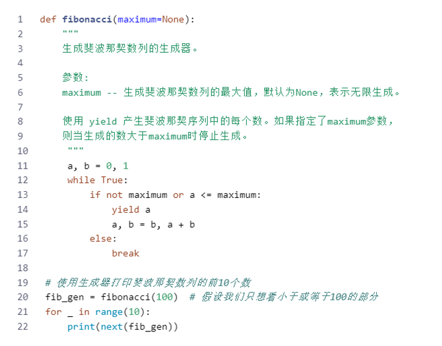

#### DeepSeek
   * 背景

     DeepSeek是一家专注于人工智能和大数据技术的创新企业，致力于为各行业提供智能化解决方案。其核心产品包括智能客服系统、数据分析平台和个性化推荐引擎，帮助企业提升运营效率、优化用户体验。

   * 优势

      低成本：DeepSeek在训练和使用成本方面具有显著优势。DeepSeek-V3的训练成本仅为557万美元，远低于行业平均水平，成为开源模型中的“性价比之王”。

      开源性：DeepSeek采取了开源策略，允许全球开发者社区检查、改进并利用这些模型进行进一步的研究和开发。这不仅促进了知识的共享和技术的进步，还为开发者提供了广阔的商用空间。

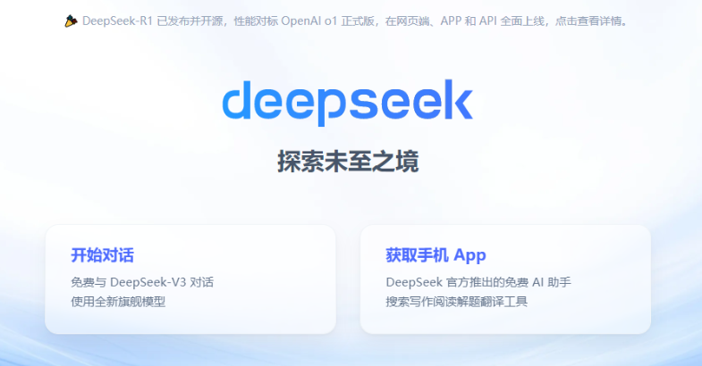

### 大模型核心运行机制

大模型的核心运行机制基于深度学习，尤其是Transformer架构。其核心是自注意力机制，能够捕捉输入序列中不同部分的关系。模型通过预训练在大规模数据上学习语言规律，再通过微调适应特定任务。训练过程中，使用反向传播和优化算法（如Adam）调整数百万甚至数十亿的参数。依赖GPU/TPU等高性能硬件和分布式训练加速计算。输入文本经过分词与嵌入转换为向量表示，模型通过推理生成输出，并采用生成策略（如束搜索）确保输出质量。整个过程依赖大规模数据和计算资源，实现复杂的语言理解和生成能力。核心架构图如下：

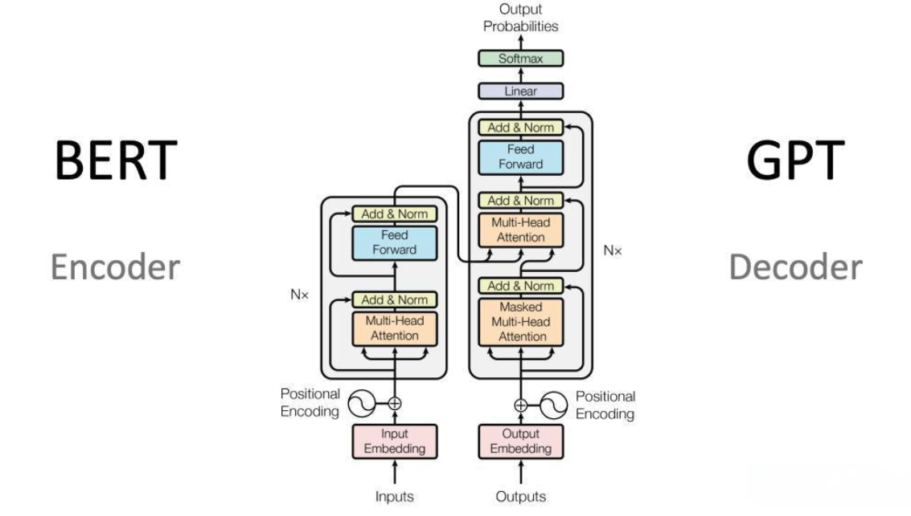

核心模型树如下：

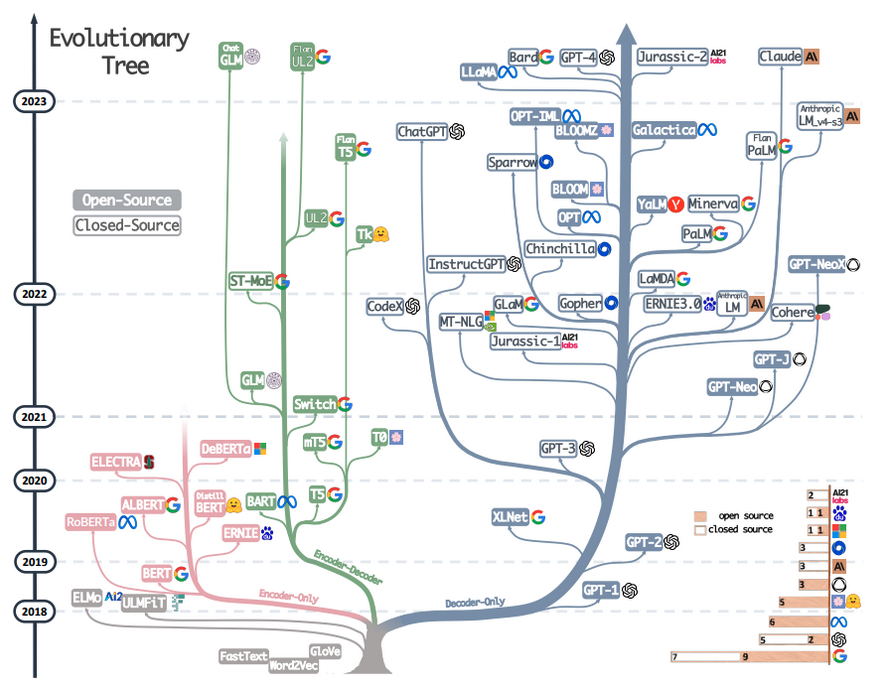

大模型是怎么演进的？

* Encoder Only: 对应粉色分支，即BERT派，典型模型： BERT
  * 自编码模型（Autoencoder Model）：通过重建句子来进行预训练，通常用于理解任务，如文本分类和阅读理解。
  * 模型像一个善于分析故事的专家，输入一段文本，能拆解的头头是道，本质上是把高维数据压缩到低维空间。

* Decoder Only: 对应蓝色分支，GPT派, 典型模型： GPT4，LLaMA，DeepSeek，QWen
    * 自回归模型（Autoregressive Model）：通过预测序列中的下一个词来进行预训练，通常用于文本生成任务。
    * 模型像一个会讲故事的专家，给点提示，就能流畅的接着自说自话。
* Encoder-Decoder: 对应绿色分支，T5派, 典型模型： T5, ChatGLM
    * 序列到序列模型（Sequence to Sequence Model）：结合了编码器和解码器，通常用于机器翻译和文本摘要等任务。
    * 模型像一个“完型填空专家”，是因为它特别擅长处理这种类型的任务。通过将各种NLP任务统一转换为填空问题，T5派能够利用其强大的语言理解和生成能力来预测缺失的文本。这种方法简化了不同任务之间的差异，使得同一个模型可以灵活地应用于多种不同的NLP任务，并且通常能够在多个任务上取得很好的性能。

### 小结

Q1：大模型有那些分类？

* 大语言模型、视觉大模型、语音大模型和多模态大模型

Q2：大模型有那些应用场景？

* 机器翻译、文本生成、对话系统、聊天机器人等应用

## 【实操】VMware安装

### 学习目标

掌握大模型部署必备的VMWare+CentOS，完成虚拟机安装与配置

### 软件介绍

* 虚拟化介绍

  虚拟机 (Virtual Machine) 指通过软件模拟的具有完整硬件系统功能的，运行在一个完全隔离环境中的完整计算机系统

* 常用的虚拟化软件

  * VMware：虚拟机软件兼容性很强，快照功能很快捷，方便，允许你在任意开机时刻创建系统快照和恢复
  * VirtualBox：Sun公司的产品，属于轻量级的虚拟机平台，功能相对也很精简，快照功能这里叫备份和快速修复，在不同的快照间跳转用起来感觉不是很方便，也不能实现文件拖拽的功能。

* 宿主机和虚拟机关系图

  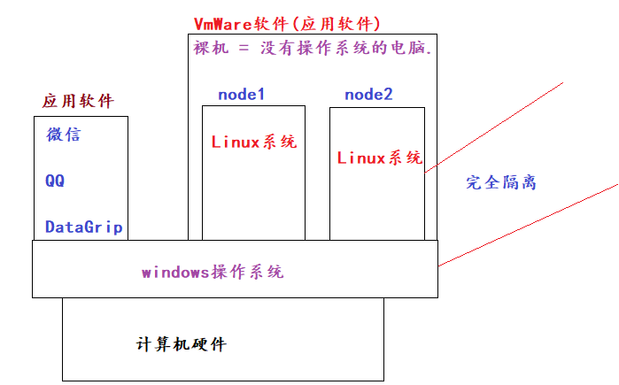

### VMware软件安装

> 参考提供给大家的详细安装文档, 我们已经装好了, 此处只强调两点.

* 安装路径要合法, 不要出现中文, 空格, 特殊符号等.
* 建议大家找1个路径, 统一管理, 例如:  D:/SoftWare/VMware

### 搭建Linux虚拟机

> 参考提供给大家的详细安装文档,  此处只强调两点.

* 记得手动修改IP为统一IP: 192.168.88.100,  网关为统一网关: 192.168.88.2
* 修改账号信息统一为:  root账号, 密码为: 123456

### 验证虚拟机搭建成功

* 登陆

  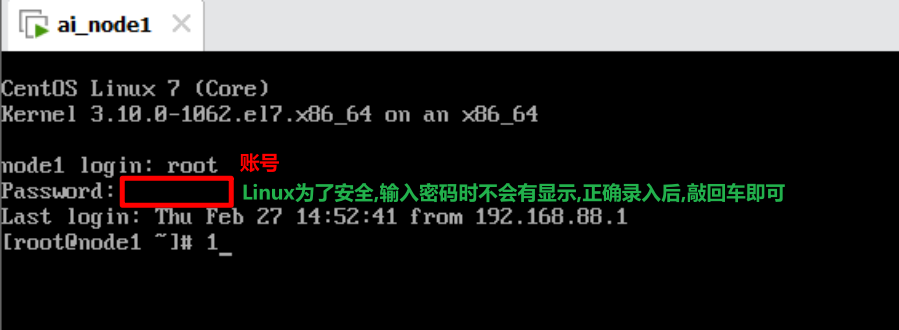

* 查看ip

  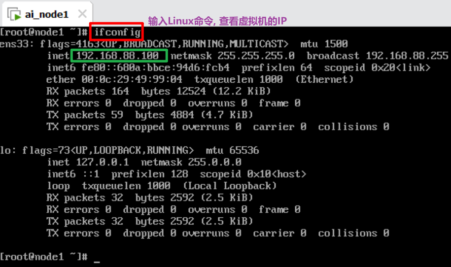

==注意: 此处的默认网关地址,和VMware虚拟网络适配器的网关地址要完全相同,否则虚拟机无法上网==

### 小结

Q1：如何在虚拟机中查看ip地址？

* ifconfig

## 【掌握】Linux基础

### 学习目标

掌握Linux核心命令，为大模型私有化部署奠定基础

### Linux系统概述

- Linux发行时间: 1991年

- Linux的创始人: 林纳斯·托瓦兹

- Linux的吉祥物: 企鹅

- 官网地址: https://www.kernel.org/

  > **Linux发行版** = Linux内核 + 系统库 + 系统软件
  >
  > Linux的内核完全开源免费, 但是Linux的发行版 不一定免费

- 常见的Linux发行版有哪些?
  - RedHat : 世界最大的Linux发行版厂商, 已经被IBM收购
  - Ubuntu: 桌面操作系统做的最好的
  - CentOS: 目前中国市场使用最多的Linux版本,目前已经被RedHat收购,但依然免费
  - Deepin: 深度公司开发的Linux版本.国内做的最好的Linux发行版
     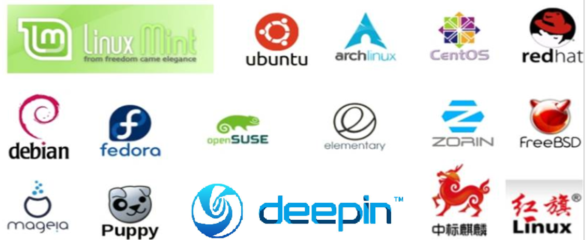

### Linux的目录结构

* Linux和Windows, Mac一样, 都是文件系统, 采用文件 和 文件夹的形式来管理数据. 

- 只不过在Linux 操作系统中, 是没有盘符概念的,  任何文件(文件夹)都是从根目录开始进行拆分的

- 且Linux中采用的是目录树结构, Windows中采用的是森系结构, 如下图:

  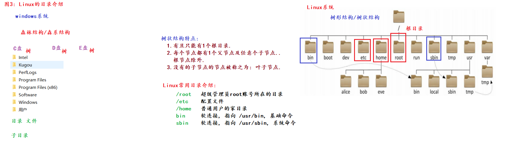

- Linux中常用的目录结构:
  - /etc :  配置文件存放的目录, 相当于Windows中的设置面板
  - /home: 用户的家目录,相当于Windows中的用户目录
  - /opt: 应用程序存放的目录,相当于Windows中的 software目录
  - /bin: 终端指令集存放的目录
  - /sbin: 超级管理员用户使用的指令集,包括用户的创建删除等指令
  - /root: 超级管理员的家目录,  每个Linux系统默认有且只有一个超管用户,拥有该操作系统的一切权限,也是最高权限.

    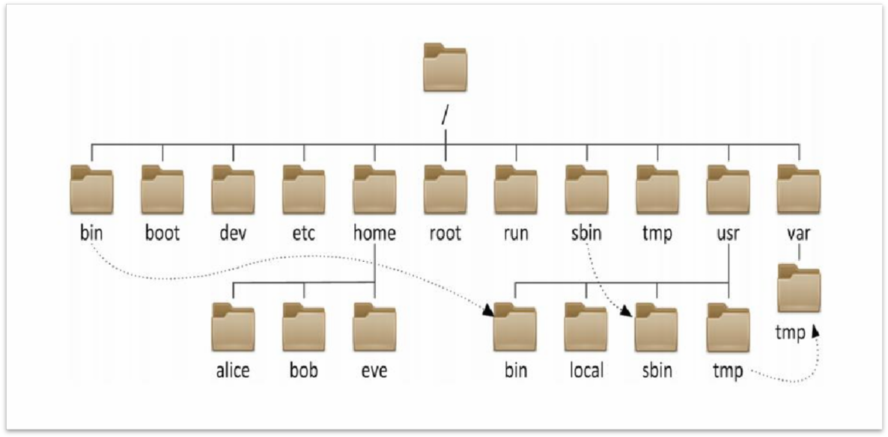

### Linux的常用命令

Linux指令的构成:

```
linux指令 = 命令(做什么) + 选项(怎么做) + 参数(对谁做)

- command : 命令名, 相应功能的英文单词或单词的缩写
- [-options] : 选项, 可用来对命令进行控制, 也可以省略
- parameter  : 传给命令的参数, 可以是 零个、一个 或者 多个
```

#### Linux文件与目录管理

* ls命令

  > ls命令: 展示linux系统中指定位置的目录信息
  >
  > ```shell
  > -a  查看所有文件,包括隐藏文件
  > -l  展示文件的详细信息,包括权限,归属,文件大小,创建修改时间,文件名称
  > -h  人性化展示文件大小,赋予最恰当的单位
  > ```

  > ls 指令的三个选项可以随意自由组合,且选项的顺序可以随意调整
  >
  > ```shell
  > ls -lh  展示文件详细信息列表,并且合理展示单位
  > ls -al  展示所有文件详细信息列表,包括隐藏文件
  > ls -alh  展示所有文件详细信息列表,包括隐藏文件,并且合理展示单位
  > ```

  > ls 可以获取任意指定路径的文件信息
  >
  > ~~~shel
  > ls  参数  路径信息
  > ls /  查看根目录的文件
  > ls aaa 查看当前目录下的aaa目录中的文件内容
  > ~~~
  >
  > ls -l 完全等价于 ll  可以快速查看文件的详细信息
  >
  > 【拓展：】ll  也可以配合选项-h -a使用

* **Linux中的路径:**

  >什么是文件路径?
  >
  >​	路径就是我们从根目录,盘符或者指定位置,查找到目标文件所经历的目录层级.
  >
  >​	现实路径的描述方式:  
  >
  >​		1.中国 北京市  昌平区  回龙观东大街  xxx校区  x号楼 x单元....
  >​		2.从当前位置触发,向前行驶五公里,左转向前行驶4公里,掉头......
  >
  >计算机中路径的描述方式
  >
  >1. 绝对路径: 从根目录或者盘符出发,直到查找到目标文件所经历的目录层级
  >2. 相对路径: 从当前目录出发,直到查找到目标文件所经历的目录层级

 * Linux中的路径和Windows中的路径有什么区别?

   > 绝对路径中, Linux 是从根目录出发进行查找, Windows是从盘符出发进行查找

  * Linux中路径的书写方式

    **hello.py**绝对路径: `/root/apple/hello.py`

    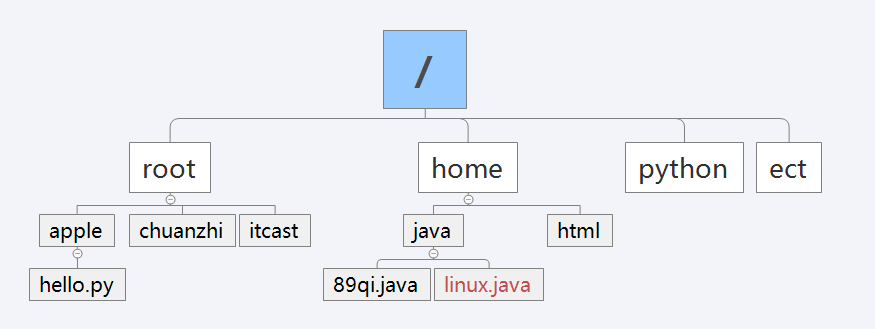

    从apple目录出发,到linux.java的相对路径: `../../home/java/linux.java`

    ~~~shel
    ./  代表当前目录
    ../ 代表上一级目录
    ~~~

* cd命令

  > cd命令,是为了切换工作目录,或者说活动目录的
  >
  > 例如:ls后不加任何参数,则默认输出当前目录的文件信息, cd命令就切换的是当前目录
  >
  > cd  路径信息  可以切换到指定目录中
  >
  > cd ../  返回上一级目录
  >
  > cd -  返回上一次操作的工作目录
  >
  > cd /  进入根目录
  >
  > cd  ~ 返回家目录,  波浪线可以省略
  >
  > **注意: cd指令中 同样可以使用相对路径,也可以使用绝对路径**

* pwd命令

  >pwd命令获取的就是当前所在的工作目录的绝对路径
  >
  >
  >
  >**注意: pwd获取的是目录路径,不是文件路径**  (==目录就等于文件夹==)
  >
  >

* mkdir命令

  >mkdir命令是创建空目录的命令,我们可以在指定路径下创建一个空目录
  >
  >~~~shel
  >mkdir 文件路径    在指定路径下创建目录
  >mkdir  ./aaa
  >
  >mkdir -p 文件路径   在指定路径下创建一个空目录,同时创建其父目录
  >mkdir -p ./111/222/333
  >~~~


* touch命令

  > touch 可以创建一个新的文件,文件的扩展名随意,甚至可以是不存在的扩展名
  >
  > touch 可以一次性创建多个文件,但是文件路径必须正确
  >
  > ~~~shell
  > touch 1.txt 2.txt 3.txt 
  > ~~~
  >
  > touch创建的文件如果存在不报错,但是没有新文件产生

* rm命令   remove  

  > rm 是删除文件的指令,可以删除文件或文件夹
  >
  > ~~~shel
  > -r 递归删除,删除文件夹时使用
  > -f 强制删除,不进行问询
  > ~~~
  >
  > rm 可以删除任意文件,路径可以是相对路径,也可以是绝对路径
  >
  > ```shell
  > # 删除文件
  > rm /root/1.txt
  > # 删除文件夹
  > rm -r /root/aaa
  > # 删除文件夹并不进行提示
  > rm -rf /root/aaa
  > ```
  >
  > rm可以一次性删除多个文件
  >
  > ~~~shell
  > # rm后跟随多个路径
  > rm 1.txt 2.txt 3.txt
  > # rm后跟随路径通配符
  > rm ./aaa/*
  > ~~~
  >
  > 在正常开发中如果使用的是root权限,不建议使用-f  如果必须使用,需要极其慎重,因为这种删除方式无法找回

#### Linux查看文件内容

* cat指令

  > 用于查看linux中的**小型**文本文件
  >
  > 因为他会一次性将所有的文件内容加载到终端中,终端的数据展示数量有限,大文件显示不全,且过于消耗内存
  >
  > ~~~shel
  > cat 文件名称
  > ~~~
  >

* more指令

  > 用于查看linux中的**中型**文本文件
  >
  > 使用more进行文件的查看可以按页显示,手动翻页或回滚,更加灵活,但同样消耗内存
  >
  > ~~~shel
  > more 文件名称
  > - enter 向下一行
  > - space 向下一页
  > - b 向上一页
  > - q 退出查看
  > ~~~

  #### Linux文件打包和压缩文件

  - tar命令

    > **tar命令是进行打包,解包, 压缩和解压的命令**
    >
    > 打包: 将多个文件归档为一个文件,文件大小不会减小.
    >
    > 解包(拆包):将一个包文件拆分为多个实体文件.
    >
    > 压缩:将文件按照一定的算法减小体积,但是文件的内容和信息不发生改变
    >
    > 解压:将一个压缩文件还原到正常状态.
    >
    > 参数:
    >
    > - c : 打包选项
    > - x : 解包选项
    > - z : 压缩或者解压选项
    > - v : 展示过程信息
    > - f : 指定文件名称
    >
    > 注意: c 和x 参数不能同时出现在终端命令中
    >
    > 打包
    >
    > ```shell
    > # tar -cvf 包的名称  要打包的文件列表
    > tar -cvf 1_3.tar 1.txt 2.txt 3.txt
    > # 将1.txt 2.txt 3.txt 打包到 aaa目录下
    > tar -cvf aaa/1_3.tar 1.txt 2.txt 3.txt
    > ```
    >
    > 解包
    >
    > ```shell
    > # 将原有的.txt文件全部删除
    > rm -f *.txt
    > # 将1_3.tar 解压到当前压缩包所在位置
    > tar -xvf 1_3.tar
    > # 将个文件解压bbb目录下
    > # 此时需要使用选项C(大写)指定解包路径
    > tar -xvf 1_3.tar -C bbb
    > ```
    >
    > 压缩
    >
    > ```
    > tar -zcvf 1_3.tar 1.txt 2.txt 3.txt
    > ```
    >
    > 解压缩
    >
    > ```
    > tar -zxvf 1_3.tar -C bbb
    > ```
    >
    > 在开发中,我们一般使用的最多的是解压.解压指令可以记忆为长兄为父(zxvf)
    >
    > 注意:
    >
    > 1. 压缩时,如果源文件太小,可能体积会增大  例如  被压缩文件只有20B 可能压缩完成后大小是50B
    > 2. 压缩和解压时一般使用.tar.gz结尾,方便程序员交流
    > 3. 使用上述指令压缩后,文件为gzip压缩格式.

#### Linux文件基本属性

* chmod命令

  > chmod主要是进行文件权限管理的,可以给文件增加修改删除权限
  >
  > 
  >
  > 语法 chmod [-R] 权限 文件或者文件夹

  > 选项：-R，对文件夹内的全部内容应用同样的操作

* 数值型权限管理

  >权限可以用3位数字来代表，第一位数字表示用户权限（u），第二位表示用户组权限（g），第三位表示其它用户权限（）。
  >数字的细节如下：r记为4，w记为2，x记为1，可以有：
  >
  >   421
  >
  >~~~shell
  ># 用户拥有读写执行权限(rwx 7), 用户组拥有读写权限(rw 6), 其他用户拥有读的权限(r 4)
  >chmod 764 1.txt
  ># 如果需要所有用户具有可读可写可执行权限
  >chmod 777 1.t.xt
  >
  ># 注意: 在开发中尽量不要出现777的权限会让别人觉得你很low 侮辱你的职业
  >~~~

  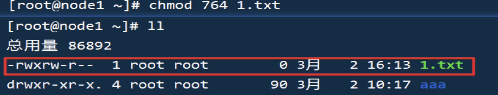

* 字母型权限管理

  >r : 读权限
  >
  >w : 写权限
  >
  >x : 执行权限
  >
  >
  >
  >u : 拥有者
  >
  >g : 用户组
  >
  >o : 其他用户
  >
  >a : 所有用户
  >
  >~~~shell
  ># 格式: chmod - + 权限
  ># 给自己减少可执行权限,给用户组增加写入权限
  >chmod u-x,g+w abc
  ># 给所有用户减少读的权限
  >chmod a-r abc
  >
  ># 格式: chmod = 权限
  ># 给自己设置属主权限为只读,此时原有权限全部消失,只保留新赋予的权限内容
  >chmod u=r abc 
  ># 给所有用户最高权限
  >chmod a=rwx abc
  >
  ># 格式: 混用
  ># 给用户读写执行权限, 给用户组读写权限, 给其他用户只读权限
  >chmod u=rwx,g-x,o-wx abc
  > 
  ># 如果我们需要修改当前目录及其目录中子文件的权限,需要使用递归方式完成操作  条件-R选项即可
  >chmod -R u=rwx,g=rw,o=r aaa
  >~~~

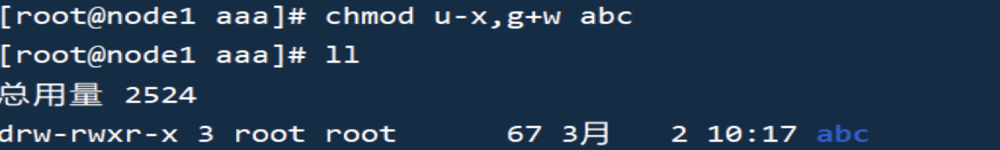

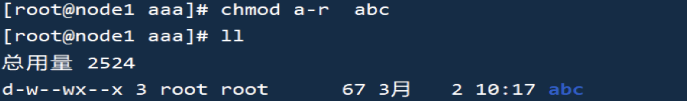

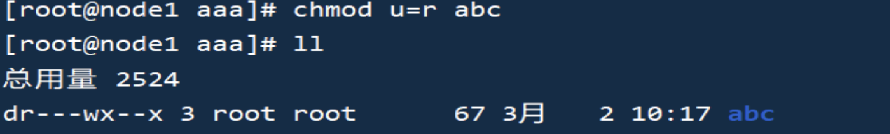

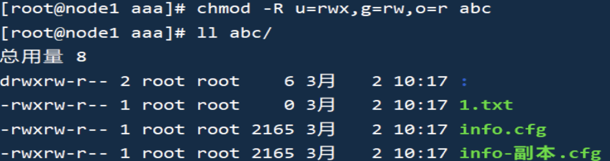

#### 系统管理命令

* ps命令

  > 查看linux系统中的进程信息
  >
  > ```shell
  > ps  查看当前活跃进程
  > ps -ef 查看当前所有进程
  > ```
  >
  > 在查看进程时,pid这一列中存储的是进程编号,也就是这个进程的唯一标识.
  > 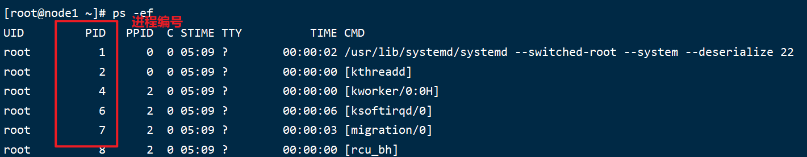

* kill命令

  > 如果我们想结束linux中的软件或服务也可以通过操作进程来解决
  >
  > ```shell
  > kill -9 进程编号
  > ```
  >
  > 注意:
  >
  > kill -9 可以快速杀死进程,但是不安全,因为我们的服务再运行过程中,可能会需要保存或者将某些任务执行完再关闭,所以轻易不用,一般都是用于杀死闲置进程,或者不响应的进程.

* ifconfig命令

  > ifconfig主要用于查看服务器的网络信息, 当前阶段最重要的信息就是ip地址
  >
  > 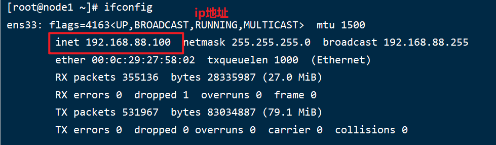
  >
  > **扩展:**
  >
  > 在windows中如果需要查看网卡信息,需要使用`ipconfig`进行查看

* free命令

  >可以使用free查看内存使用情况
  >
  >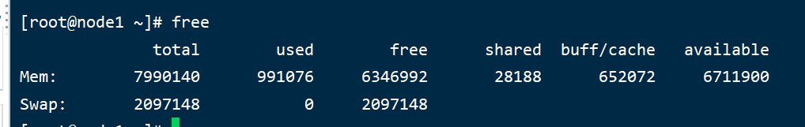
  >
  >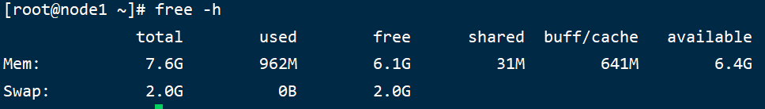
  >
  >

* df命令

  >可以使用df命令查看磁盘的使用情况
  >
  >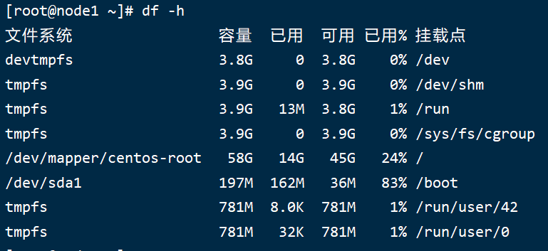

* clear命令

  >clear命令,可以清除终端窗口的信息,让光标移动到终端的最上方
  >
  >快速清屏也可以使用快捷键 ctrl + L 

### 小结

Q1：Linux文件与目录管理命令有哪些？

* ls、pwd、mkdir、touch、cd、rm

Q2：如何查看Linux中文件内容？区别是什么？

* cat：主要用于显示整个文件内容，适合查看小文件
* more：用于分页显示文件内容，适合查看大文件。

Q3：如何查看Linux系统进程命令？
* ps：是 Linux 中用于查看当前系统进程状态的工具。它可以显示正在运行的进程信息，如进程 ID（PID）、CPU 和内存使用情况、运行状态等。

### 练习

#### cd命令

~~~sql
1：切换到你的主目录。
	
2：切换到根目录 (/)。
    
3：切换到上一级目录。
      
4：切换到名为 Documents 的目录，假设它在你的主目录下。
	
5：如果你在任意目录下，直接切换到 /var/log 目录。
	
~~~

#### mkdir命令

~~~sql
1：基础创建：在你的主目录下创建一个名为 NewFolder 的新目录。

2：创建多级目录：在同一命令中创建多级目录结构，例如 ~/NewFolder/SubFolder1/SubFolder2。

3：创建多个同级目录：在你的主目录下同时创建 FolderA, FolderB, 和 FolderC。

4：在特定目录下创建：假设你当前不在主目录下，但在 /var/www 下创建一个名为 MyProject 的目录。

~~~

#### touch命令

~~~
1：基本使用：在当前目录下创建一个名为 newfile.txt 的新文件。

2：创建多个文件：在同一命令中创建多个文件，如 file1.txt, file2.txt, 和 file3.txt。

3：更新文件时间戳：假设你有一个文件 oldfile.txt，使用 touch 更新其访问和修改时间戳。

4：使用绝对路径创建文件：在 /var/log 目录下创建一个名为 log.txt 的文件。

~~~

#### rm命令

~~~sql
1：基本删除：删除当前目录下的一个名为 example.txt 的文件。

2：删除多个文件：删除当前目录下的多个文件，例如 file1.txt, file2.txt, 和 file3.txt。

3：递归删除目录：删除一个名为 mydir 的目录及其内容。

4：强制删除：使用 -f 选项强制删除一个名为 lockedfile.txt 的文件。

~~~

## 【实操】项目环境搭建

### 学习目标

掌握聊天机器人相关虚拟机配置，完成项目环境搭建

### 导入虚拟机

​	为便于后续的知识学习，本项目的开发环境部署到了CentOS7系统，因此我们先安装一下开发环境。

​	为了大家统一开发环境，我们在资料中提供了一套系统镜像，大家使用VMware软件来挂载即可快速启动。

### 挂载虚拟机

​	解压《ai_node1.zip》文件，解压后，进入解压的虚拟机镜像文件夹，双击**ai_node1.vmx**即可挂载到你的虚拟机中（需提前安装虚拟机）。

### FinalShell客户端链接

> 详见   AI环境_虚拟机搭建.md 文档, 如有任何问题, 请随时联系老师哟!

### 小结

Q1：聊天机器人项目虚拟机部署分为几步？
* 1：解压《ai_node1》虚拟机压缩文件
* 2：导入ai_node1.vmx文件到VMware软件中
* 3：修改虚拟机网络设置
