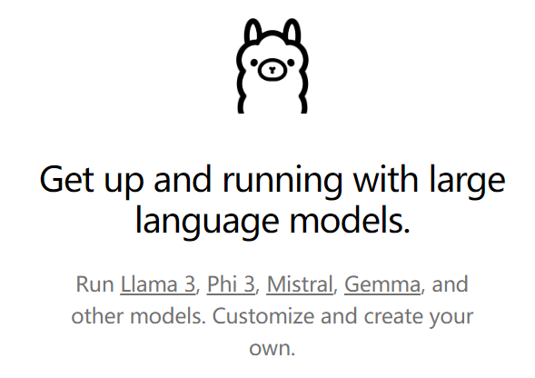
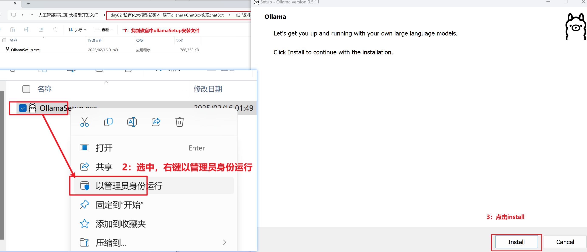
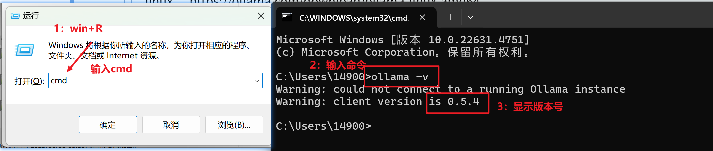
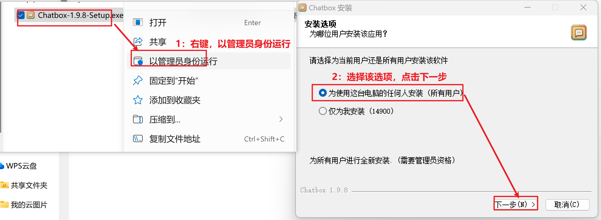
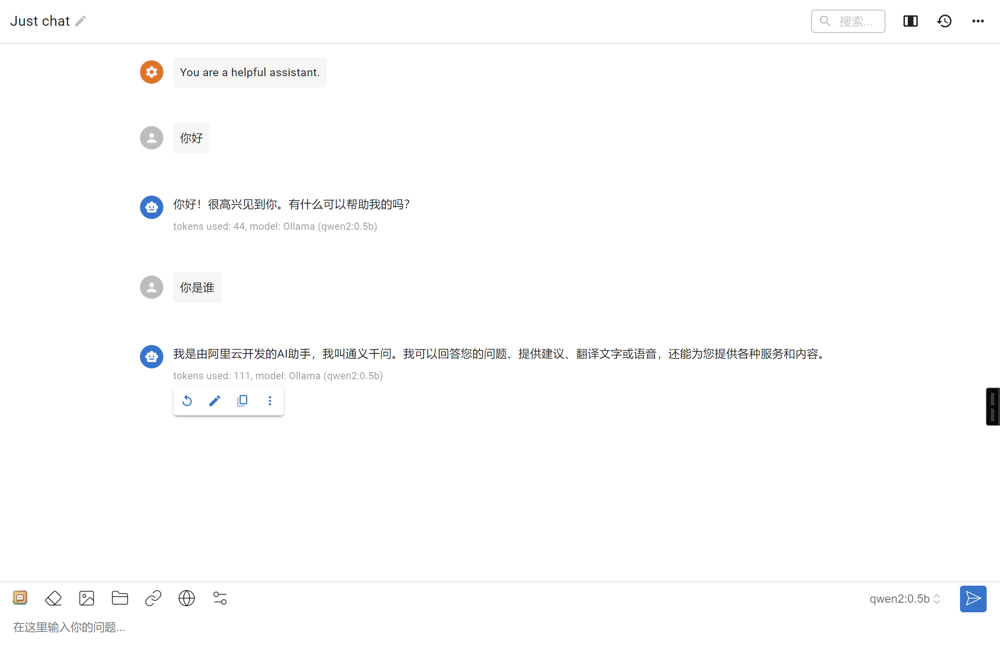
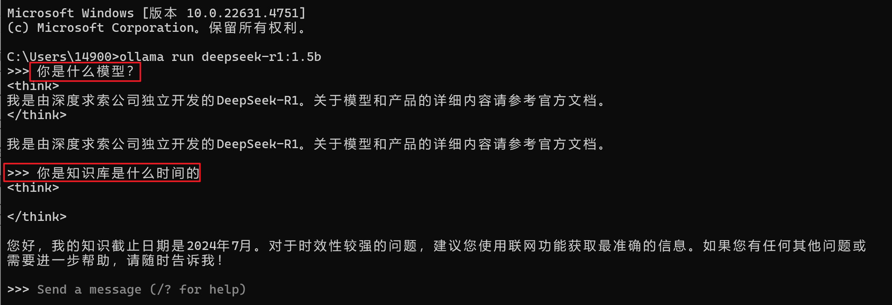

## 今日大纲介绍

* 了解私有化大模型
* 掌握Ollama安装与部署
* 熟悉Ollama客户端命令
* 掌握基于Ollama平台的ChatBot聊天机器人

## 【了解】私有大模型

### 学习目标

了解私有化大模型解决方案，能够选择企业常用的方案实现私有大模型部署

### 为什么要有私有大模型

随着AI技术的不断普及，人们也积极拥抱其带来的变化，在生活或者工作中亦使用AI技术来帮助我们更高效的完成某些事件，但是在这个过程中，也暴露出AI技术当前下存在在的系列问题，其中最严重的就是安全问题

比如：最典型的是三星员工使用ChatGPT泄露公司机密的案例。


其实上述案例表现的就是**企业数据隐私与安全的问题**，在许多行业，如金融、医疗、政府等，数据隐私和安全是至关重要的。使用公共大模型可能涉及敏感数据的泄露风险，因为公共模型在训练过程中可能接触到了来自不同来源的敏感数据。因此就有了私有大模型的市场需求，私有大模型允许企业或机构在自己的数据上训练模型，而且训练的结果只供内部或合作伙伴使用，从而确保了数据隐私和安全。

当然除了数据隐私问题原因之外，还存有便于内部员工工作提效、大模型开发的投入等诸多原因综合，直接推动私有大模型成为未来AI发展的新方向之一。 

### 私有大模型解决方案

随着AI的发展，越来越多的开发者投入到大模型开发中，他们期望能自身笔记本上运行大模型，以便开发。越来越多的企业积极改造自身产品，融入AI技术，他们期望能私有化大模型以保证数据安全。这些诉求直接推动社区出现了两个这方面的产品Ollama和LMstudio。

这两个产品各有优势：

|                | Ollama                                                       | LM Studio                                                    |
| -------------- | ------------------------------------------------------------ | ------------------------------------------------------------ |
| **产品定位**   | **开源**的大型语言模型本地运行框架                           | **闭源**的本地大型语言模型工作站，集模型训练、部署、调试于一体 |
| **技术特点**   | 高度智能化，自主学习和适应能力强- 便捷性高，操作简单易懂- 安全性强，数据传输和存储严格保护 | 高性能，采用先进计算架构和算法优化- 可定制化，支持用户定制模型结构和训练策略易用性，友好的用户界面和丰富的文档支持 |
| **功能**       | 提供预训练模型访问和微调功能- 支持多种模型架构和定制模型- 用户友好界面，简化模型实验和部署过程 | 丰富的训练数据和算法库- 可视化训练监控界面- 强大的调试工具，支持模型性能优化 |
| **应用场景**   | 学术研究- 开发者原型设计和实验- 创意写作、文本生成等         | 智能客服- 自然语言处理（如文本分类、情感分析、机器翻译）- 学术研究 |
| **用户友好性** | 界面化操作，适合不同水平的用户- 支持多种设备和平台           | 友好的用户界面，适合初学者和非技术人员- 提供全面的工具组合，易于上手 |
| **定制性**     | 提供一定程度的定制选项，但可能有限制                         | 高度可定制化，满足用户个性化需求                             |
| **资源要求**   | 需要一定的内存或显存资源来运行大型模型- 支持跨平台（macOS、Linux，Windows预览版） | 构建和训练复杂模型可能需要大量计算资源和专业技能             |
| **成本**       | 成本可能根据使用量和资源需求变化- 开源项目，可能涉及较少的直接成本 | 闭源产品，成本可能包括软件许可和可能的云服务费用             |
| **社区生态**   | 社区生态活跃，开发者主流本地运行时- 快速适配新发布的模型     | 未知（未提及具体社区生态活跃度）                             |

### 选择私有化大模型部署方案

Ollama 作为一个开源的轻量级工具，适合熟悉命令行界面的开发人员和高级用户进行模型实验和微调。它提供了广泛的预训练模型和灵活的定制选项，同时保持了高度的便捷性和安全性。最重要它是开源的，同时还提供API，对于开发有先天优势，因此在企业中备受欢迎和使用，因此本课程也才主要学习Ollama技术。

### 小结

* 了解私有化大模型解决方案
  * Ollama：开源的大型语言模型本地运行框架  
  * LM Studio：闭源的本地大型语言模型工作站，集模型训练、部署、调试于一体  

## 【实操】Ollama安装与使用

### 学习目标

通过安装Ollama工具，实现基于Ollama运行通义QWen大模型

### 什么是Ollama

> Ollama：是一款旨在简化大型语言模型本地部署和运行过程的开源软件。
>
> 中文名：羊驼
>
> 网址：https://ollama.com/

Ollama提供了一个轻量级、易于扩展的框架，让开发者能够在本地机器上轻松构建和管理LLMs（大型语言模型）。通过Ollama，开发者可以访问和运行一系列预构建的模型，或者导入和定制自己的模型，无需关注复杂的底层实现细节。

Ollama的主要功能包括快速部署和运行各种大语言模型，如Llama 2、Code Llama等。它还支持从GGUF、PyTorch或Safetensors格式导入自定义模型，并提供了丰富的API和CLI命令行工具，方便开发者进行高级定制和应用开发。



### Ollama特点

- **一站式管理**：
  - Ollama将模型权重、配置和数据捆绑到一个包中，定义成Modelfile，从而优化了设置和配置细节。
  - 包括GPU使用情况。这种封装方式使得用户无需关注底层实现细节，即可快速部署和运行复杂的大语言模型。
- **热加载模型文件**：
  - 支持热加载模型文件，无需重新启动即可切换不同的模型，
  - 提高了灵活性，还显著增强了用户体验。
- **丰富的模型库**：提供多种预构建的模型，如Llama 2、Llama 3、通义千问，方便用户快速在本地运行大型语言模型。
- **多平台支持**：支持多种操作系统，包括Mac、Windows和Linux，确保了广泛的可用性和灵活性。
- **无复杂依赖**：优化推理代码减少不必要的依赖，可以在各种硬件上高效运行。包括纯CPU推理和Apple Silicon架构。
- **资源占用少**：Ollama的代码简洁明了，运行时占用资源少，使其能够在本地高效运行，不需要大量的计算资源。

### Ollama下载与安装

#### Ollama下载

> Ollama共支持三种平台：
>
> - Window：https://ollama.com/download/OllamaSetup.exe
> - Mac：https://ollama.com/download/Ollama-darwin.zip
> - Linux：https://ollama.com/download/ollama-linux-amd64

#### Windows平台安装

* Windows安装

  ~~~shell
  第一步：在02_资料/OllamaSetup.exe 找到执行程序
  
  第二步：右键以管理员身份运行
  
  第三步：点击install
  ~~~

  

* 验证安装成功

  ~~~shell
  第一步：win+R组合键  输入cmd
  
  第二步： 输入命令  ollama -v
  
  第三步：显示ollama版本号 ollama version is 0.5.4
  
  即安装成功！
  ~~~

  

#### Linux下载与安装

* 手动安装

  >window和mac版本直接下载安装或解压即可使用。这里由于Ollama需要安装在linux中，因此在这里主要学习如何在Linux上安装：
  >
  >Step 1. 安装
  >
  >在虚拟机/root/resource目录中已经下载好Linux版本所需的ollama-linux-amd64.tgz文件，则执行下面命令开始安装：
  >
  >~~~shell
  >tar -C /usr -xzf ollama-linux-amd64.tgz
  >~~~
  >
  >操作成功之后，可以通过查看版本指令来验证是否安装成功
  >
  >~~~shell
  >[root@bogon resource]# ollama -v
  >Warning: could not connect to a running Ollama instance
  >Warning: client version is 0.3.9
  >~~~
  >
  >
  >
  >Step 2. 添加开启自启服务
  >
  >创建服务文件/etc/systemd/system/ollama.service，并写入文件内容：
  >
  >~~~shell
  >[Unit]
  >Description=Ollama Service
  >After=network-online.target
  >
  >[Service]
  >ExecStart=/usr/bin/ollama serve
  >User=root
  >Group=root
  >Restart=always
  >RestartSec=3
  >
  >[Install]
  >WantedBy=default.target
  >~~~
  >
  >生效服务：
  >
  >~~~shell
  > systemctl daemon-reload
  >systemctl enable ollama
  >~~~
  >
  >启动服务：
  >
  >~~~shell
  >sudo systemctl start ollama
  >~~~
  >
  >

* 一键安装

  Ollama在Linux上也提供了简便的安装命令，但是过程中需要下载400M左右的数据，比较慢，因此课堂上采用第一种方式安装，但在工作中一般采用下面命令进行安装：

  ~~~shell
  curl -fsSL https://ollama.com/install.sh | sh
  ~~~

### 运行通义千问大模型

#### 首次运行

> 通义千问（Qwen）是阿里巴巴集团Qwen团队研发的大语言模型和大型多模态模型系列。Qwen具备自然语言理解、文本生成、视觉理解、音频理解、工具使用、角色扮演、作为AI Agent进行互动等多种能力。
>
> 官网：https://qwen.readthedocs.io/zh-cn

在终端输入一下命令即可运行通义千问大模型： ollama run qwen2:0.5b

```shell
[root@bogon resource]# ollama run qwen2:0.5b
pulling manifest 
pulling 8de95da68dc4... 100% ▕█████████████████████████████████████████████████████████████████████████████████▏ 352 MB                         
pulling 62fbfd9ed093... 100% ▕█████████████████████████████████████████████████████████████████████████████████▏  182 B                         
pulling c156170b718e... 100% ▕█████████████████████████████████████████████████████████████████████████████████▏  11 KB                         
pulling f02dd72bb242... 100% ▕█████████████████████████████████████████████████████████████████████████████████▏   59 B                         
pulling 2184ab82477b... 100% ▕█████████████████████████████████████████████████████████████████████████████████▏  488 B                         
verifying sha256 digest 
writing manifest 
removing any unused layers 
success 
>>> 您好
你好！有什么可以帮助你的？

>>> 你是什么大模型
我是来自于阿里云的预训练模型，我叫通义千问。我可以回答您关于计算机科学、机器学习等领域的各种问题，也可以进行自然语言处理、聊天机器人、智能问答等任务。我的设计目的是让计算机能够像人类一样思考和解决问题。

```

**命令解释：**

> 第1行：为运行一个本地大模型的命令，这个命令的格式为：

```shell
ollama run 模型名称:模型规模
```

> 第2~11行：如果首次运行，本地没有大模型则会从远程下载大模型

> 第12~16行：运行成功模型之后，通过终端进行对话聊天

#### 修改模型路径

直接运行上述小节命令，会下载300多M的数据，比较慢，而在虚拟机中已经提前下载好了相关模型（包括后续用到的模型），存储在/root/ollama目录中，因此这里我们需要修改ollama的模型路径，ollama软件在各个操作系统上的默认存储路径是：

> macOS: ~/.ollama/models 
> Linux:  ~/.ollama/models 
> Windows:  ~/.ollama/models 

要修改其默认存储路径，需要通过设置系统环境变量来实现，即在/etc/profile文件中最后增加一下环境变量：

```shell
export OLLAMA_MODELS=/root/ollama
```

然后执行一下命令，生效环境变量：

```shell
[root@bogon ollama]# source /etc/profile
[root@bogon ollama]# echo $OLLAMA_MODELS
/root/ollama
[root@bogon ollama]# 
```

然后重新ollama服务，则会跳过下载，直接进入大模型，对话完成后可以通过/bye指令终止对话：

```shell
[root@bogon ollama]# systemctl stop ollama
[root@bogon ollama]# ollama serve &
[root@bogon ~]#  ollama run qwen2:0.5b
>>> 您好
很高兴为您服务！有什么问题或需要帮助的吗？

>>> /bye
[root@bogon ~]# 
```

**让重启也支持模型路径：**

> 上述方式修改后，通过ollama命令是生效的，但是重启电脑则不生效，要解决这个问题，则还需要进行如下配置：

修改服务文件/etc/systemd/system/ollama.service内容为一下：：

```shell
[Unit]
Description=Ollama Service
After=network-online.target

[Service]
ExecStart=/usr/bin/ollama serve
User=root
Group=root
Restart=always
RestartSec=3
Environment="OLLAMA_MODELS=/root/ollama"

[Install]
WantedBy=default.target
```

生效修改的配置：

```shell
systemctl daemon-reload
systemctl restart ollama
```

#### 对话指令初体验

在Ollama终端中提供了一系列指令，可以用来调整和控制对话模型：


> /?    该指令主要是列出支持的指令列表

```
[root@bogon ~]#  ollama run qwen2:0.5b
>>> /?
Available Commands:
  /set            Set session variables
  /show           Show model information
  /load <model>   Load a session or model
  /save <model>   Save your current session
  /clear          Clear session context
  /bye            Exit
  /?, /help       Help for a command
  /? shortcuts    Help for keyboard shortcuts

Use """ to begin a multi-line message.
```

### 小结

* 通过安装Ollama工具，实现基于Ollama运行通义QWen大模型
  * 完成Ollama软件安装
  * 实现Qwen模型本地部署

## 【熟悉】对话指令详解

### 学习目标

掌握基于Ollama客户端相关命令，完成对大模型进行操作

### /bye 指令

> 退出当前控制台对话, 快捷键: ctrl + d

```shell
[root@bogon ~]#  ollama run qwen2:0.5b
>>> 您好
你好！有什么可以帮助您的吗？

>>> /bye
[root@bogon ~]# 
```

### /show指令

> /show 指令：用于查看当前模型详细信息
>
> ```shell
> [root@bogon ~]#  ollama run qwen2:0.5b
> >>> /show
> Available Commands:
>   /show info         查看模型的基本信息
>   /show license      查看模型的许可信息
>   /show modelfile    查看模型的制作源文件Modelfile
>   /show parameters   查看模型的内置参数信息
>   /show system       查看模型的内置Sytem信息
>   /show template     查看模型的提示词模版
> ```

> /show info         查看模型的基本信息
>
> ```shell
> >>> /show info
> Model details:
> Family              qwen2		模型名称
> Parameter Size      494.03M		模型大小
> Quantization Level  Q4_0		模型量化级别
> ```

> /show license      查看模型的许可信息—开源软件的许可协议
>
> ```shell
> >>> /show license
> 
>                                  Apache License
>                            Version 2.0, January 2004
>                         http://www.apache.org/licenses/
> 
>    TERMS AND CONDITIONS FOR USE, REPRODUCTION, AND DISTRIBUTION
>    ............................................................
> ```

> /show modelfile    查看模型的制作源文件Modelfile
>
> modelfile ：文件是用来制作私有模型的脚步文件，后续课程学习

```shell
>>> /show modelfile
# Modelfile generated by "ollama show"
# To build a new Modelfile based on this, replace FROM with:
# FROM qwen2:0.5b

FROM /root/ollama/blobs/sha256-8de95da68dc485c0889c205384c24642f83ca18d089559c977ffc6a3972a71a8
TEMPLATE "{{ if .System }}<|im_start|>system
{{ .System }}<|im_end|>
{{ end }}{{ if .Prompt }}<|im_start|>user
{{ .Prompt }}<|im_end|>
{{ end }}<|im_start|>assistant
{{ .Response }}<|im_end|>
"
PARAMETER stop <|im_start|>
PARAMETER stop <|im_end|>
LICENSE """
......................................................................
```

> /show parameters   查看模型的内置参数信息

```shell
>>> /show parameters
Model defined parameters:
stop                           "<|im_start|>"
stop                           "<|im_end|>"
```

> /show system       查看模型的内置system信息—system常常用来定一些对话角色扮演

```shell
>>> /show system
No system message was specified for this model.
```

> /show template     查看模型的提示词模版
>
> template：是最终传入大模型的字符串模版，模版中的内容由上层应用动态传入

```shell
>>> /show template
{{ if .System }}<|im_start|>system
{{ .System }}<|im_end|>
{{ end }}{{ if .Prompt }}<|im_start|>user
{{ .Prompt }}<|im_end|>
{{ end }}<|im_start|>assistant
{{ .Response }}<|im_end|>
```

### /? shortcuts 指令

> 查看在控制台中可用的快捷键

```
>>> /? shortcuts
Available keyboard shortcuts:
  Ctrl + a            移动到行头
  Ctrl + e            移动到行尾
  Ctrl + b            移动到单词左边
  Ctrl + f            移动到单词右边
  Ctrl + k            删除游标后面的内容
  Ctrl + u            删除游标前面的内容
  Ctrl + w            删除游标前面的单词

  Ctrl + l            清屏
  Ctrl + c            停止推理输出
  Ctrl + d            退出对话（只有在没有输入时才生效）
```

### """ 指令

> """ 用于输入内容有换行时使用，如何多行输入结束也使用 """ 

```shell
>>> """
... 您好
... 你是什么模型？
... """ 
我是一个计算机程序，可以回答您的问题、提供信息和执行任务。请问您有什么问题或者指令想要我帮助您？
```

### /set 指令

> set指令主要用来设置当前对话模型的系列参数

```
>>> /set
Available Commands:
  /set parameter ...     设置对话参数
  /set system <string>   设置系统角色
  /set template <string> 设置推理模版
  /set history           开启对话历史
  /set nohistory         关闭对话历史
  /set wordwrap          开启自动换行
  /set nowordwrap        关闭自动换行
  /set format json       输出JSON格式
  /set noformat          关闭格式输出
  /set verbose           开启对话统计日志
  /set quiet             关闭对话统计日志
```

> /set parameter ...     设置对话参数

```
>>> /set parameter
Available Parameters:
  /set parameter seed <int>             Random number seed
  /set parameter num_predict <int>      Max number of tokens to predict
  /set parameter top_k <int>            Pick from top k num of tokens
  /set parameter top_p <float>          Pick token based on sum of probabilities
  /set parameter num_ctx <int>          Set the context size
  /set parameter temperature <float>    Set creativity level
  /set parameter repeat_penalty <float> How strongly to penalize repetitions
  /set parameter repeat_last_n <int>    Set how far back to look for repetitions
  /set parameter num_gpu <int>          The number of layers to send to the GPU
  /set parameter stop <string> <string> ...   Set the stop parameters
```

| Parameter      | Description                                                  | Value Type | Example Usage        |
| -------------- | ------------------------------------------------------------ | ---------- | -------------------- |
| num_ctx        | 设置上下文token大小. (默认: 2048)                            | int        | num_ctx 4096         |
| repeat_last_n  | 设置模型要回顾的距离以防止重复. (默认: 64, 0 = 禁用, -1 = num_ctx) | int        | repeat_last_n 64     |
| repeat_penalty | 设置惩罚重复的强度。较高的值（例如，1.5)将更强烈地惩罚重复，而较低值（例如，0.9)会更加宽容。（默认值：1.1） | float      | repeat_penalty 1.1   |
| temperature    | **模型的温度。提高温度将使模型的答案更有创造性。（默认值：0.8）** | float      | temperature 0.7      |
| seed           | 设置用于生成的随机数种子。将其设置为特定的数字将使模型为相同的提示生成相同的文本。（默认值：0） | int        | seed 42              |
| stop           | 设置停止词。当遇到这种词时，LLM将停止生成文本并返回          | string     | stop "AI assistant:" |
| num_predict    | 生成文本时要预测的最大标记数。（默认值：128，-1 =无限生成，-2 =填充上下文） | int        | num_predict 42       |
| top_k          | **减少产生无意义的可能性。较高的值（例如100）将给出更多样化的答案，而较低的值（例如10）将更加保守。（默认值：40）** | int        | top_k 40             |
| top_p          | 与Top-K合作。较高的值（例如，0.95）将导致更多样化的文本，而较低的值（例如，0.5)将产生更集中和保守的文本。（默认值：0.9） | float      | top_p 0.9            |
| num_gpu        | 设置缓存到GPU显存中的模型层数                                | int        | 自动计算             |

**JSON格式输出**

```shell
>>> /set format json
Set format to 'json' mode.
>>> 您好
{"response":"你好，欢迎光临，请问有什么我可以帮助您的吗？"}

>>> /set noformat
Disabled format.
>>> 您好
Hello! How can I assist you?
```

**输出对话统计日志**

```shell
>>> /set verbose
Set 'verbose' mode.
>>> 您好
您好！我需要您的信息，以便回答您的问题。请问您能告诉我更多关于这个主题的信息吗？

total duration:       1.642906162s			总耗时
load duration:        3.401367ms			加载模型数据耗时
prompt eval count:    11 token(s)			提示词token消耗数量
prompt eval duration: 196.52ms				提示词处理耗时
prompt eval rate:     55.97 tokens/s		提示词处理速率
eval count:           24 token(s)			响应token消耗数量
eval duration:        1.304188s				响应处理耗时
eval rate:            18.40 tokens/s		响应处理速率
```

### /clear 指令

在命令行终端中对话是自带上下文记忆功能，如果要清除上下文功能，则使用/clear指令清除上下文内容，例如：

前2个问题都关联的，在输入/clear则把前2个问题的内容给清理掉了，第3次提问时则找不到开始的上下文了。

```
>>> 请帮我出1道java list的单选题 
以下是一些关于Java List的单选题：

1. 在Java中，List是哪一种数据结构？
2. Java中的顺序存储方式（例如：使用数组）主要用来做什么？
3. 一个列表对象可以包含哪些类型的元素？

>>> 再出1道
以下是一些关于Java List的单选题：

4. 在Java中，List接口用于创建和操作集合。
5. Java中的顺序存储方式（如：使用数组）的主要优势有哪些？
6. 一个列表对象可以包含哪些类型？

>>> /clear
Cleared session context
>>> 在出1道
很抱歉，我无法理解您的问题。您能否提供更多的背景信息或者问题描述，以便我能更好地帮助您？
```

### /load 指令

> load可以在对话过程中随时切换大模型

```shell
>>> 你是什么大模型
我是一个基于开放AI平台的模型，拥有一个强大的数学推理能力，并且在各种自然语言处理任务上都表现优秀。我可以回答您提出的问题，也可以提供与主题相关的信息和建议。如果您有任何问题或需要帮助，
请随时告诉我！

>>> /load deepseek-coder
Loading model 'deepseek-coder'
>>> 你是什么大模型
我是由中国的深度求索（DeepSeek）公司开发的编程智能助手，名为 Deepseek Coder。我主要用于解答和协助计算机科学相关的问题、问题解决方案等任务。我的设计目标是提供最全面准确的高质量服务来帮
助用户理解复杂的新技术或概念并迅速找到它们在实际应用中的实现方法或者原理所在的地方。
```

### /save 指令

> 可以把当前对话模型存储成一个新的模型

```shell
>>> /save test
Created new model 'test'
```

保存的模型存储在ollama的model文件中，进入下面路径即可看见模型文件test：

```shell
[root@bogon library]# pwd
/root/ollama/manifests/registry.ollama.ai/library
[root@bogon library]# ls
deepseek-coder  qwen2  test
```

### 小结

* 掌握基于Ollama客户端相关命令
  * /bye指令 ：退出当前控制台对话
  * /show指令：用于查看当前模型详细信息
  * /load指令：可以在对话过程中随时切换大模型
  * /set指令：指令主要用来设置当前对话模型的系列参数
  * clear指令：清除上下文内容

## 【熟练】客户端命令详解

Ollama客户端还提供了系列命令，来管理本地大模型，接下来就先了解一下相关命令：


### run 命令

> run命令主要用于运行一个大模型，命令格式是：

```shell
ollama run MODEL[:Version] [PROMPT] [flags]
比如，运行通义千问命令：
ollama run qwen2:0.5b
```

> [:Version] 可以理解成版本，而版本信息常常以大模型规模来命名，可以不写，不写则模式成latest

```
ollama run qwen2
等同
ollama run qwen2:latest
```

> [PROMPT] 参数是用户输入的提示词，如果带有此参数则，run命令会执行了输入提示词之后即退出终端，即只对话一次。

```shell
[root@bogon ~]#  ollama run qwen2:0.5b 您好
您好！有什么问题我可以帮助您？

[root@bogon ~]# 
```

> [flags] 指定运行时的参数

```shell
Flags:
      --format string      指定运行的模型输出格式 (比如. json)
      --insecure           使用非安全模，比如在下载模型时会忽略https的安全证书
      --keepalive string   指定模型在内存中的存活时间
      --nowordwrap         关闭单词自动换行功能
      --verbose            开启统计日志信息
```

例如，在启动时增加 --verbose参数，则在对话时，自动增加统计token信息：

```shell
[root@bogon ~]# ollama run qwen2:0.5b --verbose
>>> 您好
欢迎光临，我可以为您提供帮助。有什么问题或需要帮助的地方？

total duration:       1.229917477s
load duration:        3.027073ms
prompt eval count:    10 token(s)
prompt eval duration: 167.181ms
prompt eval rate:     59.82 tokens/s
eval count:           16 token(s)
eval duration:        928.995ms
eval rate:            17.22 tokens/s

```

### show 命令

> 不用运行大模型，查看模型的信息，与之前所学的/show功能类似。

```shell
[root@bogon ~]# ollama show -h
Show information for a model

Usage:
  ollama show MODEL [flags]

Flags:
  -h, --help         查看使用帮助
      --license      查看模型的许可信息
      --modelfile    查看模型的制作源文件Modelfile
      --parameters   查看模型的内置参数信息
      --system       查看模型的内置Sytem信息
      --template     查看模型的提示词模版

```

例如，查看提示词模版：

```shell
[root@bogon ~]# ollama show qwen2 --template
{{ if .System }}<|im_start|>system
{{ .System }}<|im_end|>
{{ end }}{{ if .Prompt }}<|im_start|>user
{{ .Prompt }}<|im_end|>
{{ end }}<|im_start|>assistant
{{ .Response }}<|im_end|>
```

### pull 命令   

查询模型名称的网站：https://ollama.com/

> 从远程下载一个模型，命令格式是：

```
ollama pull MODEL[:Version] [flags]
```

> [:Version] 可以理解成版本，但在这里理解成大模型规模，可以不写，不写则模式成latest

```
ollama pull qwen2
等同
ollama pull qwen2:latest
```

> [flags] 参数，目前只有一个--insecure参数，用于来指定非安全模式下载数据

```shell
ollama pull qwen2 --insecure
```

### list/ls 命令

> 查看本地下载的大模型列表，也可以使用简写ls

```shell
[root@bogon ~]# ollama list
NAME                    ID              SIZE    MODIFIED       
qwen2:latest            e0d4e1163c58    4.4 GB  10 minutes ago  
deepseek-coder:latest   3ddd2d3fc8d2    776 MB  3 hours ago     
qwen2:0.5b              6f48b936a09f    352 MB  8 hours ago     
[root@bogon ~]# ollama ls
NAME                    ID              SIZE    MODIFIED       
qwen2:latest            e0d4e1163c58    4.4 GB  10 minutes ago  
deepseek-coder:latest   3ddd2d3fc8d2    776 MB  3 hours ago     
qwen2:0.5b              6f48b936a09f    352 MB  8 hours ago   
```

**列表字段说明：**

- NAME：名称
- ID：大模型唯一ID
- SIZE：大模型大小
- MODIFIED：本地存活时间

<b style="color:Red">注意：在ollama的其它命令中，不能像docker一下使用ID或ID缩写，这里只能使用大模型全名称。</b>

### ps 命令

> 查看当前运行的大模型列表，PS命令没其它参数

```
[root@bogon ~]# ollama ps
NAME                    ID              SIZE    PROCESSOR       UNTIL                   
deepseek-coder:latest   3ddd2d3fc8d2    1.3 GB  100% CPU        About a minute from now 
```

**列表字段说明：**

- NAME：大模型名称
- ID：唯一ID
- SIZE：模型大小
- PROCESSOR：资源占用
- UNTIL：运行存活时长

### rm 命令

> 删除本地大模型，RM命令没其它参数

```shell
[root@localhost system]# ollama ls
NAME                    ID              SIZE    MODIFIED     
qwen2:latest            e0d4e1163c58    4.4 GB  16 hours ago    
deepseek-coder:latest   3ddd2d3fc8d2    776 MB  19 hours ago    
qwen2:0.5b              6f48b936a09f    352 MB  24 hours ago    
[root@localhost system]# ollama rm qwen2:0.5b
deleted 'qwen2:0.5b'
[root@localhost system]# ollama ls
NAME                    ID              SIZE    MODIFIED     
qwen2:latest            e0d4e1163c58    4.4 GB  16 hours ago    
deepseek-coder:latest   3ddd2d3fc8d2    776 MB  19 hours ago    
[root@localhost system]# 
```

## 【掌握】OllamaAPI 详解

### 学习目标

掌握基于Ollama API接口，实现基于API的方式访问

### HTTP基础知识

#### 什么是HTTP

HTTP，全称为超文本传输协议（HyperText Transfer Protocol），是互联网上应用最为广泛的一种网络协议。它是客户端和服务器之间进行通信的规则集合，允许将超文本标记语言（HTML）文档从Web服务器传输到Web浏览器。简而言之，HTTP是Web浏览器和Web服务器之间的“语言”，使得用户能够浏览网页、下载文件、提交表单等。

#### HTTP请求特征

HTTP请求是客户端（如浏览器）向服务器发送的请求消息，用于获取或操作资源。以下是HTTP请求的主要特征：

**请求方法**
请求方法定义了客户端希望执行的操作类型，常见方法包括：

- **GET**：请求获取指定资源。
- **POST**：向服务器提交数据，通常用于表单提交。

**请求URL**
 请求URL指定了资源的路径，通常包括协议（如HTTP或HTTPS）、服务器地址、端口号和资源路径。

 **请求头（Headers）**
请求头包含关于请求的附加信息，常见字段包括：

- **Host**：指定服务器的主机名和端口号。
- **User-Agent**：描述客户端的信息（如浏览器类型）。
- **Accept**：指定客户端能够接收的媒体类型。
- **Content-Type**：指示请求体的媒体类型（如`application/json`）。
- **Authorization**：包含认证信息（如Bearer Token）

**请求体（Request Body）**

请求体用于携带客户端发送的数据，通常在POST、PUT等方法中使用。例如：

- 表单数据：`username=test&password=123456`
- JSON数据：`{"username": "test", "password": "123456"}`

#### HTTP请求体方法对比

​	在HTTP协议中，**GET**和**POST**是两种最常用的请求方法，它们在用途、数据传递方式、安全性等方面有显著区别。

- **GET**：
  - 用于**请求资源**，通常用于从服务器获取数据（如加载网页、查询数据）。
  - 适合幂等操作（多次请求不会对资源产生影响）。
- **POST**：
  - 用于**提交数据**，通常用于向服务器发送数据（如表单提交、文件上传）。
  - 适合非幂等操作（多次请求可能会对资源产生影响）。

#### HTTP状态码分类

​	200 OK：请求成功，响应中包含请求的数据。

​	302 Found：资源临时移动到新URL。

​	404 Not Found：请求的资源不存在。

​	500 Internal Server Error：服务器内部错误，无法完成请求。

​	502 Bad Gateway：服务器作为网关时收到无效响应。 

### API 详解

Ollama对客户端相关的命令也提供API操作的接口，方便在企业应用中通过程序类操作私有大模型。

#### 开通远程访问

为了在本机（开发环境）中能访问虚拟机中的Ollama API，我们需要先开通Ollama的远程访问权限：

**Step 1：增加环境变量**

在/etc/profile中增加一下环境变量：

```shell
export OLLAMA_HOST=0.0.0.0:11434
export OLLAMA_ORIGINS=*
```

然后通过一下命令，生效环境变量：

```shell
source /etc/profile
```

**Step 2：增加服务变量**

修改服务文件/etc/systemd/system/ollama.service内容为一下：

```shell
[Unit]
Description=Ollama Service
After=network-online.target

[Service]
ExecStart=/usr/bin/ollama serve
User=root
Group=root
Restart=always
RestartSec=3
Environment="OLLAMA_MODELS=/root/ollama"
Environment="OLLAMA_HOST=0.0.0.0:11434"
Environment="OLLAMA_ORIGINS=*"

[Install]
WantedBy=default.target
```

生效修改的配置：

```shell
systemctl daemon-reload
systemctl restart ollama
```

**Step 3：开通防火墙**

```shell
firewall-cmd --zone=public --add-port=11434/tcp --permanent
firewall-cmd --reload
```

也可以关闭防火墙：

```shell
systemctl stop firewalld
```

#### 导入Apifox文档

为了方便后续使用程序接入Ollama中的大模型，在此可以先通过Apifox进行Api的快速体验与学习。在资料文件夹中《Ollama.apifox.json》文件提供了供Apifox软件导入的json内容，再此我们先导入到Apifox软件中，快速体验一下API相关功能。

**Step 1：打开导入项目**


**Step 2：选择导入的文件**


**Step 3：输入项目名称**


**Step 4：完成导入，进入项目**

> 中间如果有导入预览，则直接点击确定即可。


#### 配置环境地址

Oallma支持的API可以在资料文件夹中通过《Ollama API文档.html》了解详解，双击打开查看：


通过网页可以了解到Ollama支持7个API （这里只列举了常用的），接下来我们重点先了解对话和向量化接口，因为这两个接口是最重要的，其它接口则留给大家课后自行尝试，但是在正式体验之前，需要先配置一下环境地址。

**配置测试环境地址：**


#### 聊天对话接口说明

聊天对话接口，是实现类似ChatGPT、文心、通义千问等网页对话功能的关键接口，请求的地址与参数如下：

> POST /api/chat


{
  "model": "qwen2:0.5b",
  "messages": [
    {
      "role": "user",
      "content": "你好"
    }
  ],

```json
{
  "model": "qwen2.5:0.5b",
  "messages": [
    {
      "role": "string",
      "content": "string",
      "images": "string"
    }
  ],
  "format": "string",
  "stream": true,
  "keep_alive": "string",
   "tools": [
    {
      "type": "function",
      "function": {
        "name": "get_current_weather",
        "description": "Get the current weather for a location",
        "parameters": {
          "type": "object",
          "properties": {
            "location": {
              "type": "string",
              "description": "The location to get the weather for, e.g. San Francisco, CA"
            },
            "format": {
              "type": "string",
              "description": "The format to return the weather in, e.g. 'celsius' or 'fahrenheit'",
              "enum": ["celsius", "fahrenheit"]
            }
          },
          "required": ["location", "format"]
        }
      }
    }
  ],
  "options": {
    "seed": 0,
    "top_k": 0,
    "top_p": 0,
    "repeat_last_n": 0,
    "temperature": 0,
    "repeat_penalty": 0,
    "stop": [
      "string"
    ]
  }
}

```

* 请求参数

| 名称           | 位置 | 类型     | 必选 | 中文名           | 说明                             |
| -------------- | ---- | -------- | ---- | ---------------- | -------------------------------- |
| body           | body | object   | 否   |                  | none                             |
| model          | body | string   | 是   | 模型名称         | none                             |
| messages       | body | [object] | 是   | 聊天消息         | none                             |
| role           | body | string   | 是   | 角色             | system、user或assistant          |
| content        | body | string   | 是   | 内容             | none                             |
| images         | body | string   | 否   | 图像             | none                             |
| format         | body | string   | 否   | 响应格式         | none                             |
| stream         | body | boolean  | 否   | 是否流式生成     | none                             |
| keep_alive     | body | string   | 否   | 模型内存保持时间 | 5m                               |
| tools          | body | [object] | 否   | 工具             |                                  |
| options        | body | object   | 否   | 配置参数         | none                             |
| seed           | body | integer  | 否   | 生成种子         | none                             |
| top_k          | body | integer  | 否   | 多样度           | 越高越多样，默认40               |
| top_p          | body | number   | 否   | 保守度           | 越低越保守，默认0.9              |
| repeat_last_n  | body | integer  | 否   | 防重复回顾距离   | 默认: 64, 0 = 禁用, -1 = num_ctx |
| temperature    | body | number   | 否   | 温度值           | 越高创造性越强，默认0.8          |
| repeat_penalty | body | number   | 否   | 重复惩罚强度     | 越高惩罚越强，默认1.1            |
| stop           | body | [string] | 是   | 停止词           | none                             |

> 返回示例

```json
{
    "model": "llama3.1",
    "created_at": "2024-09-07T09:00:57.035084368Z",
    "message": {
        "role": "assistant",
        "content": "",
        "tool_calls": [
            {
                "function": {
                    "name": "get_current_weather",
                    "arguments": {
                        "format": "celsius",
                        "location": "Paris"
                    }
                }
            }
        ]
    },
    "done_reason": "stop",
    "done": true,
    "total_duration": 14452649821,
    "load_duration": 21370256,
    "prompt_eval_count": 213,
    "prompt_eval_duration": 11306354000,
    "eval_count": 25,
    "eval_duration": 3082983000
}

```

* 返回结果

| 状态码 | 状态码含义                                              | 说明 | 数据模型 |
| ------ | ------------------------------------------------------- | ---- | -------- |
| 200    | [OK](https://tools.ietf.org/html/rfc7231#section-6.3.1) | 成功 | Inline   |

* 返回数据结构

状态码 **200** 时才返回以下信息。

| 名称                 | 类型     | 必选  | 约束 | 中文名            | 说明 |
| -------------------- | -------- | ----- | ---- | ----------------- | ---- |
| model                | string   | true  | none | 模型              | none |
| created_at           | string   | true  | none | 响应时间          | none |
| message              | object   | true  | none | 响应内容          | none |
| role                 | string   | true  | none | 角色              | none |
| content              | string   | true  | none | 内容              | none |
| tool_calls           | [object] | false | none | 调用的工具集      |      |
| done                 | boolean  | false | none |                   | none |
| total_duration       | integer  | false | none | 总耗时            | none |
| load_duration        | integer  | false | none | 模型加载耗时      | none |
| prompt_eval_count    | integer  | false | none | 提示词token消耗数 | none |
| prompt_eval_duration | integer  | false | none | 提示词耗时        | none |
| eval_count           | integer  | false | none | 响应token消耗数   | none |
| eval_duration        | integer  | false | none | 响应耗时          | none |

* 对话操作演示


> 视觉对话演示

随着技术与算力的进步，大模型也逐渐分化成多种类型，而在这些种类中比较常见的有：

- 大语言模型：用于文生文，典型的使用场景是：对话聊天—仅文字对话

  Qwen、ChatGLM3、Baichuan、Mistral、LLaMA3、YI、InternLM2、DeepSeek、Gemma、Grok 等等

- 文本嵌入模型：用于内容的向量化，典型的使用场景是：模型微调

  text2vec、openai-text embedding、m3e、bge、nomic-embed-text、snowflake-arctic-embed

- 重排模型：用于向量化数据的优化增强，典型的使用场景是：模型微调

  bce-reranker-base_v1、bge-reranker-large、bge-reranker-v2-gemma、bge-reranker-v2-m3

- 多模态模型：用于上传文本或图片等信息，然后生成文本或图片，典型的使用场景是：对话聊天—拍照批改作业

  Qwen-VL 、Qwen-Audio、YI-VL、DeepSeek-VL、Llava、MiniCPM-V、InternVL

- 语音识别语音播报：用于文生音频、音频转文字等，典型的使用场景是：语音合成

  Whisper 、VoiceCraft、StyleTTS 2 、Parler-TTS、XTTS、Genny

- 扩散模型：用于文生图、文生视频，典型的使用场景是：文生图

  AnimateDiff、StabilityAI系列扩散模型 

在这些模型中，Ollama目前仅支持大语言模型、文本嵌入模型、多模态模型，文本嵌入模型在后面的会学习，再此可以先来体验一下多模态模型：

**Step 1：私有化多模态大模型**

> LLaVA（ Large Language and Vision Assistant）是一个开源的多模态大模型，它可以同时处理文本、图像和其他类型的数据，实现跨模态的理解和生成。
>
> 网址:https://github.com/haotian-liu/LLaVA.git

```shell
ollama run llava --keepalive 1h
```

**Step 2：准备图片素材**

准备一张图片：


然后通过程序把图片数据转出Base64字符串：

```java
import base64
def main():
    # 读取文件内容
    with open("../assets/Snipaste_2024-06-22_16-01-31.png", "rb") as file:
        bytes_data = file.read()
    # 将字节数据编码为Base64字符串
    base64_str = base64.b64encode(bytes_data).decode('utf-8')
    # 打印Base64字符串
    print(base64_str)
if __name__ == "__main__":
    main()
```

生成的Base64也可以在【资料/多模态测试图片Base64字符串.txt 】中找到。

**Step 3：调用多模态接口**

在Ollama中可以通过内容生成接口和聊天对话接口来支持多模态，在此以聊天对话接口为例：

- 图片信息通过images字段传入，且可传入多张
- 识别的结果为引文，需要自行翻译


### 小结

* 掌握基于Ollama API接口
  * 了解大模型网络调用流程

## 【实操】ChatBox与Ollama快速搭建ChatBot

### 学习目标

掌握ChatBox环境搭建，完成ChatBox集成Ollama实现对话

### ChatBox是什么

在当前市场上有很多类似ChatGPT、通义、文心、星火等这样的对话大模型供我们使用，帮助我们快速高效的完成日常的工作，但是对于一些企业来说，会存在一些数据安全的问题，因为您输入到大模型中的内容，会进过内部训练，成为大模型的一部分数据。就比如《三星被曝因ChatGPT泄露芯片机密！韩媒：数据「原封不动」传美国》，三星员工把一些内部资料输入到了ChatGPT，则ChatGPT拿到这些资料后，经过训练成模型数据，这样全球用户就都可以访问到这个数据。

企业为避免类似的情况发生，可以采取部署企业私有大模型的方案来解决此问题，这就引出了接下要学习的知识：搭建企业私有ChatBot。要完成这个知识需要先学习一个ChatBox的软件，我们接下来看一下：

Chatbox 是一款基于人工智能技术的对话工具，通常用于提供智能客服、聊天机器人或其他自动化对话服务。它可以帮助企业或个人实现高效的客户沟通、问题解答、任务处理等功能。


ChatBox功能特点包含：

- 一键免费拥有你自己的 ChatGPT/Gemini/Claude/Ollama 应用
- 与文档和图片聊天
- 代码神器：生成与预览
- 支持本地大模型
- 支持多平台AI接入
- 支持插件扩展

### 安装ChatBox

ChatBox提供了windows桌面安装方式，相关文件已下载到02_资料/Chatbox-1.9.8-Setup.exe，可以找到文件，然后通过以下操作进行安装：

#### 

**Step 1：桌面win安装 ** 



**Step 2：访问ChatBox**


### ChatBox界面介绍

#### 主界面

> 主界面如下，主要包括的内容有：
>
> - 功能菜单（左侧）
>   - 对话菜单
>   - 功能菜单
> - 模型选择


#### 对话聊天界面

> 从主界面中点击【立即开始】则可快速进入聊天界面，然后与大模型进行聊天
>
> - 聊天区域：用户可以发送文本、图片等信息，与大模型进行对话
> - 聊天历史：显示历史用户与大模型对话列表
> - 聊天设置：可以进行对话模型切换与参数设置


### ChatBox集成Ollama

ChatBox对话聊天实际是调用的第三方AI平台，并且支持非常丰富的平台：

- **AWS Bedrock**：集成了 AWS Bedrock 服务，支持了 **Claude / LLama2** 等模型，提供了强大的自然语言处理能力。
- **Google AI (Gemini Pro、Gemini Vision)**：接入了 Google 的 **Gemini** 系列模型，包括 Gemini 和 Gemini Pro，以支持更高级的语言理解和生成。
- **Anthropic (Claude)**：接入了 Anthropic 的 **Claude** 系列模型，包括 Claude 3 和 Claude 2，多模态突破，超长上下文，树立行业新基准。
- **ChatGLM**：加入了智谱的 **ChatGLM** 系列模型（GLM-4/GLM-4-vision/GLM-3-turbo），为用户提供了另一种高效的会话模型选择。
- **Moonshot AI (月之暗面)**：集成了 Moonshot 系列模型，这是一家来自中国的创新性 AI 创业公司，旨在提供更深层次的会话理解。
- **Together.ai**：集成部署了数百种开源模型和向量模型，无需本地部署即可随时访问这些模型。
- **01.AI (零一万物)**：集成了零一万物模型，系列 API 具备较快的推理速度，这不仅缩短了处理时间，同时也保持了出色的模型效果。
- **Groq**：接入了 Groq 的 AI 模型，高效处理消息序列，生成回应，胜任多轮对话及单次交互任务。
- **OpenRouter**：其支持包括 **Claude 3**，**Gemma**，**Mistral**，**Llama2**和**Cohere**等模型路由，支持智能路由优化，提升使用效率，开放且灵活。
- **Minimax**: 接入了 Minimax 的 AI 模型，包括 MoE 模型 **abab6**，提供了更多的选择空间。
- **DeepSeek**: 接入了 DeepSeek 的 AI 模型，包括最新的 **DeepSeek-V2**，提供兼顾性能与价格的模型。
- **Qwen**: 接入了 Qwen 的 AI 模型，包括最新的 **qwen-turbo**，**qwen-plus** 和 **qwen-max** 等模型。

除此之外，ChatBox也支持与本地私有部署的大模型就行对话，而这种组合使用场景非常适合数据敏感的企业。


要在ChatBox中使用Ollama中的大模型，也非常便捷，可以按照以下步骤进行操作：

**Step 1：运行本地大模型**

```shell
ollama run qwen2 --keepalive 1h
```

命令说明：

- 命令运行的是通义大模型
- 通过`--keepalive`参数设置大模型被加载到内存中的存活时长为1小时

**Step 2：配置Ollama信息**

进入对话聊天界面，并点击位置的设置按钮，则弹出下图中间区域的对话框，然后点击位置的【模型】菜单，然后按图填写信息：


**Step 3：开始对话**

配置完成之后，返回对话界面，在1号位置选择通义大模型，然后即可开始对话聊天。



### 小结

* 掌握ChatBox环境搭建
  * 完成ChatBox软件安装
  * 实现ChatBox部署Qwen大模型

## 【扩展】Windows版本的Ollama安装与DeepSeek大模型部署

### cmd进入黑窗口平台

~~~
键盘组合键 win+r 输入cmd
~~~

### 下载deepseek模型

```
ollama pull deepseek-r1:1.5b
```

### 体验deepseek模型

```
ollama run deepseek-r1:1.5b
```




