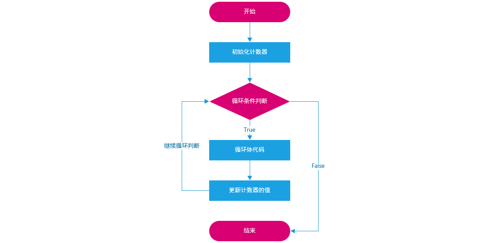
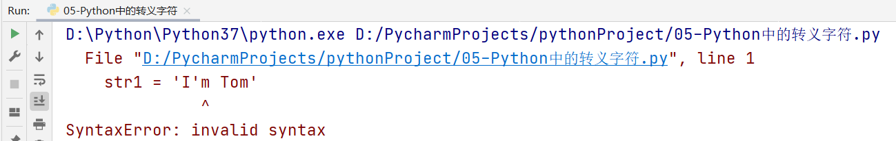
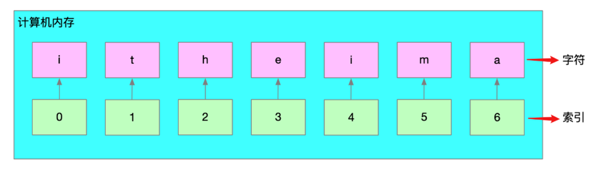
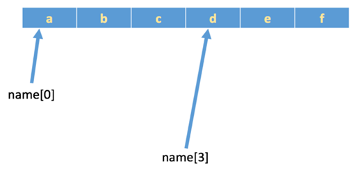
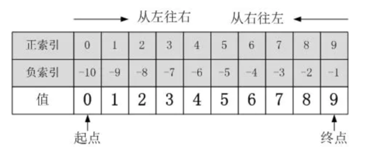
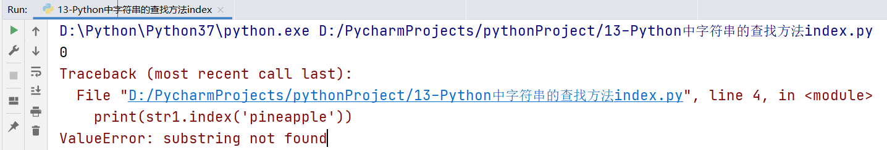

## 今日大纲介绍

* Python中循环的介绍

* while循环基本语法及其应用

* 循环中的两大关键词

* for循环基本语法及其应用

* 了解字符串及掌握字符串常见操作

## 【了解】Python中循环的介绍

### 学习目标

- 理解循环的概念及其在现实生活中的应用场景。
- 掌握循环的作用及其在编程中的重要性。

### 什么是循环

现实生活中，也有很多循环的应用场景：

（1）食堂阿姨打菜：接过顾客的餐盘→询问菜品→打菜→递回餐盘，重复以上过程，直到所有顾客的菜都打完了

（2）快递员送快递：查看送件地址→赶往目的地→电话告知收件人→收件人签收→交快递件，重复以上过程，直到所有需要送的快递都处理完了。

（3）公交司机……

（4）作业流程……

以上场景都有一个共同的特点：==有**条件**地**重复**地做一件事，每一次做的事情不同但类似。==

程序是为了解决实际问题的，==实际问题中存在着重复动作，那么程序中也应该有相应的描述，这就是**循环**。==

### 循环的作用

循环的作用是什么？

答：==让代码高效的重复执行==

### 循环的种类

在Python中，循环一共分为两大类：while循环与for循环

思考问题：while循环和for循环如何选择呢？

​	①：对于循环次数固定的（已知）情况下，建议使用for循环, 例如: 1~100循环

​	②：对于循环次数未知（不确定）的情况下，建议使用while循环, 例如: 猜数字游戏


### 小结

Q1：什么是循环？

* 循环是有条件地重复地做一件事，每一次做的事情不同但类似

Q2：循环的作用是什么？

* 循环的作用是让代码高效的重复执行。

Q3：Python中有哪两种主要的循环类型？

* Python中有while循环和for循环两种主要的循环类型。

## 【掌握】while循环基本语法及其应用

### 学习目标

- 掌握while循环的基本语法。
- 理解while循环的执行流程。
- 能够使用while循环解决实际问题。

### while循环的基本语法

~~~python
# Step1: 定义一个计数器（初始化一个计数器）
i = 0或1
# Step2: 编写while循环结构
while 循环条件(判断 计数器 是否达到了目标位置):
	循环体1
	循环体2
	...
	# Step3: 在循环内部更新计数器
	i = i + 1 或 i += 1
~~~

> 普及小知识：在计算机程序中，计数器大部分都是从0开始的。

总结：while循环三步走

==① 初始化计数器==

==② 编写循环条件（判断计数器是否达到了目标位置）==

==③ 在循环内部更新计数器==

while循环入门案例：使用while循环，循环输出5遍“Hello World”

```python
# 1. 初始化计数器
i = 0
# 2. 编写循环条件（判断计数器是否达到了100）
while i < 5:
    print('Hello World')
    # 3. 在循环体内部更新计数器
    i += 1
```

while循环流程图：



### while循环案例

> 案例1：使用while循环求1..100的和

分析：定义一个while循环，让其可以帮助我们计算 1 + 2 + 3 + 4 + 5 ... + 100，结果：5050

大问题拆解为小问题：

① 使用while循环，循环100次

```python
# 第一步：初始化计数器
i = 1
# 第二步：编写循环条件
while i <= 100:
    print(i)		#  1 2 3 4 5 6 7 8 9 10...
    # 第三步：更新计数器的值
    i += 1
```

② 在循环体内部，累计求和

```python
# 第四步：定义一个变量，用于得到最终的运算结果
result = 0
# 第五步：想办法，让result = 变量i累加后的结果
```

③ 最终代码

```python
# 第一步：初始化计数器
i = 1
# 第四步：定义一个result变量，用于接收累加后的结果
result = 0
# 第二步：编写循环条件
while i <= 100:
    # 第五步：循环累加变量i
    result += i
    # 第三步：更新计数器的值
    i += 1
print(f'1~100累加后的结果：{result}')
```

☆ 首先定义变量i和变量result，进行初始化赋值

☆ 判断变量i是否满足循环条件，如果满足循环条件，则进入到循环体内部，执行内部代码

思考：如何让变量i进行累加，然后赋予给result

```python
result = i
```

第一次循环式，i = 1，result = 0，如果想获取累加的结构，则result = result + i

```python
result = 0 + 1
```

计数器更新，i += 1，i变成2，然后i <= 100，继续执行循环内部代码

```python
result = result + i  换成数值  result = 1 + 2
```

依次类推

```python
result = result + i
```

简写

```python
result += i
```

> 案例2：求1~100之间，所有偶数的和

什么是偶数：所谓的偶数，就是能被2整除的数字就是偶数，数学中可以使用2n来表示偶数。(Python代码 => if  数值 % 2 == 0 代表它是一个偶数)

知识点：在while循环中，我们还可以结合if进行判断。

第一步：求出1~100之间，所有的偶数

```python
# 初始化计数器
i = 1
# 编写循环条件
while i <= 100:
    # 将来写代码的位置
    # 更新计数器
    i += 1
```

第二步：在循环体中，引入if条件判断，判断变量i是否为一个偶数

```python
# 初始化计数器
i = 1
# 编写循环条件
while i <= 100:
    # 将来写代码的位置
    if i % 2 == 0:
        # 代表变量i是一个偶数
        print(i)
    # 更新计数器
    i += 1
```

第三步：引入result变量，初始值为0，然后对第二步中得到的所有偶数进行累加

```python
# 初始化计数器
i = 1
# 定义result，用于接收所有偶数的和
result = 0
# 编写循环条件
while i <= 100:
    # 将来写代码的位置
    if i % 2 == 0:
        # 代表变量i是一个偶数
        result += i
    # 更新计数器
    i += 1
print(f'1~100之间所有偶数的和：{result}')
```

### 小结

Q1：while循环的基本语法是什么？

while循环的基本语法包括初始化计数器、编写循环条件、在循环内部更新计数器。

## 【熟练】循环中的两大关键词

### 学习目标

- 理解break和continue关键词的作用。
- 能够在循环中正确使用break和continue。

### 两大关键词

在Python循环中，经常会遇到两个常见的关键词：break 与 continue

break：代表终止整个循环结构

continue：代表中止当前本次循环，继续下一次循环

### 举个栗子

举例：一共吃5个苹果，吃完第一个，吃第二个…，这里"吃苹果"的动作是不是重复执行？

场景一：如果吃的过程中，吃完第三个吃饱了，则不需要再吃第4个和第5个苹果，即是吃苹果的动作停止，这里就是break控制循环流程，即终止此循环。

场景二：如果吃的过程中，吃到第三个吃出一个大虫子...,是不是这个苹果就不吃了，开始吃第四个苹果，这里就是continue控制循环流程，即退出当前一次循环继而执行下一次循环代码。

### break关键字

场景一：如果吃的过程中，吃完第三个吃饱了，则不需要再吃第4个和第5个苹果，即是吃苹果的动作停止，这里就是break控制循环流程，即终止此循环。

```python
# 初始化计数器
i = 1
# 编写循环条件
while i <= 5:
    # 当变量i == 4的时候，终止循环
    if i == 4:
        print('我已经吃饱了，实在吃不下了...')
        break
        
    # 正在吃第几个苹果
    print(f'正在吃第{i}个苹果')
    
    # 更新计数器
    i += 1
```

### continue关键字

场景二：如果吃的过程中，吃到第三个吃出一个大虫子...,是不是这个苹果就不吃了，开始吃第四个苹果，这里就是continue控制循环流程，即退出当前一次循环继而执行下一次循环代码。

```python
# 初始化计数器
i = 1
# 编写循环条件
while i <= 5:
    # 当变量i == 3的时候，中止当前循环，继续下一次循环
    if i == 3:
        # 手工更新计数器(非常重要)
        i += 1
        print('吃到了一只大虫子，这个苹果不吃了...')
        continue
        
    print(f'正在吃第{i}个苹果')
    # 更新计数器
    i += 1
```

如果在使用continue的时候，不手工更新计数器会有什么后果呢？

答：会出现死循环，建议使用Debug调试工具观看

### 死循环概念

在编程中一个靠自身控制无法终止的程序称为“死循环”。

在Python中，我们也可以使用while True来模拟死循环：

```python
while True:
    print('你是风儿我是沙，缠缠绵绵到天涯')
```

### while循环案例：猜数字

#### 案例需求

编写一个Python程序，随机生成一个1到100之间的整数，用户通过输入猜测的数字，程序会根据用户的输入提示“猜大了”、“猜小了”或“猜对了”。用户可以无限次猜测，直到猜对为止。猜对后，程序会提示用户并结束游戏。

#### 实现思路

① 编写一个循环，满足条件后停止。

② 要从1 ~ 100之间选择一个随机数 

③ if分支判断

#### 代码实现

```python
# 导包
import random

# 场景1: 不限定猜的次数, 直至猜对.
# 1. 随机生成1个 1 ~ 100之间的数字, 让用户来猜.
guess_num = random.randint(1, 100)      # 包左包右.
# print(guess_num)

# 2. 因为不知道用户多少次能猜对, 用 while循环.
while True:
    input_num = int(input('请录入您要猜的整数: '))
    # 3. 判断用户是否猜对了, 并提示. 猜对, 猜大, 猜小.
    if input_num == guess_num:
        print('恭喜您, 猜对了, 请找老师领取奖品, 练习题一套!')
        # 4. 核心细节: 猜对后, 记得: 结束循环.
        break
    elif input_num > guess_num:
        print('哎呀, 您猜大了!\n')
        # print('哎呀, 您猜大了!', end='\n\n')    # 效果同上.
    else:
        print('哎呀, 您猜小了!\n')
```

#### 巩固练习

需求: 在指定位置处填写代码, 使得完成指定需求. 

~~~python
i = 1
while i <= 10:
    if i % 3 == 0:
        # 在这里填写代码, 使得循环分别输出2次, 7次, 13次Hello World
        
    print(f'hello world {i}')
    i += 1
~~~

### 小结

Q1：break关键词的作用是什么？

* break关键词用于终止整个循环结构。

Q2：continue关键词的作用是什么？

* continue关键词用于中止当前本次循环，继续下一次循环。

Q3：在什么情况下使用break？在什么情况下使用continue？

* 在需要终止整个循环时使用break；在需要跳过当前循环并继续下一次循环时使用continue。

## 【掌握】for循环基本语法及其应用

### 学习目标

- 掌握for循环的基本语法。
- 理解for循环的执行流程。
- 能够使用for循环解决实际问题。

### for循环基本语法

for循环结构主要用于（序列 => 字符串、列表、元组、集合以及字典）类型数据的遍历（循环）操作。

> for循环主要用于序列类型数据的循环操作（遍历操作）

另外当循环次数未知的情况，建议使用for循环。

```python
for 临时变量 in 序列:
    重复执行的代码1
    重复执行的代码2
```

案例：使用for循环遍历字符串"itheima"

```python
str1 = 'itheima'
for i in str1:
    print(i)
```

使用Debug调试以上代码可知：for循环功能非常强大，可以自动判断序列的长度，长度为多少，则for循环就循环多少次。每次循环时，系统会自动将序列中的每个元素赋值给变量i，赋值完成后，for循环内部会自动更新计数器，向后移动一位，继续循环，直至元素全部循环结束。

### range方法（函数）

Python2 range() 函数返回的是列表，而在Python3中 range() 函数返回的是一个可迭代对象（类型是对象），而不是列表类型， 所以打印的时候不会打印列表。（由于我们还未学习面向对象，为了方便大家理解，你可以简单的将其理解为一个序列结构）

主要作用：用于生成一段连续的内容，从0到9

基本语法：

```python
range(stop)
range(start, stop[, step])

start: 计数从 start 开始。默认是从 0 开始。例如range（5）等价于range（0， 5）;
stop: 计数到 stop 结束，但不包括 stop。例如：range（0，5） 是 [0, 1, 2, 3, 4] 没有 5
step：步长，默认为1。例如：range（0，5） 等价于 range(0, 5, 1)
```

案例：for循环与range方法，使用for循环，循环5次

```python
for i in range(5):
    print(i)
```

### for循环案例

案例: 使用for循环，求1 ~ 100之间所有偶数的和

```python
# 定义一个变量，用于接收1~100之间所有偶数的和
result = 0
# 从1开始循环，循环100次
for i in range(1, 101):
    if i % 2 == 0:
        result += i
print(f'1~100之间所有偶数的和为{result}')
```

### 综合案例：使用for循环实现用户名+密码认证-作业

案例：用for循环实现用户登录

① 输入用户名和密码

② 判断用户名和密码是否正确（username='admin'，password='admin888'） 

③ 登录仅有三次机会，超过3次会报错 


分析：用户登陆情况有3种:

① 用户名错误(此时便无需判断密码是否正确)  -- 登陆失败 

② 用户名正确 密码错误 --登陆失败 

③ 用户名正确 密码正确 --登陆成功

```python
# 定义变量，用于记录登录次数
trycount = 0
# 循环3次，因为超过3次就会报错
for i in range(3):
    # 更新登录次数
    trycount += 1
    # 提示用户输入账号与密码
    username = input('请输入您的登录账号：')
    password = input('请输入您的登录密码：')
    
    # 判断用户名是否正确
    if username == 'admin':
    	# 判断密码是否正确
        if password == 'admin888':
            print('恭喜你，登录成功')
            break
        else:
            print('密码错误')
            print(f'您还有{3 - trycount}次输入机会')
    else:
        print('用户名错误')
        print(f'您还有{3 - trycount}次输入机会')
```

### 小结

Q1：for循环的基本语法是什么？

* for循环的基本语法是`for 临时变量 in 序列:`，后面跟着循环体。

Q2：for循环的执行流程是怎样的？

* for循环会自动遍历序列中的每个元素，每次循环时将序列中的元素赋值给临时变量，执行循环体，直到序列中的所有元素都被遍历完毕。

## 【熟悉】for循环中的else结构

### 学习目标

- 理解for循环中else结构的作用。
- 能够在for循环中正确使用else结构。

### 为什么需要在for循环中添加else结构

循环可以和else配合使用，else下方缩进的代码指的是==当循环正常结束之后要执行的代码。==

强调：'正常结束'，非正常结束，其else中的代码时不会执行的。（如遇到break的情况）

### for循环结构中的else结构

基本语法：

```python
for 临时变量 in 序列:
    循环体
else:
    当for循环正常结束后，返回的代码
```

### break关键字对for...else结构的影响

```python
str1 = 'itheima'
for i in str1:
    if i == 'e':
        print('遇e不打印')
        break
    print(i)
else:
    print('循环正常结束之后执行的代码')
```

### continue关键字对for...else结构的影响

```python
str1 = 'itheima'
for i in str1:
    if i == 'e':
        print('遇e不打印')
        continue
    print(i)
else:
    print('循环正常结束之后执行的代码')
```

### 小结

Q1：for循环中的else结构的作用是什么？

* for循环中的else结构在循环正常结束后执行，如果循环被break终止，则else结构不会执行。

Q2：break关键词对for...else结构有什么影响？

* 如果循环被break终止，则else结构不会执行。

Q3：continue关键词对for...else结构有什么影响？

* continue关键词不会影响else结构的执行，else结构仍然会在循环正常结束后执行。

## 【掌握】字符串定义和切片

### 学习目标

- 理解字符串的定义及其在Python中的表示方式。
- 理解字符串切片的概念。
- 掌握字符串切片的基本语法及其应用。

### 字符串的定义

字符串是 Python 中最常用的数据类型。我们一般使用引号来创建字符串。创建字符串很简单，只要为变量分配一个值即可。

案例1：使用单引号或双引号定义字符串变量

```python
str1 = 'abcdefg'
str2 = "hello world"

print(type(str1))  # <class 'str'>
print(type(str2))  # <class 'str'>
```

案例2：使用3个引号定义字符串变量

```python
name1 = '''I am Tom, Nice to meet you!'''
print(name1)
print(type(name1))

print('-' * 20)

name2 = """I am Jennify,
           Nice to meet you!"""
print(name2)
print(type(name2))
```

> 注意：三引号形式的字符串支持换行操作

案例3：思考如何使用字符串定义"I'm Tom"

使用单引号情况

```python
str1 = 'I'm Tom'
```

运行结果：



出现以上问题的主要原因在于，以上字符串的定义代码出现了(syntax)语法错误。==单引号在字符串定义中必须成对出现，而且Python解析器在解析代码时，会自动认为第一个单引号和最近的一个单引号是一对！==

如果一定要在单引号中在放入一个单引号，必须使用==反斜杠==进行转义。

```python
str1 = 'I\'am Tom'
```

使用双引号情况

```python
str2 = "I'm Tom"
```

> 注：在Python中，如果存在多个引号，建议① 单引号放在双引号中 ② 双引号放在单引号中。

### 字符串在计算机底层的存储形式

在计算机中，Python中的字符串属于序列结构。所以其底层存储占用一段连续的内存空间。

```python
str1 = 'itheima'
```

结构原理图：

==索引的最大值 = len(字符串) - 1==

7个字符，则索引下标的最大值为7-1 = 6



> 注意：索引下标从0开始。

### 聊聊索引下标

`索引下标`，就是编号。比如火车座位号，座位号的作用：按照编号快速找到对应的座位。同理，下标的作用即是通过下标快速找到对应的数据。


举个例子：

```python
name = 'abcdef'
print(name[0])  # a
print(name[3])  # d
```



### 什么是字符串切片

所谓的切片是指对操作的对象==截取==其中一部分的操作。字符串、列表、元组都支持切片操作。

### 字符串切片基本语法

顾头不顾尾：

```python
序列名称[开始位置下标:结束位置下标:步长(步阶)]

numstr = '0123456789'
numstr[0:3:1]  # 012 => range方法非常类似，步长：每次前进1步
numstr[0:3:2]  # 02 => 每次前进2步
步长可以为负数，正数代表从左向右截取，负数代表从右向左截取
```

① 不包含结束位置下标对应的数据， 正负整数均可；

② 步长是选取间隔，正负整数均可，正数从左向右，负数从右向左。默认步长为1。

还是有点陌生，没关系，给你举个栗子：

```python
numstr = '0123456789'
```

如果想对numstr字符串进行切片，如下图所示：



### 字符串切片案例

* 案例1

  ```python
  numstr = '0123456789'
  # 1、从2到5开始切片，步长为1
  print(numstr[2:5:1])
  print(numstr[2:5])
  # 2、只有结尾的字符串切片：代表从索引为0开始，截取到索引为5的位置（不包含索引为5的数据）
  print(numstr[:5])
  # 3、只有开头的字符串切片：代表从起始位置开始，已知截取到字符串的结尾
  print(numstr[1:])
  # 4、获取或拷贝整个字符串
  print(numstr[:])
  # 5、调整步阶：类似求偶数
  print(numstr[::2])
  # 6、把步阶设置为负整数：类似字符串翻转
  print(numstr[::-1])
  # 7、起始位置与结束位置都是负数
  print(numstr[-4:-1])
  # 8、结束字符为负数，如截取012345678
  print(numstr[:-1])
  ```

* 案例2: 给定一个图片的名称为"avatar.png"，代码实现获取这个图片的名称(avatar)以及这个图片的后缀(.png)。

  * 分析：

    * ① 建议先获取点号的位置（目前还未学习，只能一个一个数）
    * ② 从开头切片到点号位置，得到的就是文件的名称
    * ③ 从点号开始切片，一直到文件的结尾，则得到的就是文件的后缀

  * 代码

    ```python
    filename = 'avatar.png'
    # 获取点号的索引下标
    index = 6
    # 使用切片截取文件的文件
    name = filename[:index]
    print(f'上传文件的名称：{name}')
    
    # 使用切片截取文件的后缀
    postfix = filename[index:]
    print(f'上传文件的后缀：{postfix}')
    ```

### 小结

Q1：如何定义字符串？

- 可以使用单引号、双引号或三引号来定义字符串。

Q2：什么是字符串切片？

* 字符串切片是指对字符串进行截取操作，获取字符串的一部分。

Q3：字符串切片的基本语法是什么？

* 字符串切片的基本语法是`序列名称[开始位置下标:结束位置下标:步长]`。

## 【掌握】字符串的操作方法（内置）

### 学习目标

- 掌握字符串的常见操作方法，如查找、替换、切割等。
- 能够在实际编程中灵活运用字符串的操作方法。

### 字符串中的查找方法

所谓字符串查找方法即是==查找子串在字符串中的位置或出现的次数==。

基本语法：

```python
字符串.find(要查找的字符或者子串)
```

| **编号** | **函数** | **作用**                                                     |
| -------- | -------- | ------------------------------------------------------------ |
| 1        | find()   | 检测某个子串是否包含在这个字符串中，如果在返回这个子串开始的位置下标，否则则返回-1。 |
| 2        | index()  | 检测某个子串是否包含在这个字符串中，如果在返回这个子串开始的位置下标，否则则报异常。 |

### ☆ find()方法

作用：检测某个子串是否包含在这个字符串中，如果在返回这个子串开始的位置下标，否则则返回-1。

```python
# 定义一个字符串
str1 = 'hello world hello linux hello python'
# 查找linux子串是否出现在字符串中
print(str1.find('linux'))
# 在str1中查找不存在的子串
print(str1.find('and'))
```

案例：使用input方法输入任意一个文件名称，求点号的索引下标

```python
filename = input('请输入您要上传文件的名称：')
# 获取点号的索引下标
index = filename.find('.')
print(index)

# 求文件名称
print(filename[:index])

# 求文件后缀
print(filename[index:])
```

### ☆ index()方法

index()方法其功能与find()方法完全一致，唯一的区别在于当要查找的子串没有出现在字符串中时，find()方法返回-1，而index()方法则直接报错。

```python
str1 = 'apple, banana, orange'
# 判断apple是否出现在字符串str1中
print(str1.index('apple'))
print(str1.index('pineapple'))
```

运行结果：



### 字符串的修改方法

所谓修改字符串，指的就是通过函数（方法）的形式修改字符串中的数据。

| **编号** | **函数**  | **作用**             |
| -------- | --------- | -------------------- |
| 1        | replace() | 返回替换后的字符串   |
| 2        | split()   | 返回切割后的列表序列 |
| 3        | title()   | 所有单词首字母大写   |

#### ☆ replace()方法

基本语法：

```python
字符串.replace(要替换的内容, 替换后的内容, 替换的次数-可以省略)
```

案例：编写一个字符串，然后把字符串中的linux替换为python

```python
str1 = 'hello linux and hello linux'
# 把字符串中所有linux字符替换为python
print(str1.replace('linux', 'python'))
# 把字符串中的第一个linux进行替换为python
print(str1.replace('linux', 'python', 1))
# 把and字符串替换为&&
print(str1.replace('and', '&&'))
```

目前在工作中，replace主要用于实现关键字替换或过滤功能。北京 ==> BJ，论坛关键字过滤

#### ☆ split()方法

作用：对字符串进行切割操作，返回一个list()列表类型的数据

```python
str1 = 'apple-banana-orange'
print(str1.split('-'))
```

#### ☆ join()方法

作用：和split()方法正好相反，其主要功能是把序列拼接为字符串

```python
字符串.join(数据序列)
```

案例：把水果列表['apple', 'banana', 'orange']拼接成'apple-banana-orange'

```python
list1 = ['apple', 'banana', 'orange']
print('-'.join(list1))
```

### 字符串案例

#### 案例需求

将字符串向右旋转n位，例如“abcdef”向右旋转2位得到“efabcd”

#### 实现思路

利用切片操作，将字符串分为两部分并交换位置。

#### 代码实现

~~~shell

# 1. 从输入获取一个字符串
s = input("请输入一个字符串: ")

# 2. 从输入获取一个整数表示旋转的位数
n = int(input("请输入旋转的位数: "))

# 3. 计算实际需要旋转的位数（防止n大于字符串长度）
n = n % len(s)

# 4. 使用切片操作将字符串分为两部分并交换位置
rotated_string = s[-n:] + s[:-n]

# 5. 打印旋转后的字符串
print(f"旋转后的字符串是: {rotated_string}")
~~~

### 小结

Q1：find()方法的作用是什么？

* find()方法用于查找子串在字符串中的位置，如果找到则返回子串开始的位置下标，否则返回-1

Q2：replace()方法的作用是什么？

* replace()方法用于替换字符串中的指定子串为新的子串。

Q3：split()方法的作用是什么？

* split()方法用于将字符串按照指定的分隔符进行切割，返回一个列表。

## 作业

### 作业一：水仙花数

需求：水仙花数（Narcissistic number）是指一个n位数（n≥3），其各位数字的n次幂之和等于该数本身‌。例如，153是一个水仙花数，因为153=1^3+5^3+3^3。‌计算100~999之间的水仙花数。

### 作业二：进阶版模拟登陆

需求： 假设账号为: itcast, 密码为: hmai。只给3次机会, 登陆失败要提示剩余次数。


