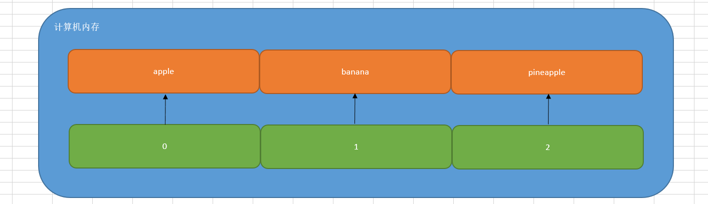
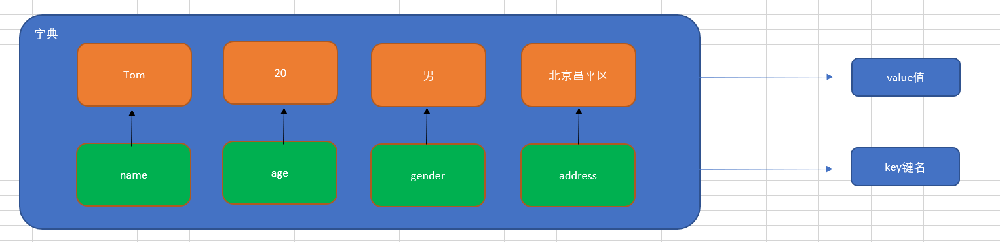

## 今日大纲

* 列表增删改查及其应用场景

* 元组定义与使用

* 字典的增删改查与应用

* 集合的定义与增删查

## 【掌握】列表及其应用场景

### 学习目标

* 掌握列表的定义格式及相关操作
* 掌握列表嵌套相关应用

### 为什么需要列表

思考：有一个人的姓名(TOM)怎么书写存储程序？

答：变量。 

思考：如果一个班级100位学生，每个人的姓名都要存储，应该如何书写程序？声明100个变量吗？

答：No，我们使用列表就可以了， 列表一次可以存储多个数据。

> 在Python中，我们把这种数据类型称之为列表。但是在其他的编程语言中，如Java、PHP、Go等等中其被称之为数组。

### 列表的定义

```python
列表序列名称 = [列表中的元素1, 列表中的元素2, 列表中的元素3, ...]
```

案例演示：定义一个列表，用于保存苹果、香蕉以及菠萝

```python
list1 = ['apple', 'banana', 'pineapple']
# list列表类型支持直接打印
print(list1)
# 打印列表的数据类型
print(type(list1))  # <class 'list'>
```

> 注意：列表可以一次存储多个数据且可以为不同的数据类型

### 列表的相关操作

列表的作用是一次性存储多个数据，程序员可以对这些数据进行的操作有：

==增、删、改、查==。

#### ☆ 查操作

列表在计算机中的底层存储形式，列表和字符串一样，在计算机内存中都占用一段连续的内存地址，我们想访问列表中的每个元素，都可以通过=="索引下标"==的方式进行获取。



如果我们想获取列表中的某个元素，非常简单，直接使用索引下标：

```python
list1 = ['apple', 'banana', 'pineapple']
# 获取列表中的banana
print(list1[1])
```

查操作的相关方法：

| **编号** | **函数** | **作用**                                                     |
| -------- | -------- | ------------------------------------------------------------ |
| 1        | index()  | 指定数据所在位置的下标                                       |
| 2        | count()  | 统计指定数据在当前列表中出现的次数                           |
| 3        | in       | 判断指定数据在某个列表序列，如果在返回True，否则返回False    |
| 4        | not in   | 判断指定数据不在某个列表序列，如果不在返回True，否则返回False |

举个栗子：

```python
# 1、查找某个元素在列表中出现的位置（索引下标）
list1 = ['apple', 'banana', 'pineapple']
print(list1.index('apple'))  # 0
# print(list1.index('peach'))  # 报错

# 2、count()方法：统计元素在列表中出现的次数
list2 = ['刘备', '关羽', '张飞', '关羽', '赵云']
# 统计一下关羽这个元素在列表中出现的次数
print(list2.count('关羽'))

# 3、in方法和not in方法（黑名单系统）
list3 = ['192.168.1.15', '10.1.1.100', '172.35.46.128']
if '10.1.1.100' in list3:
    print('黑名单IP，禁止访问')
else:
    print('正常IP，访问站点信息')
```

#### ☆ 增操作

| **编号** | **函数** | **作用**                                                     |
| -------- | -------- | ------------------------------------------------------------ |
| 1        | append() | 增加指定数据到列表中                                         |
| 2        | extend() | 列表结尾追加数据，如果数据是一个序列，则将这个序列的数据逐一添加到列表 |
| 3        | insert() | 指定位置新增数据                                             |

☆ append()

append() ：在列表的尾部追加元素

```python
names = ['孙悟空', '唐僧', '猪八戒']
# 在列表的尾部追加一个元素"沙僧"
names.append('沙僧')
# 打印列表
print(names)
```

> 注意：列表追加数据的时候，直接在原列表里面追加了指定数据，即修改了原列表，故列表为可变类型数据。

☆ extend()方法

列表结尾追加数据，如果数据是一个序列，则将这个序列的数据逐一添加到列表

案例：

```python
list1 = ['Tom', 'Rose', 'Jack']
# 1、使用extend方法追加元素"Jennify"
# names.extend("Jennify")
# print(names)

# 2、建议：使用extend方法两个列表进行合并
list2 = ['Hack', 'Jennify']
list1.extend(list2)

print(list1)
```

> 总结：extend方法比较适合于两个列表进行元素的合并操作

☆ insert()方法

作用：在指定的位置增加元素

```python
names = ['薛宝钗', '林黛玉']
# 在薛宝钗和林黛玉之间，插入一个新元素"贾宝玉"
names.insert(1, '贾宝玉')
print(names)
```

#### ☆ 删操作

| **编号** | **函数**       | **作用**                                         |
| -------- | -------------- | ------------------------------------------------ |
| 1        | del 列表[索引] | 删除列表中的某个元素                             |
| 2        | pop()          | 删除指定下标的数据(默认为最后一个)，并返回该数据 |
| 3        | remove()       | 移除列表中某个数据的第一个匹配项。               |

☆ del删除指定的列表元素

基本语法：

```python
names = ['Tom', 'Rose', 'Jack', 'Jennify']
# 删除Rose
del names[1]
# 打印列表
print(names)
```

☆ pop()方法

作用：删除指定下标的元素，如果不填写下标，默认删除最后一个。其返回结果：就是删除的这个元素

```python
names = ['貂蝉', '吕布', '董卓']
del_name = names.pop()
# 或
# del_name = names.pop(1)
print(del_name)
print(names)
```

☆ remove()方法

作用：删除匹配的元素

```python
fruit = ['apple', 'banana', 'pineapple']
fruit.remove('banana')
print(fruit)
```

#### 改操作

| **编号** | **函数**                | **作用**               |
| -------- | ----------------------- | ---------------------- |
| 1        | 列表[索引] = 修改后的值 | 修改列表中的某个元素   |
| 2        | reverse()               | 将数据序列进行倒叙排列 |
| 3        | sort()                  | 对列表序列进行排序     |

```python
list1 = ['貂蝉', '大乔', '小乔', '八戒']
# 修改列表中的元素
list1[3] = '周瑜'
print(list1)

list2 = [1, 2, 3, 4, 5, 6]
list2.reverse()
print(list2)

list3 = [10, 50, 20, 30, 1]
list3.sort()  # 升序(从小到大)
# 或
# list3.sort(reverse=True)  # 降序(从大到小)
print(list3)
```

### 列表的循环遍历

什么是循环遍历？答：循环遍历就是使用while或for循环对列表中的每个数据进行打印输出

while循环：

```python
list1 = ['貂蝉', '大乔', '小乔']

# 定义计数器
i = 0
# 编写循环条件
while i < len(list1):
    print(list1[i])
    # 更新计数器
    i += 1
```

for循环（个人比较推荐）：

```python
list1 = ['貂蝉', '大乔', '小乔']
for i in list1:
    print(i)
```

### 列表的嵌套

列表的嵌套：列表中又有一个列表，我们把这种情况就称之为列表嵌套

> 在其他编程语言中，称之为叫做二维数组或多维数组

应用场景：要存储班级一、二、三  => 三个班级学生姓名，且每个班级的学生姓名在一个列表。

```python
classes = ['第一个班级','第二个班级','第三个班级']

一班：['张三', '李四']
二班：['王五', '赵六']
三班：['田七', '钱八']

把班级和学员信息合并在一起，组成一个嵌套列表
students = [['张三', '李四'],['王五', '赵六'],['田七', '钱八']]

students = [x,y,z]
students[0] == ['张三', '李四']
students[0][1]
```

问题：嵌套后的列表，我们应该如何访问呢？

```python
# 访问李四
print(students[0][1])
# 嵌套列表进行遍历，获取每个班级的学员信息
for i in students:
    print(i)
```

### 列表案例

#### 案例需求

编写一个程序，求一个正整数数组中每对相邻元素的最大值。
 例如, 输入: [7 8 9 5 6 7 2 3] 输出: [8, 9, 9, 6, 7, 7, 3]

#### 实现思路

①定义一个正整数数组

②初始化一个空列表用于存储相邻元素的最大值

③使用 for 循环遍历数组中的每对相邻元素

④获取当前元素和下一个元素

⑤计算当前元素和下一个元素的最大值

⑥将最大值添加到 max_values 列表中

⑦打印相邻元素的最大值列表

#### 代码实现

~~~python
# 1. 定义一个正整数数组
numbers = [7, 8, 9, 5, 6, 7, 2, 3]

# 2. 初始化一个空列表用于存储相邻元素的最大值
max_values = []

# 3. 使用 for 循环遍历数组中的每对相邻元素
for i in range(len(numbers) - 1):
    # 4. 获取当前元素和下一个元素
    current = numbers[i]
    next_element = numbers[i + 1]

    # 5. 计算当前元素和下一个元素的最大值
    max_value = max(current, next_element)

    # 6. 将最大值添加到 max_values 列表中
    max_values.append(max_value)

# 7. 打印相邻元素的最大值列表
print(f"相邻元素的最大值是: {max_values}")
~~~

#### 巩固练习

给定列表original_list其中包含1, 2, 2, 3, 4, 4, 5, 6, 6, 7元素，现在通过编写程序对列表中的数据进行去重

~~~python
# 1.原始列表
original_list = [1, 2, 2, 3, 4, 4, 5, 6, 6, 7]

# 2.用于存储去重后的列表
unique_list = []

# 3.遍历原始列表
for item in original_list:
    # 4.如果元素不在去重后的列表中，则添加
    if item not in unique_list:
        unique_list.append(item)

# 5.输出去重后的列表
print("去重后的列表:", unique_list)
~~~

### 总结

Q1: 什么是列表?

* Python中的一种容器类型, 可以同时存储多个元素.

Q2: 列表常用的函数有哪些?

* 查: index(), count(), in, not in
* 增: append(), extend(), insert()
* 删: del, pop(), remove()
* 改: 列表名[索引], reverse(), sort() 

## 【掌握】元组的定义与使用

### 学习目标

* 理解元组的定义格式及应用场景
* 掌握元组的常用函数

### 为什么需要元组 

思考：如果想要存储多个数据，但是这些数据是不能修改的数据，怎么做？

答：列表？列表可以一次性存储多个数据，但是列表中的数据允许更改。

```python
num_list = [10, 20, 30]
num_list[0] = 100
```


那这种情况下，我们想要存储多个数据且数据不允许更改，应该怎么办呢？

答：使用==元组，元组可以存储多个数据且元组内的数据是不能修改的。==

### 元组的定义

元组特点：定义元组使用==小括号==，且使用==逗号==隔开各个数据，==数据可以是不同的数据类型。==

基本语法：

```python
# 多个数据元组
tuple1 = (10, 20, 30)

# 单个数据元组
tuple2 = (10,)
```

> 注意：如果定义的元组只有一个数据，那么这个数据后面也要添加逗号，否则数据类型为唯一的这个数据的数据类型。

### 元组的相关操作方法

由于元组中的数据不允许直接修改，所以其操作方法大部分为查询方法。

| **编号** | **函数**   | **作用**                                                     |
| -------- | ---------- | ------------------------------------------------------------ |
| 1        | 元组[索引] | 根据==索引下标==查找元素                                     |
| 2        | index()    | 查找某个数据，如果数据存在返回对应的下标，否则报错，语法和列表、字符串的index方法相同 |
| 3        | count()    | 统计某个数据在当前元组出现的次数                             |
| 4        | len()      | 统计元组中数据的个数                                         |

案例1：访问元组中的某个元素

```python
nums = (10, 20, 30)
print(nums[2])
```

案例2：查找某个元素在元组中出现的位置，存在则返回索引下标，不存在则直接报错

```python
nums = (10, 20, 30)
print(nums.index(20))
```

案例3：统计某个元素在元组中出现的次数

```python
nums = (10, 20, 30, 50, 30)
print(nums.count(30))
```

案例4：len()方法主要就是求数据序列的长度，字符串、列表、元组

```python
nums = (10, 20, 30, 50, 30)
print(len(nums))
```


```python
nums = (10, 20, 30, 50, 30)
print(len(nums))
```

### 元组案例

案例需求

编写一个程序来提取嵌套元组中的唯一元素。
例如: 在嵌套元组((1,2,3),(2,4,6),(2,3,5))中, 2重复出现了3次，3重复出现了2次，但我们的输出列表只会包含2、3一次。
即：[1, 2, 3, 4, 5, 6]

#### 实现思路

①定义一个嵌套元组

②使用循环方式遍历元组中的每个子元组

③嵌套循环遍历子元组中的每个元素

④将元素添加到集合中，集合天然去重

⑤将集合转化为列表

#### 代码实现

~~~python
# 1. 定义一个嵌套元组
nested_tuple = ((1, 2, 3), (2, 4, 6), (2, 3, 5))

# 2. 初始化一个空集合用于存储唯一元素
unique_elements = set()

# 3. 使用 for 循环遍历嵌套元组中的每个子元组
for sub_tuple in nested_tuple:
    # 4. 使用 for 循环遍历子元组中的每个元素
    for element in sub_tuple:
        # 5. 将元素添加到集合中（集合会自动去重）
        unique_elements.add(element)

# 6. 将集合转换为列表
unique_list = list(unique_elements)

# 7. 打印唯一元素列表
print(f"嵌套元组中的唯一元素是: {unique_list}")
~~~

#### 巩固练习

给定一个元组my_tuple，里面包含1, 2, 3, 4, 5, 6, 7, 8, 9元素，要求统计数字元组中, 奇数的个数

~~~python
# 1.定义一个数字元组
my_tuple = (1, 2, 3, 4, 5, 6, 7, 8, 9)

# 2.初始化奇数计数器
odd_count = 0

# 3.遍历元组中的每个元素
for num in my_tuple:
    # 4.检查元素是否为奇数
    if num % 2 != 0:
        odd_count += 1

# 5.输出奇数的个数
print("元组中奇数的个数:", odd_count)
~~~

### 总结

Q1: 元组的特点

* 可以存储多个元素, 但是元素值不可变.

Q2: 元组的常用函数

* index(), count(), len()

## 【掌握】字典的定义与使用

### 学习目标

* 掌握字典定义格式及相关函数
* 掌握字典在实际开发中的应用场景

### 为什么需要字典(dict)

思考1：比如我们要存储一个人的信息，姓名：Tom，年龄：20周岁，性别：男，家庭住址：北京市昌平区，如何快速存储。

```python
person = ['Tom', 20, '男', '北京市昌平区']
```

思考2：在日常生活中，姓名、年龄以及性别同属于一个人的基本特征。但是如果使用列表对其进行存储，则分散为3个元素，这显然不合逻辑。我们有没有办法，将其保存在同一个元素中，姓名、年龄以及性别都作为这个元素的3个属性。

答：使用Python中的字典

### Python中字典(dict)的概念

 特点：

① 符号为==大括号==（花括号） =>  {}

② 数据为==键值对==形式出现   =>  {key:value}，key：键名，value：值，在同一个字典中，key必须是唯一（类似于索引下标）

③ 各个键值对之间用==逗号==隔开



> 在字典中，键名除了可以使用字符串的形式，还可以使用数值的形式来进行表示

定义：

```python
# 有数据字典
dict1 = {'name': 'Tom', 'age': 20, 'gender': '男'}

# 空字典
dict2 = {}

dict3 = dict()
```

> 在Python代码中，字典中的key必须使用引号引起来

### 字典的增操作（重点）

基本语法：

```python
字典名称[key] = value
注：如果key存在则修改这个key对应的值；如果key不存在则新增此键值对。
```

案例：定义一个空字典，然后添加name、age以及address这样的3个key

```python
# 1、定义一个空字典
person = {}
# 2、向字典中添加数据
person['name'] = '刘备'
person['age'] = 40
person['address'] = '蜀中'
# 3、使用print方法打印person字典
print(person)
```

> 注意：列表、字典为可变类型

### 字典的删操作

① del 字典名称[key]：删除指定元素

```python
# 1、定义一个有数据的字典
person = {'name':'王大锤', 'age':28, 'gender':'male', 'address':'北京市海淀区'}
# 2、删除字典中的某个元素（如gender）
del person['gender']
# 3、打印字典
print(person)
```

② clear()方法：清空字典中的所有key

```python
# 1、定义一个有数据的字典
person = {'name':'王大锤', 'age':28, 'gender':'male', 'address':'北京市海淀区'}
# 2、使用clear()方法清空字典
person.clear()
# 3、打印字典
print(person)
```

### 字典的改操作

基本语法：

```python
字典名称[key] = value
注：如果key存在则修改这个key对应的值；如果key不存在则新增此键值对。
```

案例：定义一个字典，里面有name、age以及address，修改address这个key的value值

```python
# 1、定义字典
person = {'name':'孙悟空', 'age': 600, 'address':'花果山'}
# 2、修改字典中的数据（address）
person['address'] = '东土大唐'
# 3、打印字典
print(person)
```

### 字典的查操作

① 查询方法：使用具体的某个key查询数据，如果未找到，则直接报错。

```python
字典序列[key]
```

② 字典的相关查询方法

| **编号** | **函数** | **作用**                            |
| -------- | -------- | ----------------------------------- |
| 1        | keys()   | 以列表返回一个字典所有的键          |
| 2        | values() | 以列表返回字典中的所有值            |
| 3        | items()  | 以列表返回可遍历的(键, 值) 元组数据 |

案例1：提取person字典中的所有key

```python
# 1、定义一个字典
person = {'name':'貂蝉', 'age':18, 'mobile':'13765022249'}
# 2、提取字典中的name、age以及mobile属性
print(person.keys())
```

案例2：提取person字典中的所有value值

```python
# 1、定义一个字典
person = {'name':'貂蝉', 'age':18, 'mobile':'13765022249'}
# 2、提取字典中的貂蝉、18以及13765022249号码
print(person.values())
```

案例3：使用items()方法提取数据

```python
# 1、定义一个字典
person = {'name':'貂蝉', 'age':18, 'mobile':'13765022249'}
# 2、调用items方法获取数据，dict_items([('name', '貂蝉'), ('age', 18), ('mobile', '13765022249')])
# print(person.items())
# 3、结合for循环对字典中的数据进行遍历
for key, value in person.items():
    print(f'{key}：{value}')
```

### 字典案例

#### 案例需求

给定一个字符串my_string，现在要求统计每个字符出现的次数

#### 实现思路

①定义一个字符串

②初始化空字典，来存储对应字符和出现次数

③循环遍历字符串中每个字符

④如果字符串已经在字典中，计数加1，如果不在，初始化计数1

⑤输出统计每个字符出现的次数

#### 代码实现

~~~python
# 1.定义一个字符串
my_string = "hello world"

# 2.初始化一个空字典来存储字符及其出现的次数
char_count = {}

# 3.遍历字符串中的每个字符
for char in my_string:
    # 4.如果字符已经在字典中，计数加一
    if char in char_count:
        char_count[char] += 1
    # 5.如果字符不在字典中，初始化计数为1
    else:
        char_count[char] = 1

# 6.输出每个字符出现的次数
for char, count in char_count.items():
    print(f"字符 '{char}' 出现了 {count} 次")
~~~

#### 巩固练习

需求: 编写一个程序将字符串转换为字典例如:输入: '5=Five 6=Six 7=Seven'   输出: {'5': 'Five', '6': 'Six', '7': 'Seven'}

~~~python
# 1. 从输入获取一个字符串
input_string = input("请输入一个字符串: ")

# 2. 初始化一个空字典用于存储转换后的键值对
result_dict = {}

# 3. 使用 split() 方法将字符串按空格分割成多个键值对字符串
key_value_pairs = input_string.split()

# 4. 使用 for 循环遍历每个键值对字符串
for pair in key_value_pairs:
    # 5. 使用 split('=') 方法将键值对字符串按 '=' 分割成键和值
    key, value = pair.split('=')

    # 6. 将键和值添加到字典中
    result_dict[key] = value

# 7. 打印转换后的字典
print(f"转换后的字典是: {result_dict}")
~~~

### 总结

Q1: 字典的特点

* 存储的是键值对的元素
* 键具有唯一性, 值可以重复

Q2:字典的常用函数

* clear(), keys(), values(), items()

## 【熟悉】集合的定义与使用

### 学习目标

* 理解集合的定义格式及特点

### 什么是集合

集合（set）是一个无序的不重复元素序列。

① 天生去重

② 无序

### 集合的定义

在Python中，我们可以使用一对花括号{}或者set()方法来定义集合，但是如果你定义的集合是一个空集合，则只能使用set()方法。

```python
# 定义一个集合
s1 = {10, 20, 30, 40, 50}
print(s1)
print(type(s1))

# 定义一个集合：集合中存在相同的数据
s2 = {'刘备', '曹操', '孙权', '曹操'}
print(s2)
print(type(s1))

# 定义空集合
s3 = {}
s4 = set()
print(type(s3))	 # <class 'dict'>
print(type(s4))  # <class 'set'>
```

### 集合操作的相关方法（增删查）

#### ☆ 集合的增操作

add()方法：向集合中增加一个元素（单一）

```python
students = set()
students.add('李哲')
students.add('刘毅')
print(students)
```

#### ☆ 集合的删操作

remove()方法：删除集合中的指定数据，如果数据不存在则报错。

```python
# 1、定义一个集合
products = {'萝卜', '白菜', '水蜜桃', '奥利奥', '西红柿', '凤梨'}
# 2、使用remove方法删除白菜这个元素
products.remove('白菜')
print(products)
```

#### ☆ 集合中的查操作

① in ：判断某个元素是否在集合中，如果在，则返回True，否则返回False

② not in ：判断某个元素不在集合中，如果不在，则返回True，否则返回False

```python
# 定义一个set集合
s1 = {'刘帅', '英标', '高源'}
# 判断刘帅是否在s1集合中
if '刘帅' in s1:
    print('刘帅在s1集合中')
else:
    print('刘帅没有出现在s1集合中')
```

③ 集合的遍历操作

```python
for i in 集合:
    print(i)
```

### 集合案例

#### 需求

编写一个程序来统计缺失的数字并返回它们的总和。缺失的数字是指给定列表中两个极端（最大和最小数字）之间没有出现的数字。
例如，在列表[2, 5, 3, 7, 5, 7]中，两个极端（即2和7）之间缺失的数字是4和6。

~~~python
# 1. 从输入获取一个整数列表
numbers = [2, 5, 3, 7, 5, 7]

# 2. 找到列表中的最小值
min_num = min(numbers)

# 3. 找到列表中的最大值
max_num = max(numbers)

# 4. 初始化一个集合用于存储列表中的所有数字
number_set = set(numbers)

# 5. 初始化一个变量用于存储缺失数字的总和
missing_sum = 0

# 6. 遍历从最小值到最大值之间的每个数字
for num in range(min_num + 1, max_num):
    # 7. 检查数字是否不在集合中
    if num not in number_set:
        # 8. 如果不在，将数字添加到缺失数字的总和中
        missing_sum += num

# 9. 打印缺失数字的总和
print(f"缺失的数字之和是: {missing_sum}")
~~~

### 总结

Q1: 集合的特点

* 无序, 唯一

Q2: 集合的应用场景

* 适用于 元素的去重 情况

## 作业

### 作业一：集合中奇数和

给定一个集合numbers，集合中包含1, 2, 3, 4, 5, 6, 7, 8, 9, 10, 11, 12, 13, 14, 15元素，求该集合中所有奇数的和是多少

~~~python
# 1. 定义一个集合记录一些整数
numbers = {1, 2, 3, 4, 5, 6, 7, 8, 9, 10, 11, 12, 13, 14, 15}

# 2. 初始化一个变量用于存储奇数的和
odd_sum = 0

# 3. 遍历集合中的每个数字
for num in numbers:
    # 4. 检查数字是否为奇数
    if num % 2 != 0:
        # 5. 如果是奇数，将其加到奇数的和中
        odd_sum += num

# 6. 打印所有奇数的和
print(f"集合中所有奇数的和是: {odd_sum}")
~~~

