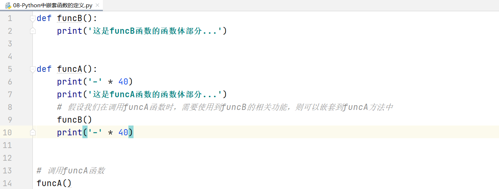
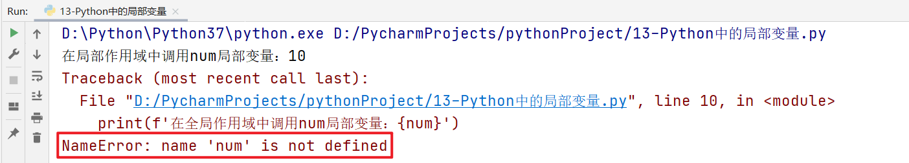
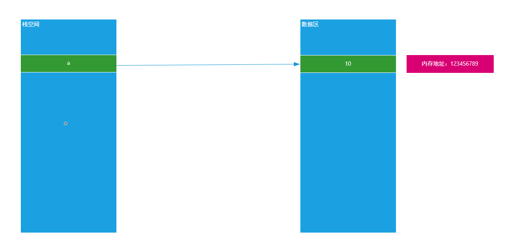
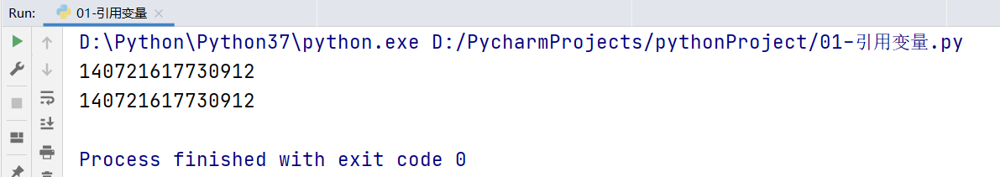
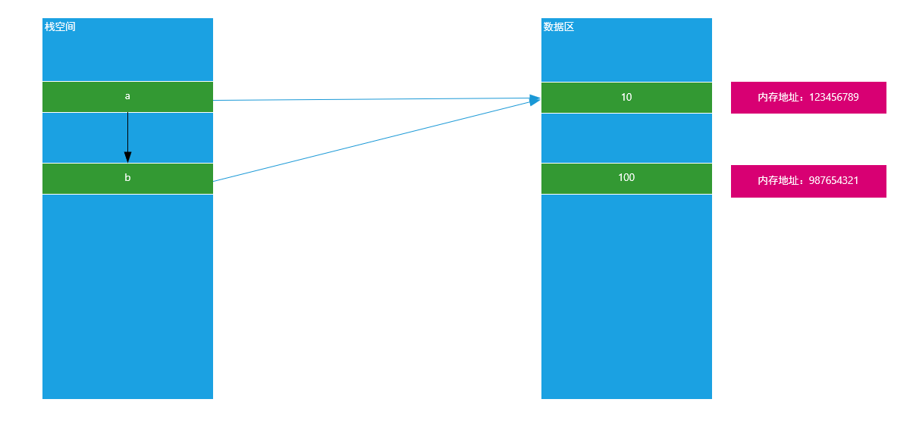
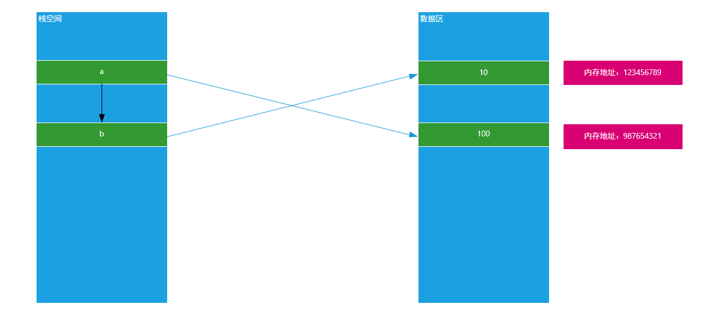
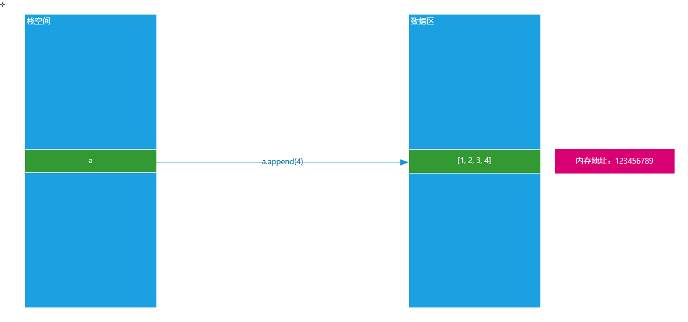
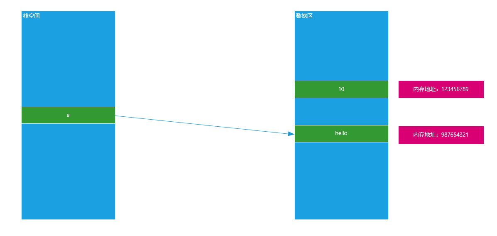
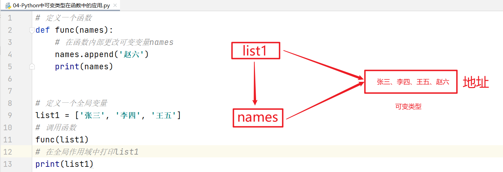
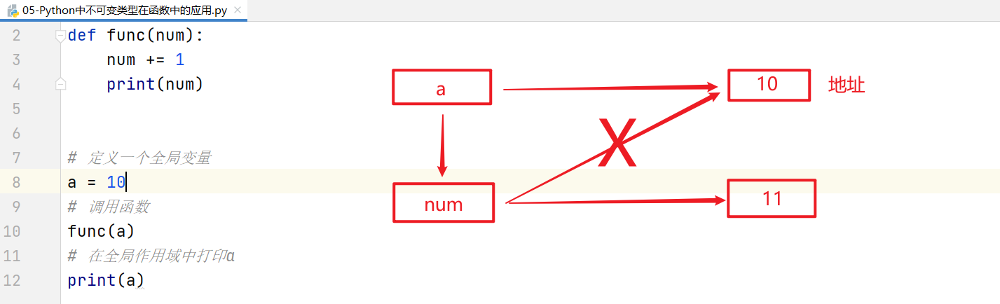

## 今日内容大纲

* Python推导式定义与应用  

* 函数定义与嵌套   ※※

* 变量的作用域 

* 函数参数进阶   ※※

* lambda函数应用场景

## 推导式

### 学习目标

* 掌握推导式的相关用法

### 什么是推导式

推导式comprehensions（又称解析式），是Python的一种独有特性。推导式是可以从一个数据序列构建另一个新的数据序列（一个有规律的列表或控制一个有规律列表）的结构体。 共有三种推导：`列表推导式`、`集合推导式`、`字典推导式`。

### 为什么需要推导式

案例：创建一个0-9的列表

while循环：

```python
# 初始化计数器
i = 0
list1 = []
# 编写循环条件
while i <= 9:
    list1.append(i)
 	# 更新计数器
    i += 1
print(list1)
```

for循环：

```python
list1 = []
# 编写for循环
for i in range(0, 10):
    list1.append(i)
print(list1)
```

思考：我们能不能把以上代码简化为一行代码搞定这个程序呢？

答：可以，使用推导式

### 列表推导式

基本语法：

```python
变量名 = [表达式 for 变量 in 列表]
变量名 = [表达式 for 变量 in 列表 if 条件]
变量名 = [表达式 for 变量 in 列表 for 变量 in 列表]
```

案例：定义0-9之间的列表

```python
list1 = []
for i in range(10):
    list1.append(i)
print(list1)
```

列表推导式

```python
list1 = [i for i in range(10)]
print(list1)
```

执行原理：[i for i in range(10)]

```powershell
列表推导式先运行表达式右边的内容：

当第一次遍历时：i = 0，其得到变量i的结果后，会放入最左侧的变量i中，这个时候列表中就是[0]
当第二次遍历时：i = 1，其得到变量i的结果后，会追加最左侧的变量i中，这个时候列表中就是[0, 1]
...
当最后一次遍历时：i = 9，其得到变量i的结果后，会追加最左侧的变量i中，这个时候列表中就是[0, 1, 2, 3, 4, 5, 6, 7, 8, 9]
```

### 列表推导式 + if条件判断

在使用列表推导式时候，我们除了可以使用for循环，其实我们还可以在其遍历的过程中，引入if条件判断。

```python
变量 = [表达式 for 临时变量 in 序列 if 条件判断]

等价于

for 临时变量 in 序列:
    if 条件判断
```

案例：生成0-9之间的偶数（i%2 == 0）序列

```python
list1 = [i for i in range(10) if i % 2 == 0]
print(list1)
```

### for循环嵌套列表推导式

```python
for 临时变量 in range(n):
    for 临时变量 in range(n):
```

基本语法：

```python
变量 = [表达式 for 临时变量 in 序列 for 临时变量 in 序列]
```

案例：创建列表 => [(1, 0), (1, 1), (1, 2), (2, 0), (2, 1), (2, 2)]

(1,0)    (1, 0-2)

(1,1)    (1, 0-2)

(1,2)    (1, 0-2)

-------------------

(2,0)    (2, 0-2)

(2,1)    (2, 0-2)

(2,2)    (2, 0-2)

原生代码：for循环嵌套

```python
list1 = []
# 外层循环
for i in range(1, 3):
    # 内层循环
    for j in range(0, 3):
        tuple1 = (i, j)
        list1.append(tuple1)
print(list1)
```

列表推导式：

```python
list1 = [(i, j) for i in range(1, 3) for j in range(0, 3)]
print(list1)
```

### 推导式案例

案例一：使用列表推导式生成平方数集合

~~~python
# 定义要生成的平方数的数量
n = 10

# 使用列表推导式生成平方数列表
squares_list = [i**2 for i in range(1, n + 1)]

# 将列表转换为集合
squares_set = set(squares_list)

# 输出结果
print("平方数集合:", squares_set)
~~~

#### 巩固练习

使用字段表达式将列表中元素映射为键值对，形成字典

~~~python
# 定义名字列表
names = ['Alice', 'Bob', 'Charlie']

# 定义年龄列表
ages = [25, 30, 35]
 
# 使用字典推导式将两个列表拼接成字典
people_dict = {names[i]: ages[i] for i in range(len(names))}

# 输出结果
print("\n名字列表:", names)
print("年龄列表:", ages)
print("拼接后的字典:", people_dict)
~~~

## Python中函数的作用与使用步骤

### 学习目标

* 掌握函数的定义和调用格式

### 为什么需要函数

在Python实际开发中，我们使用函数的目的只有一个“让我们的代码可以被重复使用”

函数的作用有两个：

==① 代码重用（代码重复使用）==

==② 模块化编程（模块化编程的核心就是函数，一般是把一个系统分解为若干个功能，每个功能就是一个函数）==

> 在编程领域，编程可以分为两大类：① 模块化编程 ② 面向对象编程

### 什么是函数

所谓的函数就是一个==被命名的==、==独立的、完成特定功能的代码段（一段连续的代码）==，并可能给调用它的程序一个==返回值==。


被命名的：在Python中，函数大多数是有名子的函数（普通函数）。当然Python中也存在没有名字的函数叫做匿名函数。

独立的、完成特定功能的代码段：在实际项目开发中，定义函数前一定要先思考一下，这个函数是为了完成某个操作或某个功能而定义的。（函数的功能一定要专一）

返回值：很多函数在执行完毕后，会通过return关键字返回一个结果给调用它的位置。

### 函数的定义

基本语法：

```python
def 函数名称([参数1, 参数2, ...]):
    函数体
    ...
    [return 返回值]
```

### 函数的调用

在Python中，函数和变量一样，都是先定义后使用。

```python
# 定义函数
def 函数名称([参数1, 参数2, ...]):
    函数体
    ...
    [return 返回值]

# 调用函数
函数名称(参数1, 参数2, ...)
```

### 通过一个栗子引入函数

① 使用Python代码，编写一个打招呼程序

```python
第一步：见到一个老师，打一声招呼
print('您好')
第二步：见到一个老师，打一声招呼
print('您好')
第二步：见到一个老师，打一声招呼
print('您好')
```

虽然以上程序可以满足程序的需求，但是我们发现，我们的代码做了很多重复性的工作。我们能不能对以上代码进行进一步的优化，避免代码的重复性编写。

② 升级：使用Python代码，编写一个打招呼程序（函数——一次编写，多次利用）

```python
# 定义函数（封装函数）
def greet():
    print('您好')

# 调用函数
# 见到一个老师，打一声招呼
greet()
# 见到一个老师，打一声招呼
greet()
# 见到一个老师，打一声招呼
greet()
```

③ 升级：使用Python代码编写一个打招呼程序，可以实现向不同的人打不同的招呼

```python
# 定义一个函数，同时为其定义一个参数
def greet(name):
    print(f'{name}，您好')

# 调用函数
# 见到了张老师，打一声招呼
greet('老张')
# 见到了李老师，打一声招呼
greet('老李')
# 见到了王老师，打一声招呼
greet('老王')
```

④ 函数的设计原则“高内聚、低耦合”，函数执行完毕后，应该主动把数返回给调用处，而不应该都交由print()等函数直接输出。

```python
# 定义一个函数，拥有name参数，同时函数执行完毕后，拥有一个return返回值
def greet(name):
    # 执行一系列相关操作
    return name + '，您好'

# 调用函数
# 见到了张老师，打一声招呼
print(greet('老张'))
# 见到了李老师，打一声招呼
print(greet('老李'))
# 见到了王老师，打一声招呼
print(greet('老王'))
```

### 聊聊return返回值

思考1：如果一个函数如些两个return (如下所示)，程序如何执行？

```python
def return_num():
    return 1
    return 2


result = return_num()
print(result)  # 1
```

答：只执行了第一个return，原因是因为return可以退出当前函数，导致return下方的代码不执行。


思考2：如果一个函数要有多个返回值，该如何书写代码？

答：在Python中，理论上一个函数只能返回一个结果。但是如果我们向让一个函数可以同时返回多个结果，我们可以使用`return 元组`的形式。

```python
def return_num():
    return 1, 2


result = return_num()
print(result)
print(type(result))  # <class 'tuple'>
```


思考3：封装一个函数，参数有两个num1，num2，求两个数的四则运算结果

四则运算：加、减、乘、除

```python
def size(num1, num2):
    jia = num1 + num2
    jian = num1 - num2
    cheng = num1 * num2
    chu = num1 / num2
    return jia, jian, cheng, chu


# 调用size方法
print(size(20, 5))
```

### 什么是说明文档

思考：定义一个函数后，程序员如何书写程序能够快速提示这个函数的作用？

答：注释

思考：如果代码多，我们是不是需要在很多代码中找到这个函数定义的位置才能看到注释？如果想更方便的查看函数的作用怎么办？

答：==函数的说明文档（函数的说明文档也叫函数的文档说明）==

### 总结

Q1:知道函数的作用

* 模块化编程
* 提高代码的复用性

Q2: 函数的定义格式

> def 函数名(参1, 参2...):
>
> ​	函数体
>
> ​	return 具体的返回值

Q3: 函数的调用格式

> 变量名 = 函数名(实参1, 实参2...)

## 函数的嵌套及案例

### 学习目标

* 掌握函数嵌套的格式

### 什么是函数的嵌套

所谓函数嵌套调用指的是==一个函数里面又调用了另外一个函数==。

### 函数嵌套的基本语法



嵌套函数的执行流程：

第一步：Python代码遵循一个“顺序原则”，从上往下，从左往右一行一行执行

当代码执行到第1行时，则在计算机内存中定义一个funcB函数。但是其内部的代码并没有真正的执行，跳过第2行继续向下运行。

第二步：执行到第5行，发现又声明了一个funcA的函数，根据函数的定义原则，定义就是在内存中声明有这样一个函数，但是没有真正的调用和执行。

第三步：代码继续向下执行，到第14行，发现funcA()，函数体()就代表调用funcA函数并执行其内部的代码。程序返回到第6行，然后一步一步向下执行，输出40个横杠，然后打印这是funcA函数的函数体部分...，然后继续向下执行，遇到funcB函数，后边有一个圆括号代表执行funcB函数，原程序处于等待状态。

第四步：进入funcB函数，执行输出这是funcB函数的函数体部分...，当代码完毕后，返回funcA函数中funcB()的位置，继续向下执行，打印40个横杠。

最终程序就执行结束了。

### 函数的应用案例

> 案例：奇偶求和

```python
"""
需求: 奇偶求和.
    编写一个程序，求出一个列表中偶数和奇数的和。
    定义函数calculate_sum()，参数为一个数字列表numbers_list, 分别求出偶数和奇数的和。
    最后，返回一个列表，第一个元素为偶数的和，第二个元素为奇数的和。

"""

# 1. 定义函数 calculate_sum()，参数为一个数字列表 numbers_list
def calculate_sum(numbers_list):
    # 2. 初始化偶数和为0
    even_sum = 0

    # 3. 初始化奇数和为0
    odd_sum = 0

    # 4. 遍历数字列表中的每个数字
    for num in numbers_list:
        # 5. 检查数字是否为偶数
        if num % 2 == 0:
            # 6. 如果是偶数，加到偶数和中
            even_sum += num
        else:
            # 7. 如果是奇数，加到奇数和中
            odd_sum += num

    # 8. 返回一个列表，第一个元素为偶数的和，第二个元素为奇数的和
    return [even_sum, odd_sum]


# 9. 从输入获取一个整数列表
numbers = [2, 5, 3, 7, 5, 7]

# 10. 调用 calculate_sum() 函数并获取结果
result = calculate_sum(numbers)

# 11. 打印结果
print(f"偶数的和是: {result[0]}, 奇数的和是: {result[1]}")
```

### 总结

Q1: 函数嵌套调用流程

- 默认按照顺序结构, 从上往下逐级调用

## 变量的作用域

### 学习目标

* 掌握变量的作用域
* 掌握global关键字的用法

### 什么是变量的作用域

变量作用域指的是变量的作用范围（变量在哪里可用，在哪里不可用），主要分为两类：全局作用域与局部作用域。

其实作用域的划分比较简单，在函数内部定义范围就称之为局部作用域，在函数外部（全局）定义范围就是全局作用域

```python
# 全局作用域
def func():
    # 局部作用域
```

### 局部变量与全局变量

在Python中，定义在函数外部的变量就称之为全局变量；定义在函数内部变量就称之为局部变量。

```python
# 定义在函数外部的变量（全局变量）
num = 10
# 定义一个函数
def func():
    # 函数体代码
    # 定义在函数内部的变量（局部变量）
    num = 100
```

### 变量作用域的作用范围

全局变量：在整个程序范围内都可以直接使用

```python
str1 = 'hello'
# 定义一个函数
def func():
    # 在函数内部调用全局变量str1
    print(f'在局部作用域中调用str1变量：{str1}')

# 直接调用全局变量str1
print(f'在全局作用域中调用str1变量：{str1}')
# 调用func函数
func()
```

局部变量：在函数的调用过程中，开始定义，函数运行过程中生效，函数执行完毕后，销毁

```python
# 定义一个函数
def func():
    # 在函数内部定义一个局部变量
    num = 10
    print(f'在局部作用域中调用num局部变量：{num}')

# 调用func函数
func()
# 在全局作用域中调用num局部变量
print(f'在全局作用域中调用num局部变量：{num}')
```

运行结果：



> 普及小知识：计算机的垃圾回收机制

### global关键字的应用场景

思考一个问题：我们能不能在局部作用域中对全局变量进行修改呢？

```python
# 定义全局变量num = 10
num = 10
# 定义一个函数func
def func():
    # 尝试在局部作用域中修改全局变量
    num = 20

# 调用函数func
func()
# 尝试访问全局变量num
print(num)
```

最终结果：弹出10，所以由运行结果可知，在函数体内部理论上是没有办法对全局变量进行修改的，所以一定要进行修改，必须使用`global`关键字。

```python
# 定义全局变量num = 10
num = 10
# 定义一个函数func
def func():
    # 尝试在局部作用域中修改全局变量
    global num
    num = 20

# 调用函数func
func()
# 尝试访问全局变量num
print(num)
```

> 记住：global关键字只是针对不可变数据类型的变量进行修改操作（数值、字符串、布尔类型、元组类型），可变类型可以不加global关键字。

### 总结

Q1: 变量的作用域

* 指的是变量的作用范围（变量在哪里可用，在哪里不可用)

Q2: global关键字的用法

* 实现在局部位置对全局变量做修改.

## 函数的参数进阶

### 学习目标

* 掌握函数参数之位置参数, 关键字参数的用法
* 掌握函数参数之不定长参数的用法

### 函数的参数

在函数定义与调用时，我们可以根据自己的需求来实现参数的传递。在Python中，函数的参数一共有两种形式：

① 形参 ② 实参

**形参**：在函数**定义时**，所编写的参数就称之为形式参数

**实参**：在函数**调用时**，所传递的参数就称之为实际参数

```python
def greet(name):  # name就是在函数greet定义时，所编写的参数（形参）
    return name + '，您好'

# 调用函数
name = '老王'
greet(name)  # 在函数调用时，所传递的参数就是实际参数
```

> 注意：虽然我们在函数传递时，喜欢使用相同的名称作为参数名称。但是两者的作用范围是不同的。name = '老王'，代表实参。其是一个全局变量，而greet(name)函数中的name实际是在函数定义时才声明的变量，所以其实一个局部变量。

### 函数的参数类型(调用)

####  ☆ 位置参数

理论上，在函数定义时，我们可以为其定义多个参数。但是在函数调用时，我们也应该传递多个参数，正常情况，其要一一对应。

```python
def user_info(name, age, address):
    print(f'我的名字{name}，今年{age}岁了，家里住在{address}')
    
# 调用函数
user_info('Tom', 23, '美国纽约')
```

> 注意事项：位置参数强调的是参数传递的位置必须一一对应，不能颠倒

#### ☆ 关键词参数（Python特有）

函数调用，通过“键=值”形式加以指定。可以让函数更加清晰、容易使用，同时也清除了参数的顺序需求。

```python
def user_info(name, age, address):
    print(f'我的名字{name}，今年{age}岁了，家里住在{address}')
    
# 调用函数（使用关键词参数）
user_info(name='Tom', age=23, address='美国纽约')
```

#### 函数定义时缺省参数（参数默认值）

缺省参数也叫默认参数，用于定义函数，为参数提供默认值，调用函数时可不传该默认参数的值（注意：所有位置参数必须出现在默认参数前，包括函数定义和调用）。

```python
def user_info(name, age, gender='男'):
    print(f'我的名字{name}，今年{age}岁了，我的性别为{gender}')


user_info('李林', 25)
user_info('振华', 28)
user_info('婉儿', 18, '女')
```

> 谨记：我们在定义缺省参数时，一定要把其写在参数列表的最后侧

### 不定长参数

不定长参数也叫可变参数。用于不确定调用的时候会传递多少个参数(不传参也可以)的场景。此时，可用==包裹(packing)位置参数==，或者==包裹关键字参数==，来进行参数传递，会显得非常方便。

### ☆ 不定长元组（位置）参数

````python
def user_info(*args):
    # print(args)  # 元组类型数据，对传递参数有顺序要求
    print(f'我的名字{args[0]}，今年{args[1]}岁了，住在{args[2]}')

# 调用函数，传递参数
user_info('Tom', 23, '美国纽约')
````

### ☆ 不定长字典（关键字）参数

```python
def user_info(**kwargs):
    # print(kwargs)  # 字典类型数据，对传递参数没有顺序要求，格式要求key = value值
    print(f'我的名字{kwargs["name"]}，今年{kwargs["age"]}岁了，住在{kwargs["address"]}')

# 调用函数，传递参数
user_info(name='Tom', address='美国纽约', age=23)
```

> kw = keyword + args

综上：无论是包裹位置传递还是包裹关键字传递，都是一个组包的过程。

Python组包：就是把多个数据组成元组或者字典的过程。

案例：Python中数据的传递案例

```python
def func(*args, **kwargs):
    print(args)
    print(kwargs)


# 定义一个元组（也可以是列表）
tuple1 = (10, 20, 30)
# 定义一个字典
dict1 = {'first': 40, 'second': 50, 'third': 60}
# 需求：把元组传递给*args参数，字典传递给**kwargs
# ① 如果想把元组传递给*args，必须在tuple1的前面加一个*号
# ② 如果想把字典传递给**kwargs，必须在dict1的前面加两个**号
func(*tuple1, **dict1)
```

## 可变与非可变数据类型

### 引用变量

在大多数编程语言中，值的传递通常可以分为两种形式“值传递与引用（地址）传递”，但是在Python中变量的传递基本上都是引用（地址）传递。

### ☆ 聊聊变量在内存底层的存储形式

```python
a = 10
```

第一步：首先在计算机内存中创建一个数值10（占用一块内存空间）

第二步：在栈空间中声明一个变量，如a

第三步：把数值10的**内存地址**赋予给变量小a，形成所谓的==“引用关系”==



### ☆ 如何验证Python中变量的引用关系

答：可以使用内置方法id()，其参数就是要显示的变量信息 => `id(变量名称)`

```python
a = 10
print(id(a))
```

### ☆ 把一个变量赋予给另外一个变量的影响

```python
a = 10
b = a
print(id(a))
print(id(b))
```

运行结果：



说明：由以上运行结果可知，当我们把一个变量赋予给另外一个变量时，其两者指向的内存地址相同。就说明a和b指向了同一块内存空间，原理图如下：



思考：如果在b = a以后，我们改变了变量a的值，问变量b是否会受到影响？

```python
# a = 10
# print(id(a))

a = 10
b = a

a = 100
print(b)  # 10 或 100

print(id(a))
print(id(b))
```

原理图：



总结：不可变数据类型（数值）在赋值以后，其中一个值的改变不影响另外一个变量，因为两者指向空间地址不同。

## Python中可变和非可变数据类型

### ☆ 问题1：在Python中一共有几种数据类型？

答：7种，数值（int整型、float浮点类型）、bool类型（True和False）、字符串类型（str）、元组（tuple 1,2,3）、列表（list [1, 2, 3]）、字典（dict {key:value})、集合（set {1, 2})

在Python中，我们可以把7种数据类型分为两大类：可变类型 + 非可变类型

① 不可变类型（内存地址一旦固定，其值就不能发生改变）

数值（int整型、float浮点类型）

bool类型（True和False）

字符串类型（str）

元组（tuple 1,2,3）


② 可变类型（内存地址一旦固定，其值是可以发生改变）

列表（list [1, 2, 3]）

字典（dict {key:value})

集合（set {1, 2})

### ☆ 问题2：如何判断一个数据类型是可变类型还是非可变类型？

在Python中，可变类型与非可变类型主要是通过这个数据类型在内存中的表现形式来进行定义的。

==① 可变类型就是在内存中，其内存地址一旦固定，其变量的值是可以发生改变的==

```python
a = [1, 2, 3]
print(id(a))

# 向内存中追加新数据（对数据进行改变只能通过数据类型.方法()实现）
a.append(4)
print(id(a))
```

原理图：



==② 非可变类型就是在内存中，内存地址一旦固定，其变量的值就没办法发生任何改变了==

```python
a = 10
print(id(a))

a = 'hello'
print(id(a))
```

原理图：



### 可变类型与非可变类型在函数中的应用

#### ☆ 可变类型

```python
# 定义一个函数
def func(mynames):
    mynames.append('赵六')
    
# 定义一个全局变量
names = ['张三', '李四', '王五']
# 调用函数
func(names)

print(names)  # ???
```

原理图：



综上所述：可变类型在函数中，如果在全局或局部中对可变类型进行增删改操作，其外部和内部都会受到影响。

#### ☆ 不可变类型

```python
# 定义一个函数
def func(num):
    num += 1
    print(num)
    
# 定义一个全局变量
a = 10
# 调用函数
func(a)
# 在全局作用域中打印a
print(a)
```



综上所述：不可变类型在函数中，局部或全局的改变对外部和内部都没有任何影响。

## 元组拆包

### 什么是拆包？

简单来说就是把一个元组中的数据一个一个拆解出来的过程，就称之为叫做拆包操作。

### 基本语法

```python
tuple1 = (10, 20)
# 拆包
num1, num2 = tuple1

以上代码可以简写为
num1, num2 = (10, 20)

还可以进一步简写
num1, num2 = 10, 20
```

### 拆包典型案例

实现两个变量值的交换

① 引入第三方变量实现数值交换

```python
c1 = '可乐'
c2 = '牛奶'

# 经过一系列Python操作，把c1和c2中的值进行交换
temp = c1
c1 = c2
c2 = temp

print(c1)  # 牛奶
print(c2)  # 可乐
```

② 使用元组拆包实现两个变量值交换

```python
c1 = '可乐'
c2 = '牛奶'

c1, c2 = (c2, c1)

print(c1)  # 牛奶
print(c2)  # 可乐
```


## lambda函数

### 普通函数与匿名函数

在Python中，函数是一个被命名的、独立的完成特定功能的一段代码，并可能给调用它的程序一个返回值。

所以在Python中，函数大多数是有名函数 => 普通函数。但是有些情况下，我们为了简化程序代码，也可以定义匿名函数 => lambda表达式

### lambda表达式应用场景

如果一个函数有一个返回值，并且只有一句代码，可以使用 lambda简化。

### lambda表达式基本语法

```python
变量 = lambda 函数参数:表达式（函数代码 + return返回值）
# 调用变量
变量()
```

### 编写lambda表达式

定义一个函数，经过一系列操作，最终返回100

```python
def fn1():
    return 100

# 调用fn1函数
print(fn1)  # 返回fn1函数在内存中的地址
print(fn1())  # 代表找到fn1函数的地址并立即执行
```

lambda表达式进行简化：

```python
fn2 = lambda : 100

print(fn2)  # 返回fn2在内存中的地址
print(fn2())
```

### 编写带参数的lambda表达式

编写一个函数求两个数的和

```python
def fn1(num1, num2):
    return num1 + num2

print(fn1(10, 20))
```

lambda表达式进行简化：

```python
fn2 = lambda num1, num2:num1 + num2

print(fn2(10, 20))
```

### ☆ 带默认参数的lambda表达式

```python
fn = lambda a, b, c=100 : a + b + c
print(fn(10, 20))
```

### ☆ 带if判断（三目运算符）的lambda表达式

```python
fn = lambda a, b : a if a > b else b

print(fn(10, 20))
```

### ☆ 列表数据+字典数据排序（重点）

知识点：列表.sort(key=排序的key索引, reverse=True)

```python
students = [
    {'name': 'Tom', 'age': 20},
    {'name': 'Rose', 'age': 19},
    {'name': 'Jack', 'age': 22}
]

# 按name值升序排列
students.sort(key=lambda x: x['name'])  # Jack/Rose/Tom
print(students)

# 按name值降序排列
students.sort(key=lambda x: x['name'], reverse=True)
print(students)

# 按age值升序排列
students.sort(key=lambda x: x['age'])
print(students)
```

## 作业

### 作业一_基础题：模拟计算器

需求：使用函数方式定义一个计算器，要求函数可以接收两个整数，并且可以返回这两个整数的加减乘除结果


### 作业二_进阶题：最近回文数

需求：查找最近回文数.回文数是指从前往后读和从后往前读都是一样的数字，比如 121。最近的回文数指的是离给定数字最近的回文数，比如给定数字 125，最近的回文数是121。编写一个程序，查找离给定整数最近的回文数。


