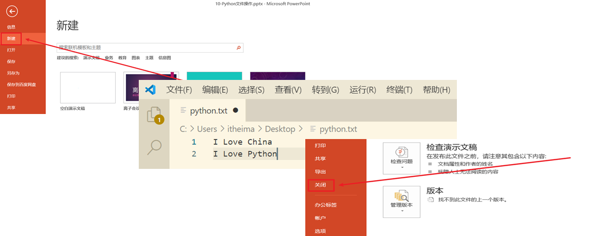

## 今日大纲

* 文件的概念与基本操作

* Python异常处理方式【掌握】

* 内置模块与自定义模块的应用【活学活用】

* 学生管理系统

## 文件的概念

### 学习目标

* 理解文件的相关概述
* 理解文件的作用

### 什么是文件

内存中存放的数据在计算机关机后就会消失。要长久保存数据，就要使用硬盘、光盘、U 盘等设备。为了便于数据的管理和检索，引入了==“文件”==的概念。

一篇文章、一段视频、一个可执行程序，都可以被保存为一个文件，并赋予一个文件名。操作系统以文件为单位管理磁盘中的数据。一般来说，==文件可分为文本文件、视频文件、音频文件、图像文件、可执行文件等多种类别。==


### 思考：文件操作包含哪些内容呢？

在日常操作中，我们对文件的主要操作：创建文件、打开文件、文件读写、文件备份等等



### 文件操作的作用

文件操作的作用就是==把一些内容(数据)存储存放起来==，可以让程序下一次执行的时候直接使用，而不必重新制作一份，省时省力。

### 总结

Q1: 文件操作包括哪些内容?

*  打开文件
* 读写操作
* 关闭文件

## 文件的基本操作

### 学习目标

* 掌握绝对路径和相对路径的写法
* 掌握文件的读取相关操作
* 掌握文件的写入相关操作

### open函数打开文件

在Python，使用open()函数，可以打开一个已经存在的文件，或者创建一个新文件，语法如下：

```python
f = open(name, mode)
注：返回的结果是一个file文件对象（后续会学习，只需要记住，后续方法都是f.方法()）
```

name：是要打开的目标文件名的字符串(可以包含文件所在的具体路径)。

mode：设置打开文件的模式(访问模式)：只读r、写入w、追加a等。

> r模式：代表以只读模式打开一个已存在的文件，后续我们对这个文件只能进行读取操作。如果文件不存在，则直接报错。另外，r模式在打开文件时，会将光标放在文件的第一行（开始位置）。

> w模式：代表以只写模式打开一个文件，文件不存在，则自动创建该文件。w模式主要是针对文件写入而定义的模式。但是，要特别注意，w模式在写入时，光标也是置于第一行同时还会清空原有文件内容。

> a模式：代表以追加模式打开一个文件，文件不存在，则自动创建该文件。a模式主要也是针对文件写入而定义模式。但是和w模式有所不同，a模式不会清空文件的原有内容，而是在文件的尾部追加内容。

文件路径：① 绝对路径 ② 相对路径

① 绝对路径：绝对路径表示绝对概念，一般都是从盘符开始，然后一级一级向下查找（不能越级），直到找到我们要访问的文件即可。

比如访问C盘路径下的Python文件夹下面的python.txt文件，其完整路径：

```powershell
Windows
C:\Python\python.txt
Linux
/usr/local/nginx/conf/nginx.conf
```

> 绝对路径一般路径固定了，文件就不能进行移动，另外在迁移过程中会比较麻烦。

② ==相对路径==：相对路径表示相对概念，不需要从盘符开始，首先需要找到一个参考点（就是Python文件本身）

同级关系：我们要访问的文件与Python代码处于同一个目录，平行关系，同级关系的访问可以使用`./文件名称`或者直接写`文件名称`即可

上级关系：如果我们要访问的文件在当前Python代码的上一级目录，则我们可以通过`../`来访问上一级路径（如果是多级，也可以通过../../../去一层一层向上访问

下级关系：如果我们要访问的文件在与Python代码同级的某个文件夹中，则我们可以通过`文件夹名称/`来访问某个目录下的文件

### 入门级案例

```python
# 1、打开文件
f = open('python.txt', 'w')
# 2、写入内容
f.write('人生苦短，我学Python！')
# 3、关闭文件
f.close()
```

> 强调一下：中文乱码问题，默认情况下，计算机常用编码ASCII、GBK、UTF-8

### 解决写入中文乱码问题

```python
# 1、打开文件
f = open('python.txt', 'w', encoding='utf-8')
# 2、写入内容
f.write('人生苦短，我学Python！')
# 3、关闭文件
f.close()
```

### 文件的读取操作

`read(size)方法`：主要用于文本类型或者二进制文件（图片、音频、视频...）数据的读取

size表示要从文件中读取的数据的长度（单位是字符/字节），如果没有传入size，那么就表示读取文件中所有的数据。

```python
f.read()  # 读取文件的所有内容
f.read(1024)  # 读取1024个字符长度文件内容，字母或数字
```

```python
# 1、打开文件
f = open('python.txt', 'r', encoding='utf-8')
# 2、使用read()方法读取文件所有内容
contents = f.read()
print(contents)
# 3、关闭文件
f.close()
```

`readlines()方法`：主要用于文本类型数据的读取

readlines可以按照行的方式把整个文件中的内容进行一次性读取，并且返回的是一个列表，其中每一行的数据为一个元素。

```python
# 1、打开文件
f = open('python.txt', 'r', encoding='utf-8')
# 2、读取文件
lines = f.readlines()
for line in lines:
    print(line, end='')
# 3、关闭文件
f.close()
```

`readline()方法`：一次读取一行内容，每运行一次readline()函数，其就会将文件的指针向下移动一行

```python
f = open('python.txt’)

while True:
   # 读取一行内容
   content = file.readline()
   # 判断是否读取到内容
   if not content:
       break
   # 如果读取到内容，则输出
   print(content)

# 关闭文件
f.close()
```

### 聊聊文件操作的mode模式

| **模式** | **描述**                                                     |
| -------- | ------------------------------------------------------------ |
| r        | 以只读方式打开文件。文件的指针将会放在文件的开头。这是默认模式。 |
| rb       | 以二进制格式打开一个文件用于只读。文件指针将会放在文件的开头。这是默认模式。 |
| r+       | 打开一个文件用于读写。文件指针将会放在文件的开头。           |
| rb+      | 以二进制格式打开一个文件用于读写。文件指针将会放在文件的开头。 |
| w        | 打开一个文件只用于写入。如果该文件已存在则打开文件，并从开头开始编辑，即原有内容会被删除。如果该文件不存在，创建新文件。 |
| wb       | 以二进制格式打开一个文件只用于写入。如果该文件已存在则打开文件，并从开头开始编辑，即原有内容会被删除。如果该文件不存在，创建新文件。 |
| w+       | 打开一个文件用于读写。如果该文件已存在则打开文件，并从开头开始编辑，即原有内容会被删除。如果该文件不存在，创建新文件。 |
| wb+      | 以二进制格式打开一个文件用于读写。如果该文件已存在则打开文件，并从开头开始编辑，即原有内容会被删除。如果该文件不存在，创建新文件。 |
| a        | 打开一个文件用于追加。如果该文件已存在，文件指针将会放在文件的结尾。也就是说，新的内容将会被写入到已有内容之后。如果该文件不存在，创建新文件进行写入。 |
| ab       | 以二进制格式打开一个文件用于追加。如果该文件已存在，文件指针将会放在文件的结尾。也就是说，新的内容将会被写入到已有内容之后。如果该文件不存在，创建新文件进行写入。 |
| a+       | 打开一个文件用于读写。如果该文件已存在，文件指针将会放在文件的结尾。文件打开时会是追加模式。如果该文件不存在，创建新文件用于读写。 |
| ab+      | 以二进制格式打开一个文件用于追加。如果该文件已存在，文件指针将会放在文件的结尾。如果该文件不存在，创建新文件用于读写。 |

> 虽然mode文件操作模式很多，但是我们只需要记住3个字符即可。r、w、a

> r+、w+、a+，代加号，功能全，既能读，又能写（区别在于指针到底指向不同）

> rb、wb、ab，代b的字符，代表以二进制的形式对其进行操作，适合读取文本或二进制格式文件，如图片、音频、视频等格式

> rb+、wb+、ab+，代加号，功能全，既能读，又能写（区别在于指针到底指向不同）

### 总结

Q1: 文件操作相关的函数有哪些?

* 打开文件: open()
* 读取数据: read(), readline(), readlines()
* 关闭文件: close()

## os模块

### 学习目标

* 掌握os模块常用函数

### os模块使用步骤

在Python中文件和文件夹的操作要借助os模块里面的相关功能，具体步骤如下：

第一步：导入os模块

```python
import os
```

第二步：调用os模块中的相关方法

```python
os.函数名()
```

### 文件操作相关方法

| **编号** | **函数**                          | **功能**             |
| -------- | --------------------------------- | -------------------- |
| 1        | os.rename(旧文件名称，新文件名称) | 对文件进行重命名操作 |
| 2        | os.remove(要删除文件名称)         | 对文件进行删除操作   |

案例：把Python项目目录下的python.txt文件，更名为linux.txt，休眠20s，刷新后，查看效果，然后对这个文件进行删除操作。

```python
# 第一步：导入os模块
import os
# 第三步：引入time模块
import time


# 第二步：使用os.rename方法对python.txt进行重命名
os.rename('python.txt', 'linux.txt')

# 第四步：休眠20s
time.sleep(20)

# 第五步：删除文件（linux.txt)
os.remove('linux.txt')
```

### 文件夹操作相关操作

前提：

```python
import os
```

相关方法：

| **编号** | **函数**                 | **功能**                                    |
| -------- | ------------------------ | ------------------------------------------- |
| 1        | os.mkdir(新文件夹名称)   | 创建一个指定名称的文件夹                    |
| 2        | os.getcwd()              | current  work   directory，获取当前目录名称 |
| 3        | os.chdir(切换后目录名称) | change  directory，切换目录                 |
| 4        | os.listdir(目标目录)     | 获取指定目录下的文件信息，返回列表          |
| 5        | os.rmdir(目标目录)       | 用于删除一个指定名称的"空"文件夹            |

案例1：

```python
# 导入os模块
import os


# 1、使用mkdir方法创建一个images文件夹
if not os.path.exists('images'):
	os.mkdir('images')

if not os.path.exists('images/avatar')
    os.mkdir('images/avatar')

# 2、getcwd = get current work directory
print(os.getcwd())

# 3、os.chdir，ch = change dir = directory切换目录
os.chdir('images/avatar')
print(os.getcwd())

# 切换到上一级目录 => images
os.chdir('../../')
print(os.getcwd())

# 4、使用os.listdir打印当前所在目录下的所有文件，返回列表
print(os.listdir())

# 5、删除空目录
os.rmdir('images/avatar')
```

案例2：准备一个static文件夹以及file1.txt、file2.txt、file3.txt三个文件

① 在程序中，将当前目录切换到static文件夹

② 创建一个新images文件夹以及test文件夹

③ 获取目录下的所有文件

④ 移除test文件夹

```python
# 导入os模块
import os

# ① 在程序中，将当前目录切换到static文件夹
os.chdir('File')
# print(os.getcwd())

# ② 创建一个新images文件夹以及test文件夹
if not os.path.exists('images'):
    os.mkdir('images')

if not os.path.exists('test'):
    os.mkdir('test')

# ③ 获取目录下的所有文件
# print(os.listdir())
for file in os.listdir():
    print(file)

# ④ 移除test文件夹
os.rmdir('test')
```

### 文件夹删除补充（递归删除、慎重！）

```python
# 导入shutil模块
import shutil

# 递归删除非空目录
shutil.rmtree('要删除文件夹路径')
```

> 递归删除文件夹的原理：理论上，其在删除过程中，如果文件夹非空，则自动切换到文件夹的内部，然后把其内部的文件，一个一个删除，当所有文件删除完毕后，返回到上一级目录，删除文件夹本身。

### with-open语句

它主要是针对于 文件操作的, 即: 你再也不用手动 close()释放资源了, 该语句会在 语句体执行完毕后, 自动释放资源.

格式:
​        with open('路径', '模式', '码表') as 别名,  open('路径', '模式', '码表') as 别名:
​            语句体

特点:
​        语句体执行结束后, with后边定义的变量, 会自动被释放.

案例：

~~~python
# 1. 打开 数据源 和 目的地文件.
with open('./data/a.txt', 'rb') as src_f, open('./data/b.txt', 'wb') as dest_f:
    # 2. 具体的 拷贝动作.
    # 2.1 循环拷贝.
    while True:
        # 2.2 一次读取8192个字节.
        data = src_f.read(8192)
        # 2.3 读完了, 就不读了.
        if len(data) <= 0:
        # if data == '':
            break
        # 2.4 走到这里, 说明读到了, 把读取到的数据写出到目的地文件.
        dest_f.write(data)
~~~

### 总结

Q1: OS模块的常用函数

* rename()
* remove()
* mkdir()
* getcwd()
* chdir()
* listdir()
* rmdir()
* shutil.rmtree()

## 文件案例

### 案例需求

反转文件内容.按行读取文件内容, 对每行的内容进行反转后, 写到另1个文件中.
例如:数据源文件: a.txt

~~~
数据源文件: a.txt
好好学习,
天天向上.
abc123!@#

目的地文件: b.txt
,习学好好
.上向天天
#@!321cba
~~~

### 实现思路

① 读取两个文件a.txt，并且将读取到的文件存储到一个列表中

② 遍历文件行中所有的内容，去除行末换行符，使用切片方式翻转内容

③ 将翻转后的内容加载到一个新的列表中

④将新列表的中的内容以文件的方式写到本地磁盘b.txt

### 代码实现

```python
# 1. 定义源文件路径和目标文件路径
source_file = "a.txt"
destination_file = "b.txt"

# 2. 打开源文件以读取模式 ('r')
with open(source_file, "r", encoding="utf-8") as src_file:
    # 3. 读取源文件的所有行
    lines = src_file.readlines()

# 4. 初始化一个列表用于存储反转后的行
reversed_lines = []

# 5. 遍历每行内容
for line in lines:
    # 6. 去除行末的换行符
    stripped_line = line.rstrip('\n')
    # 7. 反转行内容
    reversed_line = stripped_line[::-1]
    # 8. 将反转后的行添加到列表中，并添加换行符
    reversed_lines.append(reversed_line + '\n')

# 9. 打开目标文件以写入模式 ('w')
with open(destination_file, "w", encoding="utf-8") as dest_file:
    # 10. 将反转后的行写入目标文件
    dest_file.writelines(reversed_lines)

# 11. 打印操作完成的消息
print(f"文件内容已反转并保存到 {destination_file}")
```

### 巩固练习

拷贝文件并改名.例如: 把 a.py文件 拷贝到 a[备份].txt 文件中

~~~python
# 1. 定义源文件路径
source_file = "a.py"

# 2. 通过字符串切片和拼接方式定义目标文件路径
base_name = source_file[:-3]  # 去掉文件扩展名
destination_file = base_name + "[备份].txt"

# 3. 打开源文件以读取模式 ('r')
with open(source_file, "r", encoding="utf-8") as src_file:
    # 4. 读取源文件的所有内容
    content = src_file.read()

# 5. 打开目标文件以写入模式 ('w')
with open(destination_file, "w", encoding="utf-8") as dest_file:
    # 6. 将源文件的内容写入目标文件
    dest_file.write(content)

# 7. 打印操作完成的消息
print(f"文件 {source_file} 已拷贝并保存为 {destination_file}")
~~~

## Python异常

### 学习目标

* 掌握捕获异常的格式

### 什么是异常

当检测到一个错误时，解释器就无法继续执行了，反而出现了一些错误的提示，这就是所谓的"异常"。

### 异常演示

```python
# 除数为0
# print(10/0)

# 文件读取异常
f = open('python.txt', 'r')
content = f.readlines()
print(content)
```

### 异常捕获

基本语法：

```python
try:
    可能发生错误的代码
except:
    如果出现异常执行的代码
```

> try...except主要用于捕获代码运行时异常，如果异常发生，则执行except中的代码

案例：

```python
try:
    f = open('python.txt', 'r')
    content = f.readline()
    print(content)
except:
    f = open('python.txt', 'w', encoding='utf-8')
    f.write('发生异常，执行except语句中的代码')
f.close()
```

### 捕获异常并输出错误信息

无论我们在except后面定义多少个异常类型，实际应用中，也可能会出现无法捕获的未知异常。这个时候，我们考虑使用Exception异常类型捕获可能遇到的所有未知异常：

```python
try:
    可能遇到的错误代码
except Exception as e:
    print(e)
```

案例：打印一个未定义变量，使用Exception异常类进行捕获

```python
try:
    print(name)
except Exception as e:
    print(e)
```

### 异常捕获中else语句

else语句：表示的是如果没有异常要执行的代码。

```python
try:
    print(1)
except Exception as e:
    print(e)
else:
    print('哈哈，真开森，没有遇到任何异常')
```

案例：

```python
try:
    f = open('python.txt', 'r')
except Exception as e:
    print(e)
else:
    content = f.readlines()
    print(content)
    f.close()
```

### 异常捕获中的finally语句

finally表示的是无论是否异常都要执行的代码，例如关闭文件

```python
try:
    f = open('python.txt', 'r')
except:
    f = open('python.txt', 'w')
else:
    content = f.readlines()
    print(content)
finally:
    f.close()
```

### 异常案例

#### 案例需求

升级猜数字游戏，增加程序健壮性，用户在输入过程中可能不会输入数字或者不按照要求输入，程序要能捕获到用户的异常输入。在已有的猜数游戏中加入异常功能。

#### 实现思路

①使用python异常捕获try...except，捕获用户异常输入

#### 代码实现

~~~python
import random


def guess_number_game():
    # 1. 随机生成1个 1 ~ 100之间的数字, 让用户来猜.
    guess_num = random.randint(1, 100)

    while True:
        try:
            # 2. 键盘录入, 表示: 玩家出拳的编号.
            input_num = int(input('请录入您要猜的整数 (1-100): '))

            # 3. 判断用户是否猜对了, 并提示. 猜对, 猜大, 猜小.
            if input_num == guess_num:
                print('恭喜您, 猜对了, 请找夯老师领取奖品, 练习题一套!')
                break
            elif input_num > guess_num:
                print('哎呀, 您猜大了!')
            else:
                print('哎呀, 您猜小了!')
        except ValueError:
            print('输入无效，请输入一个整数!')


# 调用猜数字游戏函数
guess_number_game()
~~~

### 总结

Q1: 什么是异常?

* Python中, 把程序出现的所有非正常情况, 统称为异常.

Q2: 掌握捕获异常的格式.

> try:
>
> ​	可能出现问题的代码
>
> Except exception as e:
>
> ​	出现问题后的解决方案
>
> else:
>
> ​	如无异常, 则会执行这里的内容
>
> finally:
>
> ​	无论是否有问题, 都会执行这里的内容.

## Python内置模块

### 学习目标

* 理解Python模块的概念
* 掌握Python导入模块的方式

### 什么是Python模块

Python 模块(Module)，是一个==Python 文件==，以 .py 结尾，包含了 Python 对象定义和Python语句。模块能定义==函数，类和变量==，模块里也能包含可执行的代码。

```python
import os		=>     os.py
import time	    =>     time.py
import random  =>  random.py

random.randint(1, 10)
```

> 在Python中，模块通常可以分为两大类：==内置模块(目前使用的)== 和 ==自定义模块==

### 模块的导入方式

☆ import 模块名

☆ import 模块名 as 别名

☆ from 模块名 import *

☆ from 模块名 import 功能名

### 使用import导入模块

基本语法：

```python
import 模块名称
或
import 模块名称1, 模块名称2, ...
```

使用模块中封装好的方法：

```python
模块名称.方法()
```


案例：使用import导入math模块

```python
import math

# 求数字9的平方根 = 3
print(math.sqrt(9))
```

案例：使用import导入math与random模块

```python
import math, random

print(math.sqrt(9))
print(random.randint(-100, 100))
```

> 普及：我们在Python代码中，通过import方式导入的实际上都是文件的名称

### 使用as关键字为导入模块定义别名

在有些情况下，如导入的模块名称过长，建议使用as关键字对其重命名操作，以后在调用这个模块时，我们就可以使用别名进行操作。

```python
import time as t

# 调用方式
t.sleep(10)
```

> 在Python中，如果给模块定义别名，命名规则建议使用大驼峰。

### 使用from...import导入模块

提问：已经有了import导入模块，为什么还需要使用from 模块名 import 功能名这样的导入方式？

答：import代表导入某个或多个模块中的所有功能，但是有些情况下，我们只希望使用这个模块下的某些方法，而不需要全部导入。这个时候就建议采用from 模块名 import 功能名

### ☆ from 模块名 import *

这个导入方式代表导入这个模块的所有功能（等价于import 模块名）

```python
from math import *
```

### ☆ from 模块名 import 功能名（推荐）

```python
from math import sqrt, floor
```

注意：以上两种方式都可以用于导入某个模块中的某些方法，但是在调用具体的方法时，我们只需要`功能名()`即可

```python
功能名()
```

案例：

```python
# from math import *
# 或
from math import sqrt, floor

# 调用方式
print(sqrt(9))
print(floor(10.88))
```

### time模块中的time()方法

在Python中，time模块除了sleep方法以外，还有一个方法叫做time()方法

```python
time.time()
```

主要功能：就是返回格林制时间到当前时间的秒数（时间戳）

案例：求循环代码的执行时间

```python
import time

# 返回：格林制时间到当前时间的秒数
start = time.time()

# 编写一个循环
list1 = []
for i in range(1000000):
    list1.append(i)

end = time.time()
print(f'以上代码共执行了{end - start}s')
```

### 总结

Q1: 模块指的是什么?

* Python中, 把.py文件称之为模块.

Q2: 导入模块有哪些方式?

* import .... as 别名
* from ... import ... as 别名

## Python中的自定义模块

### 学习目标

* 理解什么是自定义模块

### 什么是自定义模块

在Python中，模块一共可以分为两大类：内置系统模块  和  自定义模块

模块的本质：在Python中，模块的本质就是一个Python的独立文件（后缀名.py），里面可以包含==全局变量、函数以及类==。

> 注：在Python中，每个Python文件都可以作为一个模块，模块的名字就是==文件的名字==。也就是说自定义模块名必须要符合标识符命名规则。

> 特别注意：我们在自定义模块时，模块名称不能为中文，不能以数字开头，另外我们自定义的模块名称不能和系统中自带的模块名称(如os、random)相冲突，否则系统模块的功能将无法使用。比如不能定义一个叫做os.py模块

### 定义一个自定义模块

案例：在Python项目中创建一个自定义文件，如my_module.py

```python
def sum_num(num1, num2):
   	return num1 + num2
```

### 导入自定义模块

```python
import 模块名称
或
from 模块名称 import 功能名
```

案例：

```python
import my_module

# 调用my_module1模块中自定义的sum_num方法
print(my_module.sum_num(10, 20))
```

### Python模块案例

#### 案例需求

在python中，创建A模块定义求和函数, 在B模块中调用A模块中的函数.

#### 代码实现

~~~python
# module_a.py

def sum_numbers(numbers):
    """计算列表中所有数字的和"""
    return sum(numbers)


# module_b.py
# 导入A模块
import module_a

# 定义一个数字列表
numbers = [1, 2, 3, 4, 5]

# 调用A模块中的求和函数
total_sum = module_a.sum_numbers(numbers)

# 输出结果
print(f"列表 {numbers} 的和是: {total_sum}")
~~~

#### 巩固练习

在python中，创建A模块定义打印水仙花数函数, 在B模块中调用.

~~~python
"""
需求: 练: A模块定义打印水仙花数函数, 在B模块中调用.
"""

# A模块
# 1. 定义打印水仙花数的函数
def print_narcissistic_numbers():
    # 2. 遍历100到999之间的所有数字
    for num in range(100, 1000):
        # 3. 计算数字的每一位
        hundreds = num // 100
        tens = (num // 10) % 10
        units = num % 10

        # 4. 计算水仙花数
        if num == hundreds ** 3 + tens ** 3 + units ** 3:
            # 5. 打印水仙花数
            print(num)

# B模块
# 1. 导入A模块中的打印水仙花数函数
from module_a import print_narcissistic_numbers

# 2. 调用打印水仙花数函数
print_narcissistic_numbers()
~~~

## 学生管理系统

### 案例需求

使用python语言实现学生管理系统，要求进入系统显示系统功能界面，功能如下：

~~~python
添加学生信息
删除学生信息
修改学生信息
查询学生信息
遍历所有学生信息
退出系统
~~~

系统共6个功能，用户根据自己需求选取，实现该需求

### 实现思路

①构建系统功能菜单界面封装函数

②使用函数封装功能实现对学生信息添加、删除、修改、查询、遍历和退出


### 代码实现

~~~python
# 1. 定义函数 print_info()  , 打印提示信息.
def print_info():
    print('1. 添加学生信息')
    print('2. 删除学生信息')
    print('3. 修改学生信息')
    print('4. 查询单个学生信息')
    print('5. 查询所有的学生信息')
    print('6. 退出系统')


# 3.1 定义容器, 用来存储学生信息, 格式如下:
# [{'id':'heima001', 'name':'刘亦菲', 'tel': '111'}, {'id':'heima002', 'name':'高圆圆', 'tel': '222'}]
info = []

# 3. 自定义函数 add_info(), 实现: 添加学生, 编号必须唯一
def add_info():
    # 3.2 提示用户录入 学生的学号并接收.
    new_id = input('请录入您要添加的学生的学号: ')  # heima001, heima002, abc...

    # 3.3 判断, 用户录入的学号是否存在, 如果存在, 就提示 学号存在, 然后添加结束.  如果不存在, 就提示录入 其它信息, 接收并存储.
    for stu in info:  # stu的格式, {'id':'heima001', 'name':'刘亦菲', 'tel': '111'}
        if stu['id'] == new_id:
            # 走这里, 说明学号存在
            print('您录入的学号已存在, 请重新操作')
            break
    else:
        # 走这里, 说明没有走break, 说明 录入的学号不存在, 就提示录入其它信息, 并添加.
        new_name = input('请录入您要添加的学生的姓名: ')
        new_tel = input('请录入您要添加的学生的手机号: ')
        # 3.4 将用户录入的数据封装成字典.
        stu_dict = {'id': new_id, 'name': new_name, 'tel': new_tel}
        # 3.5 将上述的字典(一个学生的信息), 添加到 学生列表中(info)
        # global info  说明我们在操作全局变量, 但是因为 info是一个列表, 它是可变类型, 所以形参的改变直接影响实参.
        info.append(stu_dict)


# 4. 自定义函数 delete_info(), 实现: 删除学生, 根据编号删除
def delete_info():
    # 4.1 提示用户录入要删除的学生学号, 并接收.
    del_id = input('请录入您要删除的学生的id:')
    # 4.2 判断该学号是否存在.
    for stu in info:
        # stu 就是已经存在的每一个学生的信息, 格式为:  {'id':'heima001', 'name':'刘亦菲', 'tel': '111'}
        if stu['id'] == del_id:
            # 4.3 如果学号存在就删除该学生.
            info.remove(stu)  # 删除学生信息
            print(f'学号为 {del_id} 的学生信息已删除成功!')
            break
    else:
        # 4.4 如果学号不存在, 就提示: 该学号不存在, 请重新操作.
        print('您录入的学号不存在, 请重新操作')


# 5. 自定义函数 update_info(), 实现: 修改学生信息, 根据编号修改, 只能修改: 姓名, 手机号.
def update_info():
    # 5.1 提示用户录入要修改的学生学号, 并接收.
    update_id = input('请录入您要修改的学生的id:')
    # 5.2 判断该学号是否存在.
    for stu in info:
        # stu 就是已经存在的每一个学生的信息, 格式为:  {'id':'heima001', 'name':'刘亦菲', 'tel': '111'}
        if stu['id'] == update_id:
            # 5.3 如果学号存在就修改 该学生信息.
            new_name = input('请录入您要修改的学生的姓名: ')
            new_tel = input('请录入您要修改的学生的手机号: ')
            # 5.4 根据录入的信息, 修改元素值.
            stu['name'] = new_name
            stu['tel'] = new_tel

            print(f'学号为 {update_id} 的学生信息已修改成功!')
            break
    else:
        # 4.4 如果学号不存在, 就提示: 该学号不存在, 请重新操作.
        print('您录入的学号不存在, 请重新操作')


# 6. 自定义函数 search_info(), 实现: 查询某个学生信息, 根据姓名查询
def search_info():
    # 6.1 提示用户录入要查询的学生的姓名, 并接收.
    search_name = input('请录入您要查询的学生的姓名:')

    # 6.5 我们用bool类型的变量标记是否查找到学生, True: 有这个人, False: 没有这人
    # 6.5.1 初值为 False, 假设没有这个学生.
    flag = False

    # 6.2 判断该姓名是否存在.
    for stu in info:
        # stu 就是已经存在的每一个学生的信息, 格式为:  {'id':'heima001', 'name':'刘亦菲', 'tel': '111'}
        if stu['name'] == search_name:
            # 6.3 如果姓名存在就打印该学生.
            print(stu)
            # 6.5.2 查找到学生了, 就将flag的值改为 True
            flag = True

    # 6.5.3 判断是否查询到学生.
    # if flag == False:
    if not flag:  # 逻辑运算符, and, or, not
        # 6.4 如果姓名不存在, 就提示: 查无此人, 请重新操作.
        print('查无此人, 请重新操作')


# 7. 自定义函数 search_all(), 实现: 查询所有学生的信息.
# 数据格式为: [{'id':'heima001', 'name':'刘亦菲', 'tel': '111'}, {'id':'heima002', 'name':'高圆圆', 'tel': '222'}]

def search_all():
    # 7.1 判断是否有学生信息, 如果没有则提示用户先添加再查询.
    if len(info) == 0:
        print('没有学生信息, 请先添加, 后查询!')
    else:
        # 7.2 如果有, 则打印所有学生信息.
        # 直接遍历所有.
        for stu in info:
            print(f'学生id:{stu["id"]}, 学生姓名:{stu["name"]}, 学生手机号:{stu["tel"]}')


# 2. 自定义while True循环逻辑, 实现: 用户录入什么数据, 就进行相应的操作
# 注意: 处理一下非法值.
# if __name__ == '__main__':
while True:
    # 2.1 打印操作界面信息.
    print_info()

    # 2.2 提示用户录入他/她要进行操作的数字, 并接收.
    num = input('请录入您要操作的数字: ')
    if num == '1':
        add_info()
    elif num == '2':
        delete_info()
    elif num == '3':
        update_info()
    elif num == '4':
        search_info()
    elif num == '5':
        search_all()
    elif num == '6':
        print('谢谢您的使用, 让我们下次再会!')
        break  # 记得结束循环
    else:
        print('没有这样的数字, 录入有误, 请重新录入')
    print()  # 目的, 更好的展示结果.

~~~


