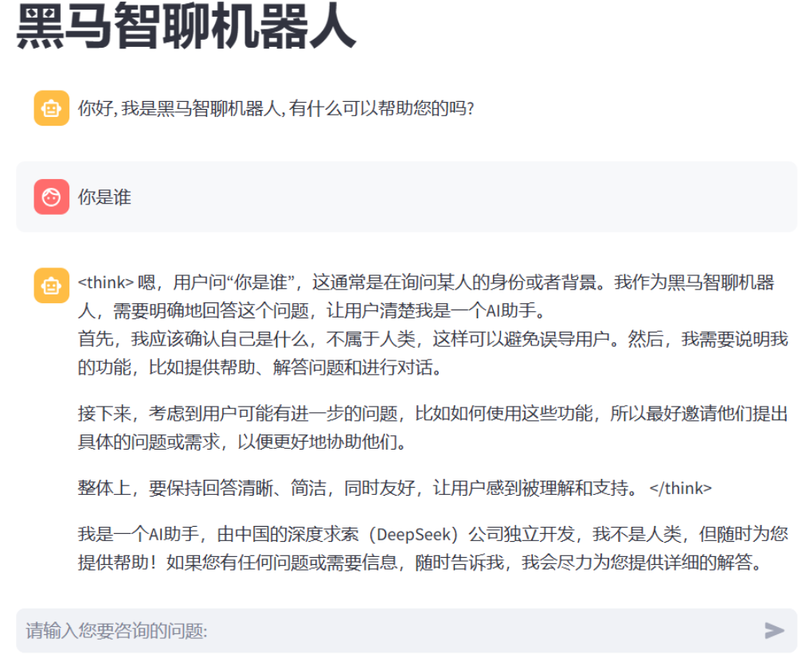
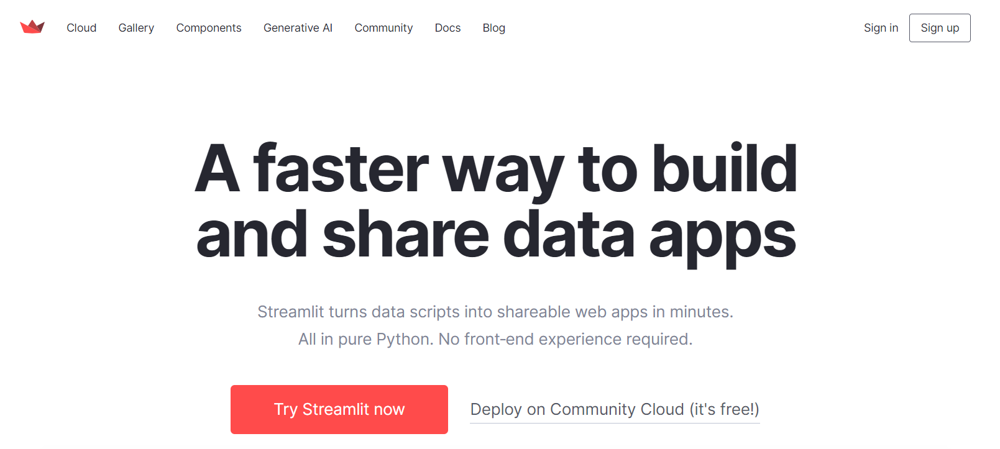

## 今日目标

* 掌握Ollama模块实现
* 熟练使用Streamlit
* 掌握基于Ollama平台Python语言聊天机器人实现

## 【熟悉】黑马智聊机器人

### 项目介绍

随着人工智能技术的飞速发展，聊天机器人在多个领域得到了广泛应用，如客户服务、教育辅导、娱乐互动等。然而，现有的许多聊天机器人依赖于云端服务，这不仅可能导致用户数据隐私泄露，还可能因网络延迟影响用户体验。因此，开发一款本地部署的聊天机器人显得尤为重要。本地聊天机器人能够在用户本地环境中运行，确保数据的安全性和对话的实时性，同时也能根据用户的个性化需求进行定制和优化。

### 项目演示



### 项目技术架构

- **后端模型**：利用 Ollama 平台的 Qwen 模型，该模型具备出色的自然语言处理能力，能够理解和生成自然语言文本，为聊天机器人提供核心的对话处理功能。
- **前端界面**：采用 Streamlit 框架搭建用户界面，Streamlit 是一个简单易用的 Python 库，能够快速创建美观、交互式的 Web 应用，使用户能够通过网页与聊天机器人进行**实时**对话。

- **对话交互**：用户可以通过 Streamlit 界面输入文本，聊天机器人基于 Qwen 模型对输入内容进行理解和处理，生成相应的回复并展示在界面上，实现**流畅**的对话交互。
- **模型调用**：后端服务负责将用户输入传递给 Qwen 模型，并获取模型生成的回复，然后将回复内容返回给前端界面进行展示，确保对话的**实时**性和准确性。
- **界面展示**：Streamlit 界面提供简洁明了的布局，包括输入框、发送按钮和对话展示区域，用户可以方便地输入问题并查看机器人的回答，提升用户体验。

### 项目开发环境

- **操作系统**：支持主流操作系统，如 Windows、macOS 和 Linux。
- **依赖软件**：需要安装 Python 环境以及 Ollama 平台和 Streamlit 库。
- **硬件要求**：推荐配置较高的处理器和足够的内存，以确保模型的高效运行和良好的用户体验。

## 【熟练】Ollama模块实现

### 学习目标

能够使用Python调用本地部署大模型API，完成聊天对话功能

### Qwen模型PythonAPI实现文本扩写

>需求：通过python调用API实现基于qwen2在0.5b数据集下实现对文本的续写，用户输入一个简短的故事开头，系统能够生成一段连贯、有趣的续写内容。
>
>**细节: 本地需要先安装下依赖包.** 
>
>pip install ollama 
>
>pip install langchain -i https://pypi.tuna.tsinghua.edu.cn/simple
>pip install langchain-community -i https://pypi.tuna.tsinghua.edu.cn/simple
>pip install dashscope -i https://pypi.tuna.tsinghua.edu.cn/simple
>
>pip install streamlit==1.32.0

```python
import ollama
response = ollama.chat(model='qwen2:0.5b',messages=[{'role': 'user', 'content': '从前有座山，山里有个庙，续写一下', },])
print(response.message.content)
print(response['message']['content'])
```

### Qwen模型PythonAPI实现文本问答

>需求：构建一个简单的命令行交互程序，用户可以通过输入问题与AI模型进行对话。该程序将使用qwen2:0.5b语言模型。用户可以通过命令行输入问题，程序将调用AI模型生成回答，并将结果输出到终端。

```python
import ollama
# 3. 定义一个循环
while True:
    # 4. 获取prompt提示词
    prompt = input("请输入您的问题：")
    response = ollama.chat(model='qwen2:0.5b',
                           messages=[{'role': 'user', 'content': prompt, }, ])
    # 5. 调用模型，回答问题
    result = response['message']['content']
    # 6. 打印回答
    print(result)
```

### Qwen模型PythonAPI实现编程代码

>需求：构建一个基于AI模型的代码生成工具，用户可以通过输入自然语言描述所需功能，AI模型将自动生成相应的Python代码。该工具旨在帮助开发者快速获取代码片段，减少手动编写代码的时间。

```python
# 4. 获取prompt提示词
prompt = """
请为以下功能生成一段Python代码：
求两个数的最大公约数
"""
response = ollama.chat(model='qwen2:0.5b',
                       messages=[{'role': 'user', 'content': prompt}, ])
# 5. 调用模型，回答问题
result = response['message']['content']
# 6. 打印回答
print(result)

```

### Qwen模型PythonAPI实现情感标签

>需求：构建一个基于AI模型的用户反馈分类工具，用户可以通过输入具体的反馈内容，AI模型将自动将其归类到预设的类别中（如“价格过高”、“售后支持不足”、“产品使用体验不佳”、“其他”）。该工具旨在帮助企业快速分析用户反馈，识别主要问题，并采取相应的改进措施。

```python
# 4. 获取prompt提示词
prompt = """
你需要对用户的反馈进行原因分类。
分类包括：价格过高、售后支持不足、产品使用体验不佳、其他。
回答格式为：分类结果：xx。
用户的问题是：性价比不高，我觉得不值这个价钱。
"""
response = ollama.chat(model='qwen2:0.5b',
                       messages=[{'role': 'user', 'content': prompt}, ])
# 5. 调用模型，回答问题
result = response['message']['content']
# 6. 打印回答
print(result)
```

### 小结

* 能够使用Python调用本地部署大模型API，完成聊天对话功能
  * 掌握基于Ollama平台调用Qwen模型
    * 文本扩写
    * 文本问答
    * 编程代码
    * 情感标签

## 【熟练】Streamlit

### 学习目标

实现基于Streamlit前端聊天页面开发

只用 `Python` 也能做出很漂亮的网站？`Streamlit` 说可以。


`Streamlit` 官方介绍：能在几分钟内把 `Python` 脚本变成可分享的网站。只需使用纯 `Python` ，无需前端经验。甚至，你只需要懂 `markdown` ，然后按照一定规则去做也能搞个网页出来。它还支持免费部署。


官方网站：https://streamlit.io/



### Streamlit安装

首先你的电脑需要有 `python` 环境。

有 `python` 环境后，使用下面这条命令就可以安装 `streamlit`。

```powershell
pip install streamlit==1.32.0 -i https://pypi.tuna.tsinghua.edu.cn/simple
```

安装 `streamlit` 成功后可以使用下面这条命令看看能不能运行起来。

```powershell
streamlit hello
```

### 基础语法

#### 标题

使用 `st.title()` 可以设置标题内容。

```python
st.title('Streamlit教程')
```

#### 段落write

段落就是 `HTML` 里的 `<p>` 元素，在 `streamlit` 里使用 `st.write('内容')` 的方式去书写。

```python
import streamlit as st

st.write('Hello')
```

#### 使用markdown

`streamlit` 是支持使用 `markdown` 语法来写页面内容的，只需使用单引号或者双引号的方式将内容包起来，并且使用 `markdown` 的语法进行书写，页面就会出现对应样式的内容。

```python
import streamlit as st

"# 1级标题"
"## 2级标题"
"### 3级标题"
"#### 4级标题"
"##### 5级标题"
"###### 6级标题"
```

#### 图片

渲染图片可以使用 `st.image()` 方法，也可以使用 `markdown` 的语法。

`st.image(图片地址, [图片宽度])` ，其中图片宽度不是必填项。

```python
import streamlit as st

st.image('./avatar.jpg', width=400)
```

#### 表格

`streamlit` 有静态表格和可交互表格。表格在数据分析里属于常用组件，所以 `streamlit` 的表格也支持 `pandas` 的 `DataFrame` 。


静态表格 table

静态表格使用 `st.table()` 渲染，出来的效果就是 `HTML` 的 `<table>`。

`st.table()` 支持传入字典、`pandas.DataFrame` 等数据。

```python
import streamlit as st
import pandas as pd

st.write('dict字典形式的静态表格')
st.table(data={
    'name': ['张三', '李四', '王五'],
    'age': [18, 20, 22],
    'gender': ['男', '女', '男']
})

st.write('pandas中dataframe形式的静态表格')

df = pd.DataFrame(
    {
        'name': ['张三', '李四', '王五'],
        'age': [18, 20, 22],
        'gender': ['男', '女', '男']
    }
)
st.table(df)
```

#### 可交互表格 dataframe

可交互表格使用 `st.dataframe()` 方法创建，和 `st.table()` 不同，`st.dataframe()` 创建出来的表格支持按列排序、搜索、导出等功能。

```python
import streamlit as st
import pandas as pd

st.write('dict字典形式的可交互表格')
st.dataframe(data={
    'name': ['张三', '李四', '王五'],
    'age': [18, 20, 22],
    'gender': ['男', '女', '男']
})

st.write('pandas中dataframe形式的可交互表格')
df = pd.DataFrame(
    {
        'name': ['张三', '李四', '王五'],
        'age': [18, 20, 22],
        'gender': ['男', '女', '男']
    }
)
st.dataframe(df)
```

#### 分割线

分隔线就是 `HTML` 里的 `<hr>` 。在 `streamlit` 里使用 `st.divider()` 方法绘制分隔线。

```python
import streamlit as st

st.divider()
```

#### 输入框

知道怎么声明变量后，可以使用一个变量接收输入框的内容。

输入框又可以设置不同的类型，比如普通的文本输入框、密码输入框。

* 普通输入框

输入框使用 `st.text_input()` 渲染。

```python
name = st.text_input('请输入你的名字：')

if name:
  st.write(f'你好，{name}')
```

☆ 密码

如果要使用密码框，可以给 `st.text_input()` 加多个类型 `type="password"`。

```python
import streamlit as st

pwd = st.text_input('密码是多少？', type='password')
```

☆ 数字输入框 number_input

数字输入框需要使用 `number_input`

```python
import streamlit as st

age = st.number_input('年龄：')

st.write(f'你输入的年龄是{age}岁')
```

众所周知，正常表达年龄是不带小数位的，所以我们可以设置 `st.number_input()` 的步长为1，参数名叫 `step`。

```python
# 省略部分代码

st.number_input('年龄：', step=1)
```

这个步长可以根据你的需求来设置，设置完后，输入框右侧的加减号每点击一次就根据你设置的步长相应的增加或者减少。

还有一点，人年龄不可能是负数，通常也不会大于200。可以通过 `min_value` 和 `max_value` 设置最小值和最大值。同时还可以通过 `value` 设置默认值。

```python
st.number_input('年龄：', value=20, min_value=0, max_value=200, step=1)
```

#### 多行文本框 text_area

创建多行文本框使用的是 `st.text_area()`，用法和 `st.text_input()` 差不多。

```python
import streamlit as st

paragraph = st.text_area("多行内容：")
```

#### Chat Elements

* Chat文本输入框

  ```shell
  import streamlit as st
  
  prompt = st.chat_input("Say something")
  if prompt:
      st.write(f"User has sent the following prompt: {prompt}")
  ```

* Chat Message

```python
# 导入 Streamlit 库，Streamlit 是一个用于快速创建数据应用的 Python 库
import streamlit as st

# 使用 st.chat_input 创建一个聊天输入框，提示用户输入问题
prompt = st.chat_input('请输入您的问题: ')

st.write(f'您的问题是: {prompt}')

# 使用 st.chat_message 创建一个用户消息容器，用于显示用户的消息
# 'user' 表示这是用户发送的消息
with st.chat_message('user'):
    # 在用户消息容器中显示文本 'Hello '
    st.write('Hello ')

# 使用 st.chat_message 创建一个消息容器，用于显示回复消息
message = st.chat_message('assistant')
# 在消息容器中显示文本 'Hello Human'，模拟助手的回复
message.write('Hello Human')
```

### 小结

* 实现基于Streamlit前端页面开发
  * 标题：
  * 输入框
  * 多行文本框

## 【掌握】Ollama平台聊天机器人实现

### 学习目标

实现基于Python调用Qwen模型API接口聊天机器人开发

### 需求

构建一个基于大模型的本地智能聊天机器人，利用其强大的自然语言处理和生成能力，为用户提供高效、精准、个性化的对话服务。该聊天机器人将集成先进的大规模预训练语言模型（如GPT、Qwen等），具备自然语言理解、多轮对话、情感分析、知识问答等核心功能，并可根据具体应用场景进行定制化扩展，例如客服咨询、教育辅导、娱乐互动等。

项目采用模块化设计，前端通过Streamlit等框架实现简洁易用的交互界面，后端基于Ollama等平台进行模型部署和管理，确保系统的高效性和可扩展性。项目目标是打造一个智能化、人性化的聊天机器人，提升用户体验，降低人工成本，并探索大模型技术在不同领域的创新应用。

### 模型调用

~~~~python
# 1. 导入相关包
import ollama

# 2. 定义一个函数，用于发起请求，返回结果
# def get_response(prompt):
#     messages = []
#     messages.append({'role': 'user', 'content': prompt, })
#     response = ollama.chat(model='qwen2.5:7b', messages=messages)
#     return response['message']['content']

# 3. 定义一个函数，用于发起请求，返回结果
def get_response(prompt):
    # response = ollama.chat(model='qwen2:0.5b', messages=prompt[-50:])
    response = ollama.chat(model='deepseek-r1:8b', messages=prompt[-50:])
    return response['message']['content']


# 7. 测试，测试结束后，终止
if __name__ == '__main__':
    s=input("请输入你要表达的内容")
    while True:

        prompt = s
        result = get_response(prompt)
        print(result)
~~~~

### 前端实现

~~~python
# 1. 导入相关包，如streamlit包
import streamlit as st
from langchain.memory import ConversationBufferMemory
from utils import get_response

# 3. 主界面主标题
st.title("黑马智聊机器人")

# 5. 会话保持：用于存储会话记录
if "memory" not in st.session_state:
    st.session_state['memory'] = ConversationBufferMemory()
    st.session_state['messages'] = [{'role': 'assistant', 'content': '你好，我是黑马智聊机器人，有什么可以帮助你的么？'}]

# 6. 编写一个循环结构，用于打印会话记录
for message in st.session_state['messages']:
    with st.chat_message(message['role']):
        st.markdown(message['content'])

# 4. 创建一个聊天窗口
prompt = st.chat_input("请输入您要咨询的问题：")
# 7. 如果文本框有数据，继续向下执行
if prompt:
    st.session_state['messages'].append({'role': 'user', 'content': prompt})
    st.chat_message("user").markdown(prompt)
    # 10. 向utils工具箱发起请求，返回响应
    with st.spinner("AI小助手正在思考中..."):
        content = get_response(st.session_state['messages'])
    st.session_state['messages'].append({'role': 'assistant', 'content': content})
    st.chat_message("assistant").markdown(content)
~~~

### 小结

* 实现基于Python调用Qwen模型API接口聊天机器人开发
  * 实现前端页面开发
  * 完成后端Python业务代码实现

## 作业

结合自己写的聊天机器人,生成学生管理系统框架

