## Chat Elements构建聊天界面

```python
# 1. 导入streamlit模块
import streamlit as st

# 2. 给界面添加一个侧边栏（导航）
with st.sidebar:
    st.write('请输入Tongyi的API Key：')
    api_key = st.text_input('', type='password')

# 3. 内容区设计
st.markdown('### 通义聊天机器人')
st.divider()

# 4. 设计一个文本输入框，获取用户的prompt
prompt = st.chat_input("请输入您的问题：")

# 用户信息
with st.chat_message("user"):
    st.write("Hello 👋")

# 机器人信息
message = st.chat_message("assistant")
message.write("Hello human")
```


## 了解LangChain的学习目标

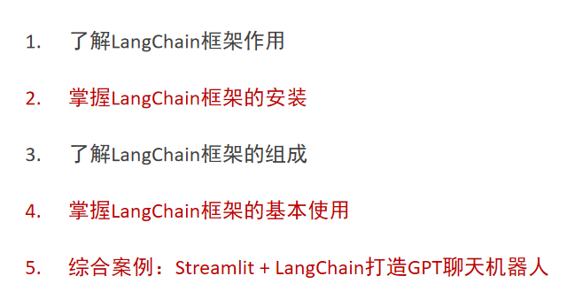


## LangChain框架概述和组成

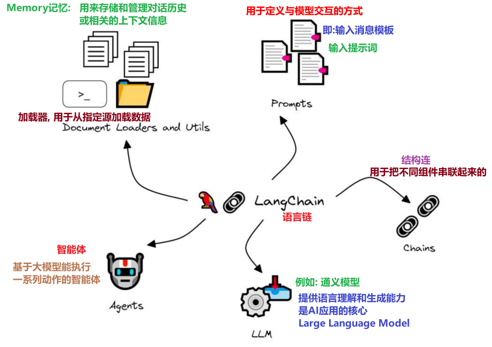

## LangChain的基础使用

```python
pip install langchain -i https://pypi.tuna.tsinghua.edu.cn/simple
pip install langchain-community -i https://pypi.tuna.tsinghua.edu.cn/simple
pip install dashscope -i https://pypi.tuna.tsinghua.edu.cn/simple          # 灵积服务
```

## 申请模型

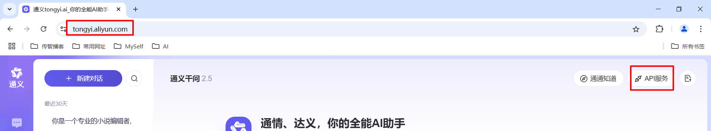

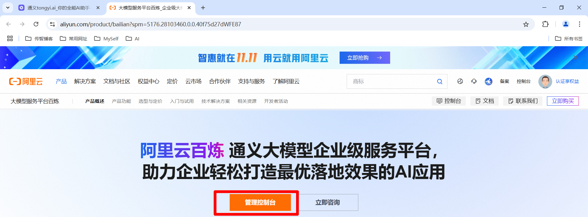

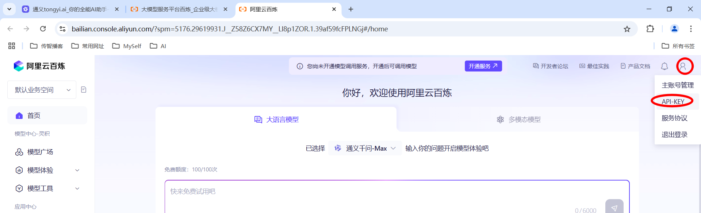

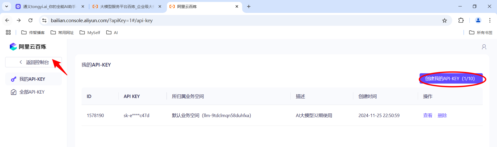

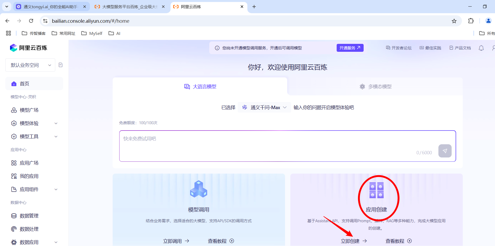

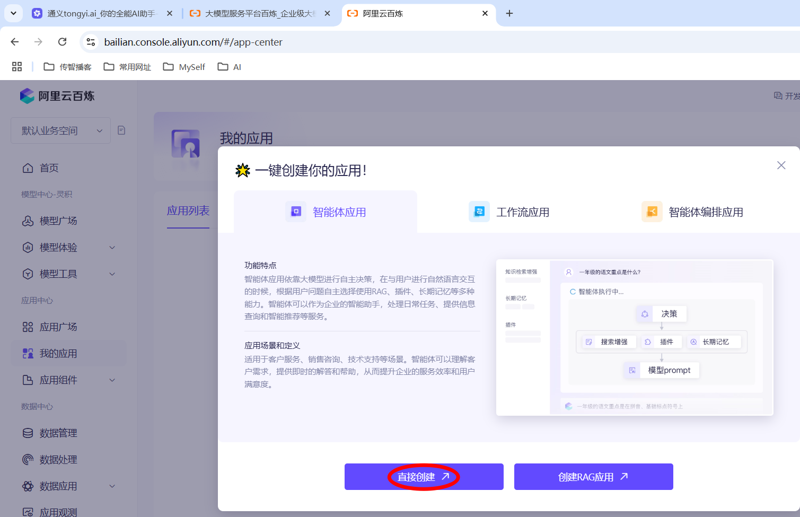

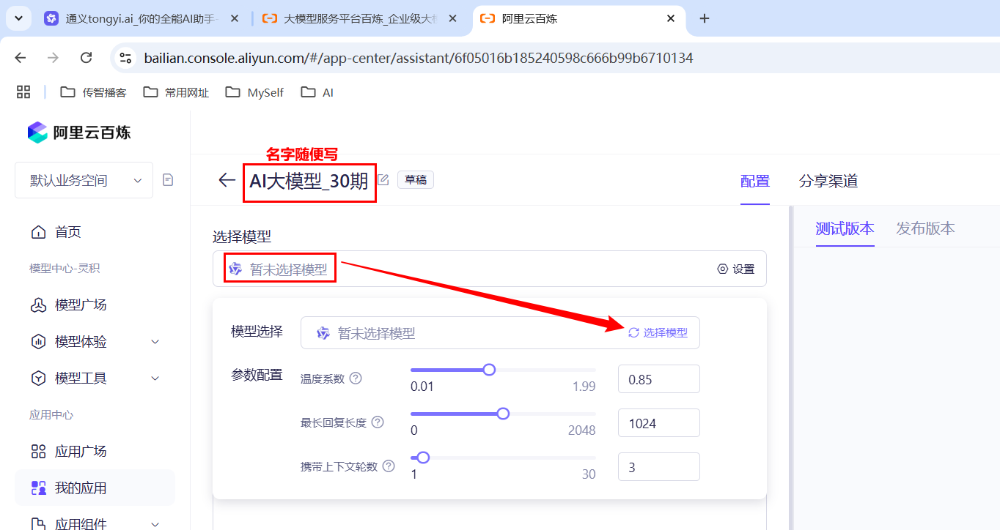

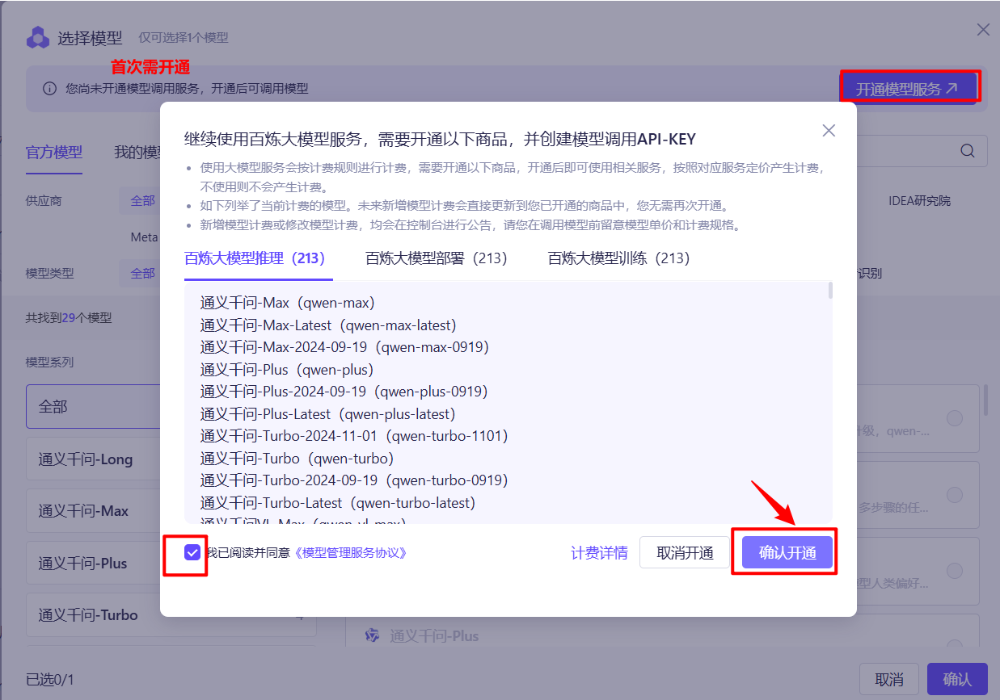

* **细节: 首次开通需要支付宝实名认证, 且要重置一下, 具体如下.** 

  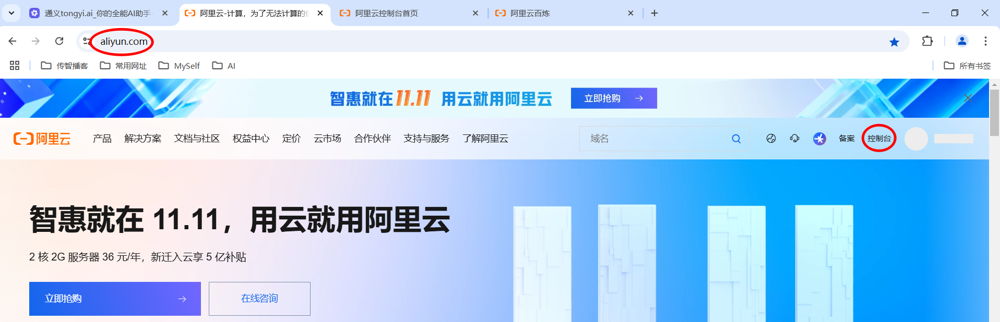

  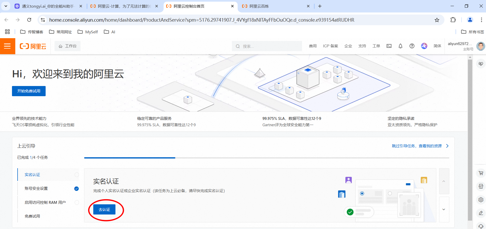

  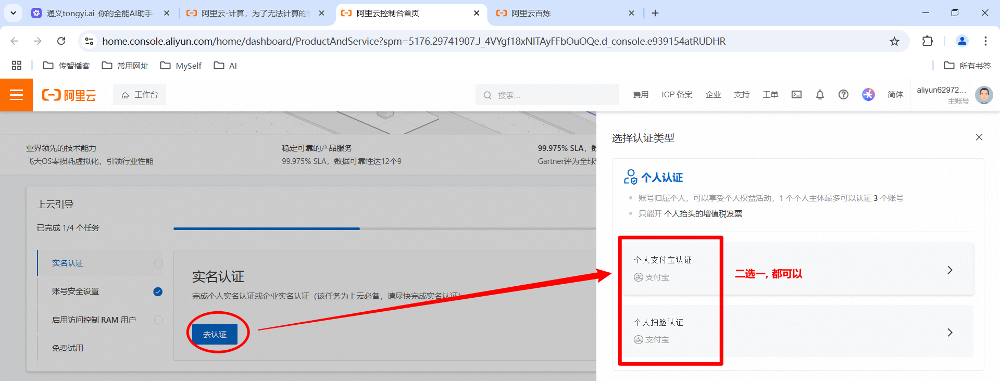

  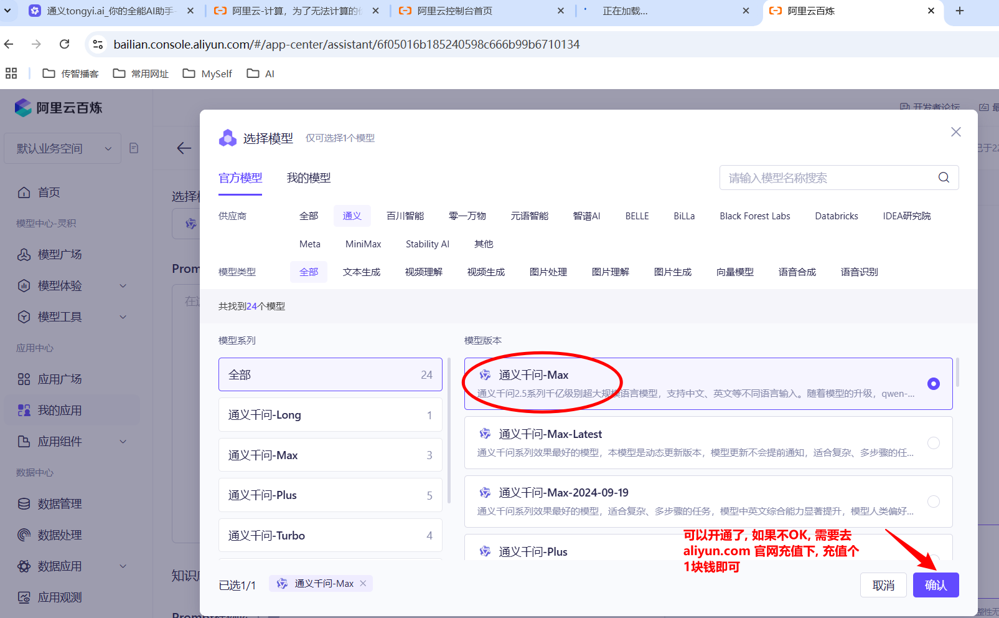

  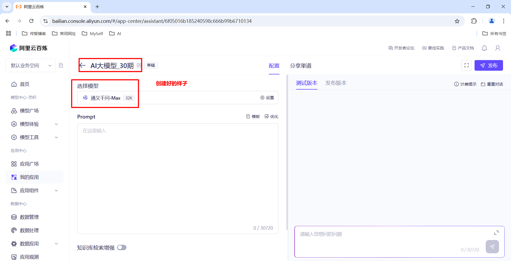

  * 配置Path环境变量

    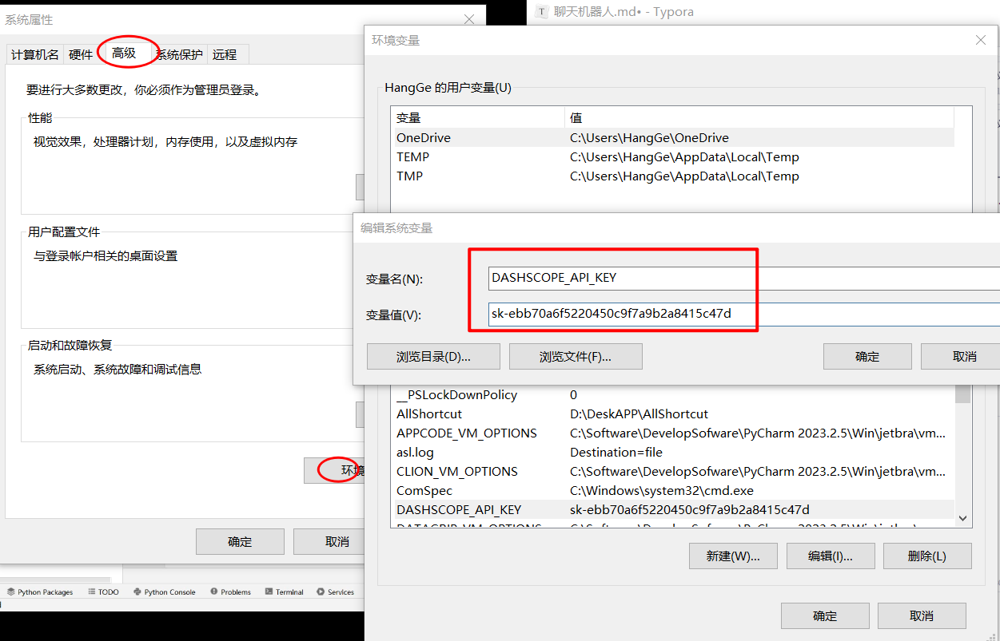


  ## 案例_文本扩写案例

  ```python
  # 1. 导入Tongyi模型
from langchain_community.llms import Tongyi

# 2. 定义一个prompt提示词
prompt = "从前有座山，山里有座庙"

# 3. 实例化Tongyi模型
llm = Tongyi(
    model = "qwen-max",
    # 如果配置了Path环境变量, 可以省略不写 dashscope_api_key, Mac本如果出问题, 可以把参数写为: api_key
    dashscope_api_key = "sk-68130f72b3144e2f886ab07660a212b4"
)

# 4. 发送请求
result = llm.invoke(prompt)

# 5. 返回最终结果
print(f"提示词：{prompt}")
print(f"最终结果：{result}")
  ```


## 案例_文本循环问答案例

```python
# 1. 导入相关包.
from langchain_community.llms import Tongyi

# 2. 初始化模型.
llm = Tongyi(
    model = 'qwen-max'		
)

# 3. 定义一个循环.
while True:
    # 4. 获取prompt提示词.
    prompt = input('请输入您的问题: ')
    # 5. 调用模型, 回答问题.
    result = llm.invoke(prompt)
    # 6. 打印结果.
    print(result)
```


## 案例_代码生成案例

```python
# 1. 导入相关包.
from langchain_community.llms import Tongyi

# 2. 初始化模型.
llm = Tongyi(
    model = 'qwen-max'
)

# 3.定义提示词.
prompt = """
请为一下功能生成一段Python代码: 求两个数的最大公约数
"""

# 4. 调用模型生成代码.
result = llm.invoke(prompt)

# 5. 打印结果.
print(result)
```


## 输入模板介绍_自定义翻译软件

```python
# 1. 导包
from langchain_community.llms import Tongyi
from langchain.prompts import ChatPromptTemplate    # 消息模板(把用户消息 => 消息体)

# 2. 创建模型.
llm = Tongyi(model='qwen-max')

# 3. 创建消息模板.
prompt_template = ChatPromptTemplate.from_messages([
    ('system', '你一个语言翻译工具, 你可以把{input_language}翻译为{output_language}'),
    ('human', '用户文本: {text}\n, 翻译后的语言风格{style}')
])

# 4. 根据以上模型, 传入模板消息变量值, 组成最终的消息体.
# 定义1个变量, 代表用户要翻译的文本.
text = input('请输入您要翻译的内容: ')
prompt_value = prompt_template.invoke({
    'input_language': '英语',
    'output_language': '中文',
    'text': text,
    'style': '文言文'
})

# 5. 调用模型, 得到结果.
result = llm.invoke(prompt_value)
print(result)
```

## 聊天机器人_utils工具类编写

```python
# 1. 导包
from langchain_community.llms import Tongyi
from langchain.chains import ConversationChain
from langchain.prompts import ChatPromptTemplate
from langchain.memory import ConversationBufferMemory


# 2. 定义一个函数, 用于发起请求, 返回结果.
def get_response(prompt, memory, api_key):
    # 3. 创建模型对象
    llm = Tongyi(model='qwen-max', dashscope_api_key=api_key)
    # 4. 创建chains链
    chains = ConversationChain(llm=llm, memory=memory)
    # 5. 发起请求, 获取结果.
    response = chains.invoke({'input': prompt})
    # 6. response是记忆体, 很对之前会话, 本次会话包含在一个response的key中
    return response['response'] # 这样写是只取本次会话的response


# 在main函数中测试
if __name__ == '__main__':
    # 1. 组装模板
    prompt = '世界上第二高的山峰是哪一座?'

    # 2. 创建记忆体对象
    memory = ConversationBufferMemory(return_messages=True)

    # 3. 获取API_KEY
    api_key = 'sk-68130f72b3144e2f886ab07660a212b4'

    # 4. 调用函数, 获取结果.
    result = get_response(prompt=prompt, memory=memory, api_key=api_key)
    # 5. 打印结果
    print(result)

```

## 聊天机器人_主界面设计

```python
# 1. 导包
import streamlit as st
from langchain.memory import ConversationBufferMemory
from utils import get_response

# 2. 设置做侧边栏
with st.sidebar:
    # 显示文本
    api_key = st.text_input('请输入Tongyi账号的API KEY:', type='password')
    st.markdown("[获取Tongyi账号的API KEY](https://bailian.console.aliyun.com/?apiKey=1#/api-key)")

# 3. 主界面主标题
st.title('通义聊天机器人')

# 4. 创建1个聊天窗口
prompt = st.chat_input("请输入您要咨询的问题:")
if prompt:
    # 5. 显示消息体, 并且设置消息类型为user
    st.chat_message('user').markdown(prompt)
```

## 聊天机器人_主界面及功能实现

* main.py 文件中的代码

  ```python
  # 1. 导包
  import streamlit as st      # 导入streamlit包, 该包作用是: 快速搭建Web应用.
  from langchain.memory import ConversationBufferMemory   # 导入会话记录模块
  from utils import get_response  # 导入工具类
  
  # 2. 设置做侧边栏
  with st.sidebar:
      # 显示文本
      api_key = st.text_input('请输入Tongyi账号的API KEY:', type='password')
      st.markdown("[获取Tongyi账号的API KEY](https://bailian.console.aliyun.com/?apiKey=1#/api-key)")
  
  # 3. 主界面主标题
  st.title('通义聊天机器人')
  
  # 4. 会话保持: 用于存储会话记录.
  if 'memory' not in st.session_state:
      # 初始化会话记录, memory: 会话记录, messages: 会话记录中的消息列表
      st.session_state['memory'] = ConversationBufferMemory()
      st.session_state['messages'] = [{'role':'ai', 'content':'你好, 我是通义聊天机器人, 有什么可以帮助你的吗?'}]
  
  # 5. 编写1个循环结构, 用于打印会话记录(中的消息列表)
  for message in st.session_state.messages:
      # 创建一个消息体, 并且设置消息类型
      with st.chat_message(message['role']):
          st.markdown(message['content'])
  
  # 6. 创建1个聊天窗口
  prompt = st.chat_input("请输入您要咨询的问题:")
  # 如果文本框有数据, 继续往下执行.
  if prompt:
      # 7. 显示消息体, 并且设置消息类型为user
      # st.chat_message('user').markdown(prompt)
  
      # 如果没有API KEY, 直接返回提示.
      if not api_key:
          st.warning('请输入Tongyi的API KEY!')
          st.stop()
      # 8. 走到这里, 代表: 1. 有API KEY; 2. 有输入文本. 把用户信息显示在主窗体
      st.session_state['messages'].append({'role':'human', 'content':prompt})
      st.chat_message('human').markdown(prompt)
      # 9. 向utils工具类发起请求, 返回响应.
      # 显示一个等待框.
      with st.spinner('AI小助手正在思考中...'):
          content = get_response(prompt, st.session_state['memory'], api_key)
  
      # 10. 把AI的回复信息, 添加到会话记录中.
      st.session_state['messages'].append({'role':'ai', 'content':content})
      # 11. 把AI的回复信息, 显示在主窗体中.
      st.chat_message('ai').markdown(content)
  
  ```

* utils.py 文件中的代码

  ```python
  # 1. 导包
  from langchain_community.llms import Tongyi
  from langchain.chains import ConversationChain
  from langchain.prompts import ChatPromptTemplate
  from langchain.memory import ConversationBufferMemory
  
  
  # 2. 定义一个函数, 用于发起请求, 返回结果.
  def get_response(prompt, memory, api_key):
      """
      根据用户录入的提示词, 获取结果(响应体).
      :param prompt: 用户输入的提示词
      :param memory: 记忆体
      :param api_key: API密钥
      :return:
      """
      # 3. 创建模型对象, 参1: 模型名称, 参2: API密钥
      llm = Tongyi(model='qwen-max', dashscope_api_key=api_key)
      # 4. 创建chains链, 参1: 模型对象, 参2: 记忆体对象
      chains = ConversationChain(llm=llm, memory=memory)
      # 5. 发起请求, 获取结果.
      response = chains.invoke({'input': prompt})
      # 6. response是记忆体, 很对之前会话, 本次会话包含在一个response的key中
      return response['response'] # 这样写是只取本次会话的response
  
  
  # 在main函数中测试
  if __name__ == '__main__':
      # 1. 组装模板
      prompt = '世界上第二高的山峰是哪一座?'
  
      # 2. 创建记忆体对象
      memory = ConversationBufferMemory(return_messages=True)
  
      # 3. 获取API_KEY
      api_key = 'sk-68130f72b3144e2f886ab07660a212b4'
  
      # 4. 调用函数, 获取结果.
      result = get_response(prompt=prompt, memory=memory, api_key=api_key)
      # 5. 打印结果
      print(result)
  ```