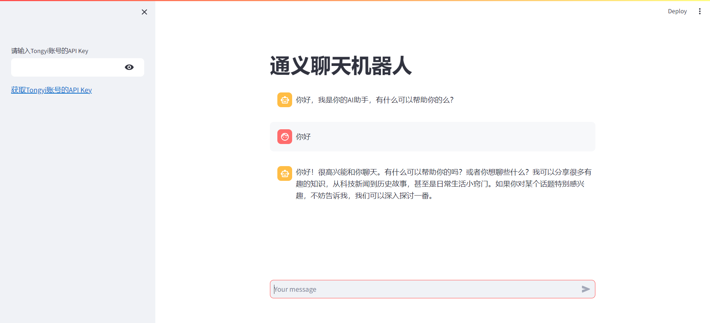

# Streamlit教程

# 一、引言

只用 `Python` 也能做出很漂亮的网站？`Streamlit` 说可以。



`Streamlit` 官方介绍：能在几分钟内把 `Python` 脚本变成可分享的网站。只需使用纯 `Python` ，无需前端经验。甚至，你只需要懂 `markdown` ，然后按照一定规则去做也能搞个网页出来。它还支持免费部署，感动到落泪。

官方网站：https://streamlit.io/


# 二、Streamlit安装

首先你的电脑需要有 `python` 环境。

有 `python` 环境后，使用下面这条命令就可以安装 `streamlit`。

```powershell
pip install streamlit -i https://pypi.tuna.tsinghua.edu.cn/simple
```

安装 `streamlit` 成功后可以使用下面这条命令看看能不能运行起来。

```powershell
streamlit hello
```

# 三、基础语法

## 1、标题

使用 `st.title()` 可以设置标题内容。

```python
st.title('Streamlit教程')
```

## 2、段落write

段落就是 `HTML` 里的 `<p>` 元素，在 `streamlit` 里使用 `st.write('内容')` 的方式去书写。

```python
import streamlit as st

st.write('Hello')
```

## 3、使用markdown

`streamlit` 是支持使用 `markdown` 语法来写页面内容的，只需使用单引号或者双引号的方式将内容包起来，并且使用 `markdown` 的语法进行书写，页面就会出现对应样式的内容。

```python
import streamlit as st

"# 1级标题"
"## 2级标题"
"### 3级标题"
"#### 4级标题"
"##### 5级标题"
"###### 6级标题"
```

## 4、图片

渲染图片可以使用 `st.image()` 方法，也可以使用 `markdown` 的语法。

`st.image(图片地址, [图片宽度])` ，其中图片宽度不是必填项。

```python
import streamlit as st

st.image('./avatar.jpg', width=400)
```

## 5、表格

`streamlit` 有静态表格和可交互表格。表格在数据分析里属于常用组件，所以 `streamlit` 的表格也支持 `pandas` 的 `DataFrame` 。


### 静态表格 table

静态表格使用 `st.table()` 渲染，出来的效果就是 `HTML` 的 `<table>`。

`st.table()` 支持传入字典、`pandas.DataFrame` 等数据。

```python
import streamlit as st
import pandas as pd

st.write('dict字典形式的静态表格')
st.table(data={
    'name': ['张三', '李四', '王五'],
    'age': [18, 20, 22],
    'gender': ['男', '女', '男']
})

st.write('pandas中dataframe形式的静态表格')
df = pd.DataFrame(
    {
        'name': ['张三', '李四', '王五'],
        'age': [18, 20, 22],
        'gender': ['男', '女', '男']
    }
)
st.table(df)
```

### 可交互表格 dataframe

可交互表格使用 `st.dataframe()` 方法创建，和 `st.table()` 不同，`st.dataframe()` 创建出来的表格支持按列排序、搜索、导出等功能。

```python
import streamlit as st
import pandas as pd

st.write('dict字典形式的可交互表格')
st.dataframe(data={
    'name': ['张三', '李四', '王五'],
    'age': [18, 20, 22],
    'gender': ['男', '女', '男']
})

st.write('pandas中dataframe形式的可交互表格')
df = pd.DataFrame(
    {
        'name': ['张三', '李四', '王五'],
        'age': [18, 20, 22],
        'gender': ['男', '女', '男']
    }
)
st.dataframe(df)
```

## 6、分割线

分隔线就是 `HTML` 里的 `<hr>` 。在 `streamlit` 里使用 `st.divider()` 方法绘制分隔线。

```python
import streamlit as st

st.divider()
```

## 7、变量

接下来要介绍的组件在交互上会越来越丰富，所以在此先引入一个“变量”的东西。

使用 `streamlit` 写页面也支持 `python` 的变量。变量的主要作用是存值。

```python
import streamlit as st

a = 10
b = 20

st.write(a * b)
```

## 8、条件判断

```python
import streamlit as st

a = 11

if a % 2 == 0:
  st.write(f'{a}是偶数')
else:
  st.write(f'{a}是奇数')
```

## 9、循环for

循环（遍历）可以使用 for，语法就是 `python` 的语法。

```python
import streamlit as st

for i in range(1, 10, 2):
  st.write(i)
```

## 10、输入框

知道怎么声明变量后，可以使用一个变量接收输入框的内容。

输入框又可以设置不同的类型，比如普通的文本输入框、密码输入框。

### ☆ 普通输入框

输入框使用 `st.text_input()` 渲染。

```python
name = st.text_input('请输入你的名字：')

if name:
  st.write(f'你好，{name}')
```

### ☆ 密码

如果要使用密码框，可以给 `st.text_input()` 加多个类型 `type="password"`。

```python
import streamlit as st

pwd = st.text_input('密码是多少？', type='password')
```

### ☆ 数字输入框 number_input

数字输入框需要使用 `number_input`

```python
import streamlit as st

age = st.number_input('年龄：')

st.write(f'你输入的年龄是{age}岁')
```

众所周知，正常表达年龄是不带小数位的，所以我们可以设置 `st.number_input()` 的步长为1，参数名叫 `step`。

```python
# 省略部分代码

st.number_input('年龄：', step=1)
```

这个步长可以根据你的需求来设置，设置完后，输入框右侧的加减号每点击一次就根据你设置的步长相应的增加或者减少。

还有一点，人年龄不可能是负数，通常也不会大于200。可以通过 `min_value` 和 `max_value` 设置最小值和最大值。同时还可以通过 `value` 设置默认值。

```python
st.number_input('年龄：', value=20, min_value=0, max_value=200, step=1)
```

### ☆ 多行文本框 text_area

创建多行文本框使用的是 `st.text_area()`，用法和 `st.text_input()` 差不多。

```python
import streamlit as st

paragraph = st.text_area("多行内容：")
```

### ☆ 复选框

很多应用在登录之前需要用户同意某些协议才能使用，如果你网站也需要这个功能的话可以使用复选框 `st.checkbox()` 让用户去勾选。

```python
import streamlit as st

checked = st.checkbox("同意以上条款")
if checked:
  st.write("同意")
else:
  st.write("不同意")
```

### ☆ 单选框

使用 `st.radio()` 可以制作单选按钮，比如让用户选择性别的时候就能派上用场。

```python
import streamlit as st

res = st.radio(
  "请选择您的性别",
  ["男", "女", "保密"]
)
```

单选按钮也可以使用一个变量来接收结果。

它还支持设置默认值，使用 `index` 参数即可。`index` 的默认值是0，也就是选中下标为 0 的那项。可以根据你的需求自定义设置。

```python
import streamlit as st

res = st.radio(
  "请选择您的性别",
  ["男", "女", "保密"],
   index=1
)
```

### ☆ 单选下拉框 selectbox

使用 `st.selectbox()` 可以创建单选下拉框。

用法是：

```python
st.selectbox(
  "提示语", 
  ["选项1", "选项2"]
)
```

案例：

```python
import streamlit as st

article = st.selectbox(
  "你喜欢哪篇文章？", 
  [
    "《『Python爬虫』极简入门》",
    "《『SD』零代码AI绘画：光影字》",
    "《『SD』Stable Diffusion WebUI 安装插件（以汉化为例）》",
    "《NumPy从入门到精通》"
  ]
)

st.write(f"你喜欢{article}")
```

### ☆ 多选下拉框 multiselect

使用 `st.multiselect()` 可以创建多选下拉框，用法和 `st.selectbox()` 一样。

```python
import streamlit as st

article_list = st.multiselect("你喜欢哪篇文章？", 
  [
    "《『Python爬虫』极简入门》",
    "《『SD』零代码AI绘画：光影字》",
    "《『SD』Stable Diffusion WebUI 安装插件（以汉化为例）》",
    "《NumPy从入门到精通》"
  ]
)

for article in article_list:
  st.write(f"你喜欢{article}")
```

### ☆ 滑块 slider

可以使用 `st.slider()` 创建滑块元素。它接收的参数和 `st.number_input()` 差不多，也是可以设置提示语、默认值、最大值、最小值以及步长。

```python
import streamlit as st

height = st.slider("粉丝量", value=170, min_value=100, max_value=230, step=1)

st.write(f"你的粉丝量是{height}")
```

### ☆ 按钮 button

使用 `st.button()` 创建按钮。它接收一个字符串作为按钮文本，可以将点击结果赋值给一个变量。

```python
import streamlit as st

submitted = st.button("关注")

if submitted:
  st.write(f"用户点击关注啦")
```

### ☆ 文件上传 file_uploader

`python` 擅长做数据分析，有时候可能需要上传一个 `csv` 之类的文件分析一下。

在 `streamlit` 中可以使用 `st.file_uploader()` 创建一个文件上传元素。

```python
import streamlit as st

uploaded_file = st.file_uploader("上传文件", type=["csv", "json"])
if uploaded_file:
  st.write(f"你上传的文件是{uploaded_file.name}")
```

`st.file_uploader()` 第一个参数是提示文本，然后可以使用 `type` 属性限制用户上传的文件格式。

接收到的文件可以赋值给一个变量，这个变量接收到文件后可以通过 `.name` 属性查看文件名。

### ☆ 侧边栏 sidebar

使用 `st.sidebar()` 可以给网页弄个侧边栏。

```python
import streamlit as st

with st.sidebar:
  search = st.text_input('搜索：')


st.write(f'页面内容，看看搜索了啥：{search}')
```

### ☆ 多列布局 columns

按照前面学到的内容写页面的话，所有元素都是从上往下布局的。如果你想一个页面有多列布局，可以使用 `st.columns()` 方法。

```python
import streamlit as st

col1, col2, col3 = st.columns(3)

with col1:
  st.write('第1列')

with col2:
  st.write('第2列')

with col3:
  st.write('第3列')
```

代码结构和页面对应起来，很直观，我就不过多讲解了。

在使用 `st.columns` 时，默认每列的宽度都是一样的。如果你希望每列宽度占比不一样的话可以这样写。

```python
import streamlit as st

# 多列布局（不同比例）
col1, col2, col3 = st.columns([1, 2, 3])

with col1:
  st.write('第1列')

with col2:
  st.write('第2列')

with col3:
  st.write('第3列')
```

此时 `st.columns()` 括号里传入的就不是数字（列数），而是一个数值型列表，这个列表元素个数表示列数，元素的数字表示每列占比。

### ☆ 选项卡 tabs

使用 `st.tabs()` 可以创建选项卡组件。

```python
import streamlit as st

# 选项卡
tab1, tab2, tab3 = st.tabs(['点赞', '关注', '收藏'])

with tab1:
  st.write('快点赞吧')
with tab2:
  st.write('关注一下啦')
with tab3:
  st.write('收藏就是学会了')
```

### ☆ 折叠展开组件 expander

使用 `st.expander()` 可以创建折叠展开组件。

```python
import streamlit as st

with st.expander('更多信息'):
  st.title('传智教育')
  st.write('博学谷')
  st.write('黑马程序员')
```

### ☆ 图表

`streamlit` 支持很多类型的图表，本文先介绍一下如何绘制折线图。

画折线图用的是 `st.line_chart()` 方法。

```python
import streamlit as st
import numpy as np

st.line_chart(np.random.randn(10, 4))
```

这里借助 `numpy` 生成一个随机的数组。`np.random.randn` 的用法是 `np.random.randn(行数, 列数)` 。

### ☆ 多页面

网站通常由多个页面组成，在 `streamlit` 中想创建多个页面很简单。

1. 在根目录创建主页入口。
2. 在根目录创建 `pages` 文件夹（一定是 `pages` 这个名字，不能是其他名）。

## 11、扩展：音视频组件

### ☆ logo

如果你想在页面中，增加一个logo图标，可以使用`st.logo`进行实现。

```python
import streamlit as st

st.logo('logo地址')
```

### ☆ 音频标签

```python
import streamlit as st

st.audio('http://music.163.com/song/media/outer/url?id=447925558.mp3', format='audio/mp3')
```

### ☆ 视频标签

```python
import streamlit as st

st.video('http://vjs.zencdn.net/v/oceans.mp4', format='video/mp4')
```

## 12、Chat Elements

### ☆ Chat文本输入框

```python
import streamlit as st

prompt = st.chat_input("Say something")
if prompt:
    st.write(f"User has sent the following prompt: {prompt}")
```

### ☆ Chat Message

```python
import streamlit as st

# 用户信息
with st.chat_message("user"):
    st.write("Hello 👋")
    
# 机器人信息
message = st.chat_message("assistant")
message.write("Hello human")
```

